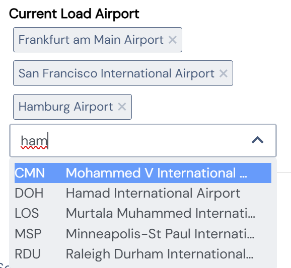

[[DocReleaseNotes]]
== BCD-UI Release Notes

=== Release Notes

The following release notes allow following BCD-UI's ongoing development. +
Potentially breaking changes are listed under _Incompatibilities_.

___
==== Release 5_7_0 ...in progress

.Major new features:
* switched to Java 17, Gradle 8.5, Tomcat 10.1

.Server:
* added zip packaging and download feature via static resourceservlet, ensure *.zip mapping in web.xml
* updated several 3rd party jars
* updated default web.xml and enforce usage of https
* cookies created are flagged as "secure"
* CORS: to make your app CORSable use `de.businesscode.bcdui.web.filters.ShiroFilter` as a replacement of `org.apache.shiro.web.servlet.ShiroFilter` and add `de.businesscode.bcdui.web.filters.CorsFilter` as a first in the chain and cover resources which should be available to CORS, or set it to `/*` to enable for the whole site.
* added BindingItem description element, also added to WRS Header

.Client:
* Login Widget to be used in login-pages, i.e. via `<bcd-loginng>` custom tag
* new dataprovider options tblSelect, tblSelectRow, tblUpdate, tblInsert, tblDelete which offers wrs -> object -> wrs functions (currently limited to wrs)
* added bcdui.bcdAlerter (.info/.warn/.error) to show a slide in alert
* autogrow attribute for textarea widget
* Firefox v137.0.2 stopped supporting xslt document() function, extended our implementation to firefox
* SideBySideChooser uses i18n tokens for source and target caption translations
* grid/cube/scorecard/far/tree get contextMenuResolver option to handle context menu options

.Security:
* Remove SPNEGO authentication mechanism as it is outdated, use oAuth instead
* Deprecate bcdui4.Cors Filter for better CORS control using bcdui4.HttpHeaderSecurity

.Development:

.Bugfixes:
* inputNg: consider value of "step" attribute for type="numeric"
* WrsNextIdentifierServlet: fix counter creation with blockSize>1
* internal logging is now compatible with Log4j2 async logging (also with disruptor based method for high throughput logging)

.Incompatibilities:
* In SQLEngine::transform '-' postfix needs to be converted to '\_' to omit table alias like `INSERT INTO $t.painTableName ($t.colName_) VALUES (1)`
* Removal of Internet Explorer support
* javax to jakarta switch (for several packages e.g. javax.servlet)
* new 3rd party jars set
* cookies created are flagged as "secure", requiring https
* add BindingInfo servlet to web.xml
* OAuth2 configuration in shiro.ini:
** OAuthAuthenticatingFilter properties renamed: authScope to scope, redirectUrl to redirectUri, apiEndpoint to userInfoEndpoint
** `redirectUri` became optional, and this value is then derived from Servlet context at runtime instead, supporting virtual hosts
** `userInfoEndpoint` became optional, the user-id is then derived directly from the id-token send from the token endpoint. The call to user info endpoint is then skipped.
** oAuth now requires a popup for the login window, this looks more consistent and allows for cookie SameSite=strict setting
** OAuth Realms now need to create the session on successful login and cannot rely on JdbcRealm doing that anymore
* wrq filter operator like automatically escapes %, _ and \ now. Don't use local workarounds where you add \ yourself.
* `bcdui.config.userName` now holds the value from bcdui_sec_user.name not user_login anymore
* `bcdui.browserCompatibility.isXYZ` for various browser detections updated. Removed `isIE`, `isMsEdge`, `isIE8`. `isChromiumEdge` became `isEdge`
* Remove msxsl namespace from preset namespaces
* comment widget uses bcdUpdateBy/bcdUpdateStamp binding items as default "addBRefs". If using the default renderer and custom addBRefs, readd these bRefs
* grid columns which use an optionsModel can be emptied via DEL. If empty values should not be allowed, ensure that the column is nullable=0
* bcdOnLoad/bcdOnUnload html attributes can only contain one function name, not multiple ones, no parameters. Function context 'this' will be the html element.
___
==== Release 5_6_0

.Major new features:
** Added support for joins, CTEs, set operators and sub-selects to Wrq
** SubjectPreferences for user-chosen SubjectSettings
** Api stubs for JavaScript auto-suggest and inline help in IDEs
** Fully supporting MySQL and Redshift now
** Security improvements

.Server:
* Wrq does support CTE common table expressions, joins and unions now
* Extend SQL analytical functions in Wrq
* Added CASE WHEN and comparision operators to Wrq
* Allow client sided setting of subject preferences via SubjectPreferences servlet and SubjectPreferencesRealm, using config from bcdui/conf/subjectPreferences.xml
* Introduced UserSettingsDefaults to subjectSettings.xml to specify user default permissions (add de.businesscode.bcdui.subjectsettings.SubjectPreferencesRealm to your realms)
* Introduced "bcdAny:" shiro user rights (automatically created internally from your user rights) which allow testing on right type level (and not value)
* Database syntax does fully support MySQL and Redshift now
* Server sided access to bindings can optionally skip subject settings via backendCanBypassSubjectFilter attribute
* SendMail class added (new gradle dependencies javax.mail:mail, com.sun.activation)

.Client:
* multiCheck widget added
* checkbox widget supports more than 1 and 0 via values parameter
* checkbox and singleSelect widget have a new skin (switch/panel) parameter for a horizontal slider switch / horizontal switch panel
* label widget added
* chips widget added
+

* inputLookup widget added
* cube/cubeModel parameter requestChain added to allow custom request builders
* sticky table (rows/cols) functionality added (either via htmlBuilder parameters or cube layout cube:Freeze element)
* messages editor and viewer added
* input widget supports type color, time and steps attribute
* singleSelect and checkbox have additional skins
* cube inline chart functionality added (render measures as a chart per row), use cube:Chart to configure and additionally load bcduiCubeInlineChart
* cube allows having measures as rows, define dm:Measures/@storedInRows=true

.Security:
* New cookie settings in context.xml and web.xml
* Preventing some possible injections in server responses
* SubjectFilter can now be applied to virtual file system
* SubjectFilters resolved inline (i.e. value list) are using prepared statements now
* RequestLifeCylce filter sets "Content-Security-Policy" (configurable via filter init param ContentSecurityPolicy)

.Development:
* Made bcduiApiSubs.js available which can be used in IDEs for auto-suggest

.Bugfixes:
* Pagination is now taking the order of all order columns into account, not only the last one

.Incompatibilities:
** Move shiro settings from web.xml to WEB-INF/shiro.ini, add +
`<listener><listener-class>org.apache.shiro.web.env.EnvironmentLoaderListener</listener-class></listener>` +
before shiro filter, +
update shiro filter from `org.apache.shiro.web.servlet.IniShiroFilter` to `org.apache.shiro.web.servlet.ShiroFilter`
** Add security features regarding cookies to context.xml and web.xml
** Add SubjectFilters to `bcd_virtualfilesystem.xml` BindingSet
** WrqModifier process() does not any more return a fragment in some cases but does now always work on the input document
** bnd:Coalesce in Binding files was removed
** For SQL engine, i.e. plain SQL-code with referencing BindingSets translated with `SQLEngine::transform()`, getTableName() was renamed to getTableReference() +
to reference the table $t (note: without `.getTableReference()` is preferred anyway)
** TextToUrl servlet returns found value in an XML element now
** removed SubjectSettingsFilter, SessionAttributesManager, SessionAttribute servlet, bcdui.config.security, client sided setting is done now via SubjectPreferences with bcdui/conf/subjectPreferences.xml as config.
* Ensure adding bcd_userId:userId and bcd_i18n:lang to subjectSettings.xml
* Removed bcdBean creationStamp, use bcdBean.currentTimestampUtc instead which is the date string in UTC timezone
* bcd_virtualFileSystem additionally got vfsPathLimit SubjectFilter which limits read/write access on the VFS. Ensure to add user rights (or default values) for:
at least cube template writing /vfs/reports/*, detail export column selects /vfs/exports/*, docUploads /vfs/documents/*. Writing vfs bindings could be achieved via /WEB-INF/*/virtual/*.
* when using subject filters in bcd_virtualFileSystem, you need bnd:BindingSet/sec:SubjectSettings/sec:SubjectFilters/@backendCanBypassSubjectFilter=true
* WRS request optional url attribute at `BindingSet` to pick servlet is moved to root WrsRequest element
* Grid configuration files: change of namespace for C elements wrq:C -> grid:C, removal of wrq:Columns in grid:SelectColumns and grid:OrderColumns, so such elements are directly followed by grid:C
* removed ZipLet decodeAndDecompressToXMLWithXInclude functionality. Update possible calls to decodeAndDecompressToXML.
* bcdui.util.clipboard.paste and pasteCSVasXML don't return the value directly. It's a promise now, so use '.then( value => {...} ) to use the value.
* New reserved SQL words `CURRENT`, `FOLLOWING`, `ROW`, `ROWS` and some less critical  analytical functions
* user messages editor/viewer now use binding sets bcd_user_messages and bcd_user_messages_readonly
* singleSelect (radio) now uses a real label instead of a span, you may have to double check css

___
==== Release 5_5_0

.Major new features:
* Migrated BCD-UI to Java 11
* Updated to log4j2
* Updated 3rd-party java libs
* Updated 3rd-party js libs
* Updated BCD-UI js code and documentation to ECMA 6 standard
* Removed jQuery Mobile

.Incompatibilities:
* Client
** Due to a security fix in the latest jQuery, self-closing html elements in jQuery.append() etc. are no longer allowed (Example:  -> )
** ChartEchart component uses new default colors, ensure to set colors in your projects and don't rely on default coloring
** Due to fontawesome/bootstrap/nouislider update, you need to rebuild your themes jar
** Grid pagination/action buttons are now in divs, so you may need to check your styling
** Grid editor bcduiSingleSelect was removed, use bcduiSimpleDropDown instead
** Moved QuickEdit to package bcdui.widgetNg
** createFixedTableHeader() uses new css classes, ensure your theme includes them
** bcdui.util.xml.parseFilterExpression was moved to bcdui.wrs.wrsUtil.parseFilterExpression

.Config
* In web.xml: add invalidRequest.blockSemicolon = false and check for other changes in Server/configFiles/web.xml
* Ensure to update dependency jars, see Docu/development/bcdui_dependencies.gradle
* Use Server/configFiles/log4j2.xml (instead of log4j.properties)
* Wrq2SqlServlet has restricted access permissions now requiring bcdAdmin:ImplementationDetails as it reveals implementation details (actual names of db objects)
* bindingItem skipWriteCheck attribute (to bypass subject settings write checks) was removed. Use the new mode (R|W|RW) attribute on SubjectFilterType instead
* for new themes, guiStatus:bcdSideBarPin was changed to guiStatus:bcdSideBarPin-left and guiStatus:bcdSideBarPin-right in case you preset a collapsed/expanded sidebar

.All versions of 3rd party libraries for runtime, are listed in
* bcdui_dependencies.gradle for java
* gradle.properties for javascript

.Build:
* Updated to gradle 7.0, including switching to com.github.node-gradle.node plugin and node-js version 12.13 (LTS)
* Updated to babel-js, node-sass and jsdoc, see build_package.json

.Core:
* _getFillParams which is used in read, write, query, queryNodes can handle xPaths with * now

.Server:
* new SubjectFilterType mode attribute to specify how this filter type should be enabled. on read, write of both (default)
* fix Postgres (empty) CLOB and BLOB reading

Layout:
* introduced right sidebar
* no need to add bcd__sidebar-left-collapse-toggle etc. divs/classes. Specify bcdEffectCollapse class at your bcd__sidebar-*__inner element

.Components:
* Cube
** minimize load of cubeConfiguration and dimensionsAndMeasures for cube/cubeConfigurator

* Grid
** use div container
** new option defaultButtons=true to show/hide action button
** allow button actions to be triggered via bcdGrid:save, bcdGrid:reset, bcdGrid:addRow on targetHtml
** major improvement to grouped headers
** fixed columnFilter for empty values
** bcduiInputField editor follows handsontable's grid cell movement rules, closes correctly on identical values

* DocUploader
** initial commit of a document uploader component, uses VFS (bcd_docUpload binding) to store data on scope/instance level (scope subjectsettings)

* Scorecard
** fix aspect definitions with multiple chooseCalc when statements
** calc:AspectRef can directly address a bindingItemId now

* Charts
** align ChartEchart adapter to support getData() and set chart:ChartsDrawn
** fix configurationFromWRS to correctly use unit and caption information in case of a standard cube (1rowDim/1colDim/1measure)

.Widgets
* InputField
** fix not disabled field until options model is ready (in case of wrapped optionmodels)

* fixedTableHeader
** createFixedTableHeader uses optimized and more compatible code
** new htmlBuilder parameters createHeaderFilters and createFixHeader

* createTableHeadFilter
** add option valueCaptionProvider which allows asynchronous providing of code/caption data for filter dialog

* comment widget
** initial commit of a comment widget to store comments in the database (bcd_comment) on scope/instance level (scope subjectsettings)

* SylkExport
** limit additionalInformation field to sync limits

.Utils
* bcdui.util.getUuid() returns you an uuid

___
==== Release 5_4_0

.Major new features:

. Support for ECMA6
* Introduced Babel to transpile for usage in Internet Explorer
* Adjusted js loader for IE
* Using 'strict' mode now in all JS sources
* updated to jQuery 3.4.1, jQuery-UI 1.12.1

. Components: Scorecard, Cube, Charts, Export, Grid, Tree
* Added Grid Component
* Added Tree Component
* Added collapse/expand functionality to cubes
* Reorganized CubeContextMenu and added hard toggle column sort
* Charts support for dark themes
* Charts removed some chart background grid elements for less crowded charts
* Charts add support for echarts when loading bcduiChart2, image export and some chart types are limitted
* Add support for radar chart when using it
* Cube allows dims-only and measure-only reports, for measure only, you can decide if the data should be aggregated or not
* Cube DND flyover when specifying @description on LevelRef and Measure nodes
* Renderer doesn't need an existing targetHtml nor defining one at all on creation. Member function setTargetHtml can be used to set and change target.
The Renderer either works directly with the specified element or (in case of specified via id) does an element lookup by id.
* Excel Report export moved to client side using FileSaver.js
* Detail Export got column chooser options, check exportMode attribute for a customized column export/save selection and a wrqModify callback function
* Remove client refresh on detail export which is not needed. Change context menu action from
    <JavaScriptAction>bcdui._migPjs._$(this.eventSrcElement).trigger("cubeActions:contextMenuCubeClientRefresh", {actionId: 'exportWysiwygAsExcel'})</JavaScriptAction>
    to
    <JavaScriptAction>bcdui._migPjs._$(this.eventSrcElement).trigger("cubeActions:reportExport")</JavaScriptAction>
* Added support for voice and free-text control

. Widgets
* periodChooser got new options: useSimpleXPath to use a straight forward xpath, autoPopup to directly show the popup calendar and suppressButtons to not show any buttons at all, showClearButton (default on for non mandatory) to allow cleaning of input
* createFilterTableHeader function to add a filter header on a renderer. Uses createTableHeadFilter function which can be reused for other header filters (like grid) 
* enableNavPath attribute to turn on/off navPath linkage (default is off (false))
* New widget: "slider", based on noUiSlider implementation
* Context menu: added support for multi-context, i.e. 

* menu.xml: added implicit i18n support for title, caption attributes; please, take a look at "incompatibilites" as well.
* Introduce body bcdSingletonHolder div where bcdCalendar, bcdAutocompletionBox, etc should be attached
* tab menu fires custom events (bcd:widget.tab.hide bcd:widget.tab.show) on the single tab areas
* inputField gets hideWildcardChar option to not attach asterisk characters (DimsionChooser supports it via dimconfig)
* tabMenu can be persisted
* New PasteList widget with support of in-clause

. Core
* Promise polyfill: ecma6-promise (used for IE)
* Wrs: add support for JDBC SQLXML type
* Wrs: Added filter with support for http 'expires' and '304' with 'Last-Modified' controlled by bcd_cache_scope
* SimpleModel: add saveChain/Parameters to be able to modify save actions
* DataProvider: added support for xpath with placeholders/fill parameters for query/queryNodes/read/write/remove operations. Mainly for handling quote/apostrophe issues when dynamically building up xPath Expressions
    Example: bcdui.wkModels.guiStatus.read("//guiStatus:ClientSettings/guiStatus:Test[@caption='{{=it[0]}}' and @caption2='{{=it[1]}}']", ["china's republic", "drag\"n drop"]);
* `BindingSet` Relation added IsLike condition for joins
* filterRowsTemplate gets enhancement of condition attributes and filterlists
* moved save handling from SimpleModel to DataProvider
* New bnd:BindingSet/bnd:C/@skipStartupRead attribute. If set to true, this BindingItem is not read on startup

. Themes
* theme update: the new bcd-ui theme is based on Bootstrap v4.3.1, with FontAwesome 5.8.1 included
* new pageEffect bcdEffectPageStickyFooter
* HtmlBuilderTemplate passes-through any attribute on wrs:C in {http://www.w3.org/1999/xhtml} namespace - prefixed by 'html' - and merges html:class appropriately
* HtmlBuilderTemplate sets bcdNegNumber class on an element in case number's value is negative

. Security
* Server writing passwords is now secured and salt is added automatically
* added implicit subjectFilter bcd_userId:userId with fixed filter value
* client-controlled subject filters
** the new servlet-filter de.businesscode.bcdui.web.filters.SubjectSettingsFilter allows setting subject filters from client
** client-controlled subject filters can be set from client via bcdui.util.security API
* Optimized row level security supporting data not requiring filtering: SubjectFilterType in subjectSettings.xml can be tagged to say null-values can be accessed by everyone in reading
* SubjectFilters sare now also applied during write.
** All values must be in the values that are also allowed on reading
** Missing values are added if the are in SubjectFilters but not in the Wrs as long as they are unambiguous
** Allowed are a single SubjectFilter, a flat bnd:And or a flat bnd:Or, but no nested expressions
* OAuth2: add general support with Shiro integration for authentication.
** Add OAuth2 authentication modules for Microsoft Azure / Graph and Google and allow combining with bcd_sec_ authorization
* Default timeout for bcd_sec_usersettings changed from 2 min to 1 hour in shiro settings to decrease database reads

. Server
* Updated 3rd party jars (apache commons etc) to latest versions
* Add notLike and notIn operators to f:Filter, including universal filter widget
* Wrq where and having clause does now understand virtual binding items: f:Expression/@bRef referencing a wrq:Columns/wrq:C which is having a wrq:Calc expressing, are now using that wrq:Calc expression
* New /bnd:BindingSet/bnd:C/@skipStartupRead to allow skipping an binding item at initial read on startup
. Build / Dev / Docu
* In Eclipse, sub-projects Client, Server, Theme etc now have names BCD-UI--SubProjectName to keep them together in the navigation tree
* Switched to gradle 4.2, added gradle wrapper, updated nodeJs to 6.11
* Updated bcduiApiStubs.js to fit Eclipse Oxygen+Tern and IDEA 2017.2
* HTML JS API docu is now showing source names and lines
* Updated web.xml to reflect an improved default setup

.Major bug fixes:
* I18n: local messages.xml catalog file can contain multi language enabling full i18n support w/o database
* HTML Custom Elements for Safari broke after Safari switched to Webcomponents API v1
* DBProperties did not close its db connection correctly

.Backward Incompatibilities:

* Menu: when using old scss themes, you need to specify '{ bcdui: { legacyTheme: true } }' in bcdui/conf/settings.json
* jQueryMobile is not compatible with jQuery 3.x anymore. When using jQueryMobile, you need to build bcdui with a jQuery 2.x
* bcd_virtualFileSystem got additional columns updatedBy, last_update, bcd_userId with additional writebacks and security constraints and a new additional key column
* Component: cube/scorecard blindUpDowns, ranking require new i18n keys (bcd_Rank_, bcd_Sc_Blind_, bcd_Cb_Blind_)
* Charts: Moved VML drawer to BCD-UI-DE
* Updated 3rd party jars (apache commons etc) to latest versions
* Cube: for templateManager, RankingEditor or Summary, you need to include bcduiComponent in addition to bcduiCube. Symptom: _renderSummaryArea is undefined
** CubeContextMenu, Sort Measure is replaced by Column Sorting, when using custom context menus, remove calls to setSortMeasure, add calls to setColumnSort
** If a template is selected and then manually modified later, cube:Layout/@name and @description attributes are appeded with ' - '+bcd_Edit_Modified
* Export: removed bcdui.component.exports.excel functions (detailExport, exportHTMLElement). Use bcdui.component.exports detailExport, exportWysiwygAsExcel functions.
* New entries for Eclipse injection to support ECMA5 transpiled sources, see Docu/development/eclipseInjected.xml
* Widgets: navpath generation is turned off by default, use widget's enableNavPath attribute to turn it on
* menu.xml: "bcdTranslate" attribute dropped, use "caption" instead
* I18n
** the servlet de.businesscode.bcdui.web.i18n.I18nServlet must be registered in web.xml (and made accessible to public)
** the servlet filter de.businesscode.bcdui.web.filters.SubjectSettingsFilter must be registered to web.xml, right after security filter (i.e. shiro)
** Add user_login to bcd_sec_user
** If you want to use salted passwords, add password_salt to bcd_sec_user and salt existing passowrds
** Also add bcdui/i18n/default/lang if you want another default language than en, see web.xml
* removed bcdui.widget._createTopLevelElement function, switch to use bcdui.util.getSingletonElement
* SubjectFilters are now also applied on writing, details see above
* bcd_user_sec writing is now secured if using the new `BindingSet` xml
* Signature of WriteProcessingCallback#processEndRow changed
* FAR module is optional, specify it in your bcduiLoadFiles attribute
* Increased timeout for bcd_sec_usersettings is now 1 hour, was 2 min
* In some cases requestDocumentBuilder.xslt, also used in AutoModel, did not limit the bRefs from filters to those given in the list, no it does. If setup incorrectly before, they are missing now.
* Successful login is no longer sending a redirect to originally requested URL but sending this in header X-BCD.Location. Use new Login widget to handle this automatically

___
==== Release 5_2_0

.Major new features:

. Components: Scorecard, Cube, Charts, Export
* Scorecard configurator added support for templates, ranking, sorting
* New reporting component added: a Free Analysis Report component (FAR)

. Widgets
* htmlHeaderBuilder now adds css classes bcdDimension/bcdMeasure
* New filter widget bcduiUniversalFilterNg allowing AND/OR expressions

. Core
* wrs-request wrq now supports HAVING clause
* New bcdui.wkModels.bcdCategories well-known model
* New Wrq2SqlServlet returning plain SQL generated from WRS-Request
* Extended features for taking over filters for detail export and drill

.Backward Incompatibilities:
. dm:FilterTranslation, dm:DimensionTranslation and dm:PeriodTranslation were renamed to dm:FT, dm:DT and dm:PT
. dm:FilterTranslation toRangeWhen attribute was moved to dm:PeriodTranslation
. LoginServlet was removed, adjust web.xml and let loginform have action=""
. bcdui.utils.wrsUtils.postWrs: onSuccessCb, onFailureCb become onSuccess, onFailure

___
==== Release 5_1_0

.Major new features:

. Components: Scorecard, Cube, Charts, Export
* Added Scorecard configurator with a drag'n drop area similar to the cube one
* Scorecard new scc:Description element in configuration, picked up by tooltip
* Scorecard new scc:Kpi/@skipAspects allows to list space separated per kpi, which aspects do not apply. Per default bcdFailure and bcdFrequeny are disabled for KPI which are not of type i/t
* dm:Measure element has got dm:Categories definition, currently supported by Free Analysis Report component (FAR)
* new dm:DimensionsAndMeasures/dm:Dimensions/dm:DimensionRef element now references dm:Levels of entire Dimension from /bcdui/conf/dimensions.xml
* new dm:CategoryTypes element defining a global set of categories used for Dimensions and Levels in /bcdui/conf/categories.xml

. Widgets
* New widget: Added dropDown Button functionality
* PeriodChooser has quick-pick options for LastDay/Week/Month (depending on the allowed options)
* DimensionChooser has new parameter to limit number of shown levels
* SideBySideChooser has new parameter doSortOptions to enable/disable sorting of optionsmodel (default is true)
* SideBySideChooser has got up/down controls to rearrange target selection

. Core
* bcdui.core.DataProviderWithXPathNodes can now be used as input model for transformations.

. Security / Bindings / WebRowSet
* Preventing XML injection via entities and XIncludes for client provided files

. Build / Dev / Docu
* Eclipse ApiStubs for IDE autosuggest is now one file only
* JSDoc Introduced new well-known types for modelXPath, WritableModelXPath, chainDef, i18nToken, targetHtmlRef

.Major bug fixes:
. META-INF/gitInformation about git's local repo status is back again

.Incompatibilities:
. Removed SideBySideChooser source and targetKey attributes. source/targetCaption (removed prefix 'default') attributes support i18n now
. DimensionChooser auto hides level selector if number of visible levels is 1, this now also applies i fonly one is left via visible=false
. Library logging is using application server's local time for timestamps (has used database timestamp before).
  Due to asynchronous nature of logging the logging event creation time is now captured rather than database record insertion time.
  Affected loggers: bcd_log_access, bcd_log_error, bcd_log_login, bcd_log_page, bcd_log_session, bcd_log_sql
. bcdui.core.DataProviderWithXPathNodes: .getData() returns a document now (instead of an element), hence if used as a parameter to XSL-T the
  parameter references the document the root element is accessed via xpath: $someParam/* ( previously was referenced by $someParam ).
  Related to this change /wrs/requestDocumentBuilder.xslt has been modified on lookups for params: $additionalFilterXPath, $additionalPassiveFilterXPath
  both using the DataProviderWithXPathNodes
. If you used cubeConfigurator's isDefaultHtmlLayout='false' before, you need to provide bcdCubeDndMatrix container yourself

___
==== Release 5_0_0

Major new features:

. Overall
* Made BCD-UI Community Edition available on github

Incompatibilities:
. Removed widgets: button, textArea and sideBySideChooser. Use widgetNg variants instead.
. web.xml: remap servlet-class for bcdui4.CacheManager to de.businesscode.bcdui.web.servlets.CacheManagerEnterprise
. Static Resources: change API call from StaticResourceServlet.Resource.fetchResource(..) to StaticResourceServlet.StaticResourceProvider.getInstance().getResource(..)
. Mapping of client artifacts has changed from '/bcdui/js/...' to '/bcdui/js/...' and for xslt accordingly.
. if you used cubeConfigurator's isDefaultHtmlLayout='false' before, you need to provide bcdCubeDndMatrix container yourself

Internal:
. Switched scorecard and cube dnd to 960 grid for defaultHtml Layout

___
==== Release 4_6_1

Major new features:
. Components: Scorecard, Cube, Grid, Charts, Export
* Cube/cubeModel default status model is guiStatusEstablished now
* New Wrs-to-Excel feature, also supporting writing into Excel templates. bcdui.component.exports.exportToExcelTemplate
* Aligned export filename generation when using navpaths, navpath info also available in wysiwyg and detail export
* Added predefined bcdRawValues scorecard aspect to report indicator and total values
* Added toRangeWhen FilterTranslation support for scorecard to analysis drills
* Enhanced bcdAspectDefaultWrqBuilder to support aspect dimensions filters
* CubeConfigurator, use bcdui.config.clientRights.bcdCubeTemplateEdit well known user right for hasUserEditRole attribute (either * for all or cubeId as value)
* CubeDND area uses i18n keys (bcd_*Dimensions, bcd_*Measures) for headers and background.
* Scorecard new whenKpiAttr switch for aspects
* CubeConfigurator, added maxMeasures and maxDimension limitation options

. Widgets
* PeriodChooser supports postfixes
* BlindUpDown listens on targetXPath changes and sets min-width depending on the width of its body
* Automatic navPath generation for widgets. Use bcdui.widget.createNavPath to grab/draw/update formatted captions or bcdui.widget.getCurrentNavPath as a plain getter.
* New attribute WidgetCaption where you can define a name for the widget (e.g. used in navPath) Use bcdui.widget.getWidgetCaption to get (translated) WidgetCaption attribute
* New attribute noEffect for blindUpDown for a simple show/hide (to avoid issues with IE chart gradients)
* Switched to NG versions of button, sideBySide and textarea
* Aligned scorecard/cube/chart tooltips

. Core
* Add new config feature for project-wide settings, defaults can be overwritten in bcdui/conf/settings.json
* BuiErrorLogAppender, BuiAccessLogAppender are added programmatically. Same for listener classes and levels
* New extension points renderHeaderColumnToken and createHeaderRow in htmlHeaderBuilder to customize add specific renderer to a header
* bcdui.config.clientRights object holds "bcdClient" security settings as array
* New bnd:WrqModifiers element for BindingSets allowing last-menu server-only WrsRequest modifications, for example to add or modify a f:Filter to fit table partitioning.
* wrsUtils do now accept DataProvider instead of DOM

. Security / Bindings / WebRowSet
* SubjectFilter in a BindingSet/SubjectSettings/SubjectFilters can be nested within And, Or elements. Top level default connective is AND.
* Cleaned reserved words list for oracle for select clause
* New WrsRequest modifier system for manipulating requests server side, just before they hit the database
* SubjectSetting bcdExport:maxRows and bcdWrs:maxRows added which allows user specific setting of export and wrs row limits
* New Windows-based single sign on with kerberos SPNEGO
* SubjectSettings row level security can now handle IN clause for few values instead of table join

Incompatibilities:
. Cube measure sort is only available when no VDMs or column dimensions are available
. DimensionChooser works on bcdDimension attributes now, f:Or[@id] is replaced with bcdDimension, f:And[@id] attribute was removed
. DimensionChooser's configuration model has renderer namespace and filterCondition element is aligned to FilterCondition
. buildPeriodFilters.xslt was removed
. PeriodChooser/formulaEditor, removed use of bcdWidgetId and removed legacy id bcdContainer_ prefix
. Remove de.businesscode.bcdui.web.errorLogging.BuiErrorLogAppender from log4j.properties to avoid double logging
. SubjectFilter elements in a `BindingSet` document must be collected inside the SubjectFilters root element
. Aligned columns in bcd_log_* tables. Double check yours against the well known ones in BCDUI
. Renamed bcd_error_logging `BindingSet` to bcd_log_error
. Renamed WidgetNG button onclick to onClickAction to avoid customTags issue with html onclick
. Please double-check log4j.properties and web.xml for updated logging entries (session logging needs web.xml listener and shiro authenticator listener)
. Log tables need a log_time column which uses a default timestamp
. bcd_log_page renamed to bcd_log_pageperformance
. When using cellAndGuiStatusFilter via filterFromCell.xslt, period filters don't have @dateFrom/To attributes anymore
. Reduced list of Oracle reserved words, may lead to unwanted table alias in SQL. Consider bcdNoTableAlias. or raise list needs to be extended again for common cases.
. removed activeX based exports and especially mergeExport from lib, application exports should use the new ones (or include the merge function in the application)
. cube hides empty cells now by default. If this is not required, use cube:Layout/@removeEmptyCells="false"
. tree renderer uses buttonNG template, update specific renderers from button to buttonNg
. Removed ActiveX base client ide exports
. legacy themes need #bcdChartToolTip setting

___
==== Release 4_6_0

Major new features:

. Overall
* Reworked and updated JSDoc for all public JS API, provided as searchable HTML docu
* Removed all global JS symbols except bcdui and guiStatus
* Clear separation of public and private JS API calls via JSDoc
* Generating jsApiStubs with public API for IDE support
* Introduced file groups allowing to load only parts of BCD-UI
* Introduced targetHtml attribute which supports dom/jquery elements, selectors and ids for renderers and widgets
* Introduced HTML custom elements for renderers and widgets

. Components: Scorecard, Cube, Grid, Charts, Export

* Cube can now be instantiated as a class via new.
* New parameter 'contextMenu' for Cube and Scorecard allows to provide a custom url. true means default context menu, false is default and means no context menu.
* Export: 'no export' message is now i18n and supports custom messages.
* Scorecard aspects: Introduced calc:ExtensionRef as a reference to a fix value in scc:Extensions.
* Added common dm:DetailData specification for scorecard and cube.
* Introducing config attribute as a replacement for metaData, metaDataModel

. Widgets
* Introducing targetHtml attribute which supports dom/jquery elements, selectors and ids
* Switched to js rendering for widgets: dimChooser,formulaEditor,inputField,multiSelect,periodChooser,sideBySideChooser,singleSelect,textArea
* PeriodChooser sets "firstSelectableDay" (when not given, use today) when clicking the input fields
* For BlindUpDown Area, removed bodyIdOrElement and extra div in html, just provide targetHtml with body content. A blindUpDown change fires guiStatus now.

. Core
* Added various functions to dataProviders (write, read, remove, query, queryNodes, fire, onChange, removeDataListener, serialize)
* Added widget functions i18nAlert, i18nConfirm
* Added onReady and onceReady functions to AbstractExecutable
* Introduced DataProvider.fire(), removed need for having before/after listener sides. Handling is now done 'after' modification only
* DataProviderHolder can now be instantiated without a source and the source can be provided later
* DataProviders are firing onChange() when getting in ready status
* DataProvider write(), remove() set uncommitted-writes flag. Executing leads to WaitingForUncomittedChanges status (not ready) in this case until fire() is called. Fire and SimpleModel data load resets flag and sets ready.
* fire() executes ModelUpdater if available. This leads to additional ready status listener calls
* AutoModel got orderByBRefs parameter for optional customized ordering
* Adjustments to support Edge including some temporary workarounds until some confirmed Edge issues are fixed
* Switch to Servlet 3.0 spec, updated jars

. Themes
* Added uploader styling
* Simplified sidebar effect, item and section html/css
* bcdReport uses nth Child for even/odd coloring

. Security / Bindings / WebRowSet

* Closed remaining security wholes found by HP Fortify

. Build / dev

* Switched build system to gradle
* Producing a development distribution now

* Producing a browsable API HTML documentation now
* Providing autosuggest support for IDEs via API stubs now
* Providing js source code maps now
* Documentation files do now support all browsers (XSLT applied are applied during build instead of during browsing)

* Eclipse injection of BCD-UI into a project does now copy all binaries onto their final places, allowing a simple "export war" to create a build.

Major bug fixes:

Deprecated:

. targetHtmlElementId/targetHTMLElementId, use targetHtml instead
. metaData, metaDataModel, use config instead
. fireBeforeDataModification, fireAfterDataModification, use fire instead after modification (old functions available via legacySymbols)

Incompatibilities:

. Components:

* Scorecard: CategoryModel is not longer an extra scorecard parameter but found in scorecard configuration as /*/scc:CategoryTypes
* Scorecard: Js class Scorecard was renamed to ScorecardModel. Scorecard is now the scorecard renderer pluy model.
* Scorecard: scc:Kpi/@aggr was removed, it served as a default for calc:ValueRef/@aggr, but was confusing, use calc:ValueRef/@aggr directly.
* Cube: Moved bcdui.component.cubeConfiguratorDND to bcdui.component.cube.configuratorDND (similar for .cubeConfigurator, .cubeRankingEditor, .cubeTemplateManager)
* Cube: Format of detail export information changed, for new format see cube.xsd. Also note that 'scope' is now provided via chainParameters
* Cube/Scorecard: isDefaultContextMenu was renamed to contextMenu and supports custom urls now in addition to boolean
* Uploader: Updated uploader bindings to follow bcd_* naming convention

. Widgets:

* Renamed widgetNG package to widgetNg. Use case sensitive(!) regex search: ([a-z])NG(\W) and replace: $1Ng$2 to update your project
* Strict camelCase for: tab/menu widget attributes rendererUrl, modelUrl, handlerJsClassName; inputField Widget attribute: onEscKey; userMessagesViewer widget: rendererUrl, bcdui.wrs.wrsUtil.validateModel attribute stylesheetUrl
* Removed button widget params: contextPath, name and rendererUrl
* Removed (most) widget xslt files (e.g. singleSelect.xslt, singleSelectTemplate.xslt). Import widget/widget.xslt instead
* Renamed inputField widget parameter bcdAutofit to autofit
* Renamed legacy calendar switch bcdPopCalendarLegacy to bcdui.widget.periodChooser.bcdPopCalendarLegacy
* Moved bcdui.core.clipboard to bcdui.util.clipboard
* Moved bcdui.core.datetime to bcdui.util.datetime
* Moved bcdui.core.* to bcdui.util.url: translateRelativeURL, resolveToFullURLPathWithCurrentURL, isAbsoluteURL, extractFolderFromURL, resolveURLWithXMLBase
* Moved bcdui.core.* to bcdui.util.xml: getParentNode, quoteXMLString, cloneElementContent, nextElementSibling, renameElement
* Moved global popupCalendar(...) function to bcdui.widget.periodChooser.popUpCalendar(...)
* DimensionChooser does not need optionsModelXPath (+ relative) anymore. "dimensionName" attribute was renamed to "dimension"
* DimensionChooser uses /bcdui/conf/dimensions.xml as fixed dimensions model with http://www.businesscode.de/schema/bcdui/dimmeas-1.0.0 as default namespace. Hierachy level between Dimensions and Level elements, Level attribute "unique" replaces "requires" Nodes

. Core

* Removed all global JS symbols including all $ functions, except bcdui and guiStatus
* Removed _addDataModificationListener, _removeDataModificationListener. Use onChange, removeDataListener instead
* Removed bcdui.easing package
* AutoModel isDistinct default value is false now
* DataProviderWithXPath, DataProviderWithXPathNodes both don't auto create xpath anymore (was done via obsolete fireBeforeDataModification)
* Fixed typo in bcdui.i18n.syncTranslateFormatMessage and translateFormatMessage to syncTranslateFormatMessage and translateFormatMessage
* Renamed afterDataModification to callback
* paramBag moved to bcdui.core.paramBag

. Theme

* Added bcd prefix to .sidebar* .grip* css classes
* Switched from bcdTitleArea, bcdSideBarItem, bcdSideBarItemHeader, bcdSideBarItemBody, bcdSideBarItemCaption to bcdSection, bcdItem, bcdSectionCaption, bcdCaption
* bcdSideBarEffect, bcdSideBarGrip*, bcdSideBarArea divs are automatically created if needed, so remove them in your code
* HtmlBuilderTemplate does not render specific bcdEven/bcdOdd classes anymore, odd/even is now handled via css n-th child
* PageEffects are handled via class attributes (bcdEffect...) at bcdSideBarContainer. No need to call init with arguments anymore.

___
==== Release 4_5_7

Major new features:

. Scorecard, Cube, Grid, Charts

* component JSP,XSLT,XML Api and documentation are generated out of api
* cubeDragNDrop is now based on connectables
* improved cube ranking area rendering and using widgetNGs now
* improved chart from cube (multi-axis, better captions, more dimension/measure combinations)
* simplified class generation (bcdEven/Odd/Total) for HtmlBuilder
* grid context menu can be limited to grid table only (not pagination etc) by setting context id "innerGrid" to contextmenu
* Upload Module: FileValidate got new APIs: runValidateSql() and customValidateReferenceData() to alleviate creation of validation SQLs.

. Widgets

* major dimchooser code cleanup, incl. listening on filter changes from outside
* widget JSP,XSLT,XML Api and documentation are generated out of api
* new widget NG: connectable
* sideBySide NG is now based on connectables
* added missing attributes to sideBySide and inputField tag/js/jsp api
* sidebar and page effects are available via bcdui.widget.pageEffects

. Core

* bcdui.core.ready waits for jQuery to be ready. Avoids Prototype/IE8/cache issues with e.g. staticModel defered init
* static models without a data attribute are generated as empty models
* added Promise polyfill
* `ModelUpdater`, `AutoModel` are also available as core functions now, not only via factory
* removal of prototype.js (keep copy of patched version in external libs)
* removal of IE version less than 8 specific code (iframe, scroll offsets)
* ie8 support only via included modules (bcdui/module/extensions/ie8Polyfills.js)
* core (activity/bcdui) JSP,XSLT,XML Api and documentation are generated out of api
* bcdui.wkModels.guiStatusEstablished holds the initial guiStatus after page entry/modelupdaters and is also one of the implicit trafochain params
* new js variables for guiStatus, _bcduiConfig, bcdI18nModel (see incompatibilities)
* xsl:import does now understand href="{bcdui.cp}/something" to make it location independent especially when in case of scorecard the xslt inlined or imported from an XML
* createModel allows specifying mimeType

. Themes

* generated targetHtmlElements will have a class attribute named after the type (e.g. bcdChart, bcdGrid, bcdSingleSelect)

. Security / Bindings / WebRowSet

* &lt;wrs:C&gt; element allows definition of any custom attributes from a well-known custom namespace: 'http://www.businesscode.de/schema/bcdui/customization-1.0.0' (well-known prefix: 'cust')
which are also exposed to the client in wrs:Header

Major bug fixes:

. fixed cube tag to support template manager without the need of a ranking editor
. dimchooser should not initially clean its targetmodel
. cube toggle hideTotals accidentally removes all rows (chrome only)
. Tree renderer.xslt provided a wrong param colNo (off-by-one) to template renderHeaderColumnToken, which is used for specific cell renderer
. A Scorecard having kpis as columns, did show kpi-id instead of kpi caption in the output plus aspects were not treated correctly in some cases

Incompatibilities:

. lib cube and grid actions observers are jquery based now, check local context menu entries for .fire calls and change them e.g. with bcdui._migPjs._$(this.eventSrcElement).trigger(...)
. widgetNG xslt/xapi template names now have a NG postfix, e.g. buttonNG
. models need either a requestDoc or url. Dummy models which only have an id attribute are not allowed anymore.
. IE8 support is only available via distribution.include = bcdui/module/extensions/** (FF,IE,Chrome, etc) or bcdui/module/extensions/ie8Polyfills.js (IE8 only)
. if prototype.js is needed within the project, you need to load in the project after bcdui
. IE version less than 8 will suffer from overlay and scroll offset issues
. removed attribute onFinishAction from executeXslt
. chart targetHtmlElements don't have the chart chart_{id} class naming anymore
. components rendered via xslt/xapi get a new class name based on their type e.g. bcdChart
. old SideBySide widget needs to provide optionsModelId and optionsModelXPath parameters separately in XSLT/XML api
. JsDataProvider jsp api takes action as body and not as attribute anymore
. injected projects need to update .project and .classpath to make use of the new generated code
. removed factory.xslt, use core.xslt instead
. removed htmlInputs.xslt, use widget.xslt instead
. renamed widgetXslt.xslt to widgetNG.xslt
. guiStatus javascript variable does not exist anymore use "bcdui.wkModels.guiStatus" instead
. _bcduiConfig was moved to bcdui.config
. bcdI18nModel javascript variable does not exist anymore use "bcdui.wkModels.bcdI18nModel" instead
. Legacy themes may need an update for the cube dragndrop/ranking area. See dhl-classic theme for details.
. new cube DnD Area and Ranking Area requires IE8 or higher (so check your frame tag for IE7 meta elements)
. removed optional cleanClientSettings=false from applyAction function
. generated sources use generated ids with prefixed bcdSId_ or bcdCId_ (Server/Client-sided), generated targetHTMLElement ids are generated from the id plus _tE postfix
. Scorecard: measurePerAggr are now in scc: namespace, adjust your aggregators to this.
. htmlbuilder bcdEven/Odd/Total simplification needs legacy theme updates
. strict camelCase for cubeConfigurator attributes: isDefaultHtmlLayout, rankingTargetHtmlElementId, templateTargetHtmlElementId and summaryTargetHtmlElementId
. cubeDND now strictly takes data from /*/cube:Dimensions/dm:LevelRef if present, otherwise from //dm:Dimensions/dm:LevelRef and from */cube:Measures/dm:MeasureRef if present, otherwise from //dm:Measures/dm:Measure
. the uploadFileValidateCommit.tag now loads the error data from 'upload_FailedRows_noHead' `BindingSet` and not 'upload_FailedRows_plusHead' - only the binding reference has changed, anything else remains.

___
==== Release 4_5_6

Major new features:

. Scorecard, Cube, Grid, Charts

* New client side calc:Ian for is-a-number and made calc:Igt available in formulaParser
* Cube default DetailExport list can now be pre or postpended
* CubeConfigurator new isDefaultContextMenu and isDefaultHtmlLayout parameters
* Added new param colDimNrOfColDims dto colDim.xslt for simple cases
* Hiding non-% units if no number is present
* Added scc:CategoryTypeRefs/scc:CategoryTypeRef/@asKpiAttribute to make the category an wrs:A attribute
* Allowing scc:Precalc also for aspects with WrqGenerator
* Excel detail export is now using POST instead of GET
* Isolated htmlHeaderBuilder for generating complex headers outside of htmlBuilder

. Widgets

* New css classes for menu bcdActive and bcdActivePath to highlight the currently selected item/page
* Cube ranking and template editors, blind up/down and PopUpCalendar uses utf8 characters (via css content) instead of images
* User Messages Viewer renders last_modified information in second column
* Added jqueryui modules tab and selectable
* Detail export allows providing detail export filename as /wrq:WrsRequest/@bcdFileName
* TreeView is not listening on its status in guiStatus
* new SideBySideChooser WidgetNG

. Core

* Renderer allows for partial redisplay now via partialHtmlTargets param in execute()
* XMLDocument does now also have getData() returning itself
* Allow autogenerated name resp. id for ConstantDataProvider, Renderer, ModelWrapper, StaticModel
* Allow an embedded xsl:stylesheet in chain:Chain/chain:Stylesheet and also an JsProcFct child with a js transformator
* Attach the bcdui.core.Renderer js object to its targetHtml as bcdRenderer
* Build scripts are now JDK 1.8 compatible
* Allowing strict camelcase "targetHtmlElementId" in more places
* DB types are now derived from prepared statements instead of select where 1=0
* ORDER BY (desc and asc) as well as TOP-N (top and bottom) bring nulls to the end of list now on all databases

. Themes

* Introducing new SCSS/960 grid based themes. Properties file can have two new properties:
"distribution.theme.inherit" which may point to a different theme name from where images are merged into the theme
and "distribution.theme.legacy" which can be set to true for old style themes.

. Security / Bindings / WebRowSet

* Added support for MS-SQLServer

Major bug fixes:

. close unmanaged connection in `ZipLet`

Incompatibilities:

. Cube DetailExport does not auto-generate i=0 t=1 filters anymore. If you need them you need to add local ones to your measure.
. Removed "isAdditive" attribute from cube:DetailExport element. You can now use isPrepend or isPostpend (=true) to place columns before or after the local list. A former isAdditive=true can be replaced with isPostpend=true.
. Cube ranking, Cube template and Blind up/down widgets use utf8 chars now.
. Cube ranking, Cube template editor now got bcd class names. Old themes need to be adjusted
. Popup calendar uses utf8 chars instead of images. To support the old style you need to set a js variable bcdPopCalendarLegacy=true before initializing bcdui
. New grid positioning of input cell may require css adjustments in older themes
. bcdCube class name was replaced with bcdReport. Be sure to update local css files
. withReadyObjects() is not longer waiting for objects to be registered if it gets the dp and not just its id
. Instead of 1.6 workspace default is now used for JDK
. Treeview: in thead css classes th.bcdHeader, th.bcdEmpty, tr.bcdHeaderRowX and tr.bcd[Not]LastRow are not longer there, use a different css selectors, should be possible in all cases
tr/@bcdLeaf="true" is also gone, check class bcdLeaf instead. In general, header is now almost identical to the one known from htmlBuilder.

. When overwriting htmlBuilder with specificRenderers, you also have to apply htmlHeaderBuilderTemplate.xslt now, before it was only htmlBuilderTemplate.xslt in the container xslt.

___
==== Release 4_5_5

Major new features:

. Scorecard, Cube, Grid, Charts

* cmp:Grid has got more configuration parameters
* cmp:Grid supports LOV references which are defined at `BindingSet` level
* cmp:Grid supports i18n-tag in @caption on the BindingItem, just set the caption to "&amp;xE0FF;admin.role.description" (the first character &amp;xE0FF; is bcdui.i18n.TAG character)
* SYLK Excel Export prefers given wrq:C caption attribute over binding item caption attribute

. Widgets

* SideBySideChooser: add support for WRS targetXPath with inlining values separated by given delimiter, default is '/'
* contextMenu: the context object has been enhanced with .bcdRowIdent and .bcdColIdent properties, so in JavaScriptAction you can access it this way, i.e. console.info("row ident", this.bcdRowIdent);
* Formula parser can now handle igt and ian (is greater than, is a number)

. Core

* Beside XSLT, js-function and .dott transformers are now possible as well.
* Models can be Javascript now in addition to DOM.
* Webworker are now supported for .js files containing transformers.
* TransformationChain does now understand all forms of chain/url itself, caller does not need anymore to build a chain.
* New "is a number" client side calc:Ian.
* wrsUtils Package: bcdui.wrs.wrsUtil.getNextIdentifier(),
API support for table-based sequencing; requires well-known binding set: bcd_identifier and
the servlet in web.xml
* `BindingSet` / WRS: wrs:References nodes which are defined in a `BindingSet` are now also pushed to the client and are available inside the WRS
* Changes on 3rdParty libs:

* Added ECMA5 lanuage feature polyfill ddr-ecma5.js

Major bug fixes:

. Grid Component: the Grid Controller is initialized even though no data is found in Wrs, yet Wrs metainformation is requried (Wrs-Header)

Incompatibilities:

. Unless mimeType is given, XML documents loaded by SimpleModel must now have an .xml/.vfsxml/.xsl/.xslt extension or none to be treated as xml.
. The RequestLifecycleFilter always enforces UTF-8 encoding on request/response
. grid.tag: the default container element for grid is now DIV instead of a SPAN
. compModel was removed because it was never used
. Several styling attributes like menuHoverForegroundColor where removed because they were never used, theme is handling menu styles
. Grid Component: the default root rendering stylesheet is now /bcdui/component/grid/grid.xslt , the file /bcdui/component/grid/gridExt.xslt is dropped.

___
==== Release 4_5_4

Major new features:

. Widgets

* SideBySideChooser is now leaving less fragments in the statusmodel when de-selecting an entry
* New messagebox style for system errors. $bcdui.debug.lastErrorUrl, $bcdui.debug.lastErrorMessage and $bcdui.debug.lastErrorUnpackedGz variables are available for detailed information
* widgets API: add validationFunction parameter to validation api, now possible to provide custom validation functions

. Core

* init.tag reduced to one and only one js include (/bcdui/bcdui.js) which triggers the bcduiLoader now.
* Remove obsolete namespaces in doc before compression is done, this reduces ziplet calls (especially for Chrome)
* '/bcdui/servletsSessionCached/WrsServlet/*' was added to well known paths for WrsServlet, please update your web.xml, refer to Caching document to find out more about the session scope caching.
* i18n: loading of i18n data is now parameterized with sessionHash, allowing to facade the call behind CacheFilter to enable session-scoped Expire cache
* i18n API: in UI debug mode the translation retains the KEY in case no mapping was found, so that developers can debug for keys which are not translated yet.
* bcdui.core.RequestDocumentDataProvider: now can take any parameterized URL
* bcdui.core.RequestDocumentDataProvider: new parameter attachSessionHash(Boolean) attaches sessionHash parameter to every URL
* bcdui.core.RequestDocumentDataProvider: sessionHash parameter is added to every URL having '/servletsSessionCached/' in its path
* debug-context on dataProviders: data providers, such as Models, Renders, Wrappers, etc. may be assigned a debug-context making it easy to debug the objects
at runtime, especially in case object-ids are auto-generated. Just provide the debug-context at construction time, i.e. bcdui.factory.createStaticModel({data:yourData,debug:{info:"some special model"}}),
later, the debug can be retrieved in browsers debugging tools during runtime. The debug-context is *only* retained in case bcdui.isDebug is true. BCD-UI may augment that
context with own debugging metrics, to avoid property-naming conflicts dont use prefix 'bcd' in your properties.
* bcdui.factory._hashValue(String): returns simple hash of a string; before this function returned MD5 has which was more precise but was too CPU excessive
hence got script-non-responding errors in IE8. This function is also used by dataListeners to determine DOM changes
* Changes on 3rdParty libs:

* added doT.js - a lightweight templating utitility, consult link:http://olado.github.io/doT/index.html[http://olado.github.io/doT/index.html, window="_blank"] for documentation.
* log4javascript updated to version 1.4.9; now supporting $log.info("foo",{obj:"obj"}) object serialization and hierarchical logging we now from Log4J
* added Apache Commons Codec library v1.9: /BCD-UI/ressources/WEB-INF/lib/commons-codec-1.9.jar; this lib has to be on your classpath.

Major bug fixes:

. ZipLet failed when the xml had a comment before its root element.
. PdfGenerator updated to 1.4.5 ( fixed issue: left (y-axis) labels incomplete in chart image exports )
. SideBySide chooser was not waiting for its options model in init
. bcdui.i18n.syncTranslateHTMLElement({elementOrId:"id"}): translates the given node, too (including its children)
. bcdui.i18n.syncTranslateHTMLElement({elementOrId:"id"}): defers translation in case the i18n catalog is not loaded yet, there is no need to sync on i18nModel anymore
. execute tag uses webpage:coalesceStringToJsArray instead of coalesceJsArray to coalesce and split up idRef argument correctly into jsArrays

Incompatibilities:

. bcdui/disableCache flag has no influence on binding sets and subjectSettings anymore.
For bindings refresh use /bcdui/servlets/CacheManager?action=refreshAll
. init.tag, i18nModelId and initTranslate attributes were removed
. web.xml change mapping of bcdui4.BCDUIConfig to /bcdui/bcdui.js and add /bcdui/bcdui.js to bcdui4.ClientCachingFilter's init param ExcludeUrls
. For new system errors messagebox you should add widget.css .bcdSysError and .bcdSysErrorBody (see bcd theme for example)
. WidgetNG API: parameter 'disableResetControl' changed its default value to 'true', so widget's supporting this flag will not display reset controls per default.
. i18n data : is loaded from URL /bcdui/servletsSessionCached/WrsServlet/* to support session-scoped caching. Please bind your WrsServlet also to that URL

___
==== Release 4_5_3

Major new features:

. Scorecard, Cube, Grid, Charts

* 

. Core

* Keep full jquery js/css modules, minimize during build
* Some Java classes are now optional and not part of each distribution
* New VFSServlet for rest-api like writing to VFS. Writing to VFS via Wrs does also still work.
* Introduced almost 100 unit-tests for Wrs and CubeConfiguration.

. Widget

* Tab does now listen on external changes of its status model.

. Security / Bindings / WebRowSet

* Bindings can now be placed in VFS, these will win over those in .war and can be refreshed at any time.
* Relations marked with @toCaseExpression="true" will use a case-when instead of a join. Expression can be refreshed refreshVFSBindings by the CacheManager.
* VFS can now provide resources under WEB-INF. Of course, the client will see these resources.
* Binding join-relations can now be auto-replaced by materialized inline sql-case expressions via bnd:Relation/@toCaseExpression. Created on start, can be refreshed using regenerateBindings
* Wrq does now support server-side wrq:Calc expressions
* Split WrqSqlGenerator into multiple classes, redesigned much of the code

Major bug fixes:

. Using average and distinct in combination with TopN produced wrong results for (sub)totals.
. User calcs using (Sub)Totals sometimes gave wrong results if there was no data for all row-dim, col-dim combinations.
. Order-by was broken in cases where there were no values for a leading col-dim member for the first rows
. i18n messages priority was broken. Correct is: 1. client: bcdui/config/messages.xml; 2. bcd_i18n bidningset; 3. default in bcuilib.jar.
. Exports using tiny url failed.

Incompatibilities:

. removed cube1 related code, namespaces, etc
. bcd_virtualFileSystem binding item requires new isServer item/column and WriteProcessing settings
. css/js jquery includes which use *.min.* variant need to use the not 'min' version now

___
==== Release 4_5_2

Major new features:

. Scorecard, Cube, Grid, Charts

* Cube's user calc editor allows use of measures which are not selected as row/column measures and also dimensions.
* User calc editor does now support varying arguments functions, like new CntDist()
* jQuery is now replacing scriptaculous and basis for modal box, cube dnd and blindUp/Down.

. Core

* A SimpleModel does now re-trigger a reload if its requestDocProvider changes, even when currently loading.

. Security / Bindings / WebRowSet

* WrsServlet does now support server calculations for column expressions: wrs:Select/wrs:Columns/wrs:C/wrq:Calc/wrq:* winning over wrs:C/@aggr.
* `BindingSet` implements &lt;WriteProcessing/Callbacks/&gt; for writing serverside bound values. Read more in <<DocBinding,Bindings>>

Major bug fixes:

. dimchooser accidently removes all filters when switching back a level without a need of reloading data
. user calc editor does not accept drop down selection via keys + enter
. Client calcs sometimes crashed when using minus (-), for example in VDMs.
. Fixed displacement of drop boxes for popupCalendar, inputField, formulaEditor in some IE versions.

Incompatibilities:

. Modal box requires now an existing bcdModalBoxDiv div. This needs to be added in standardPage.html.
. See dhl-classic widget.css "styles for modal box" section for further up to date styles
. In case you are calling ModalBox directly, you need to replace your code with calls to bcdui.widget.showModalBox
. Removed isI18n attribute from init tag. It is automatically detected if static file or well known binding set bcd_i18n is used or not
. Cube refresh is not triggered by metadata change anymore but only by cube configurator's targetmodel. can be overwritten via cube:Layout[@layoutModel] attribute
. aggr="countdistinct" was removed, use wrq:Calcs server calcs instead.
. $jQ is the new jQuery.noConflict(), was $jq.
. bnd:BindingSet / bnd:SubjectFilter: the bindings definition has changed (see bindings.xsd), bnd:SubjectFilter element is now a child element of bnd:SubjectSettings,
and was a direct child of bnd:BindingSet before. The bnd:Security-Element is now bound to bindings-namespace, was defined in scope of subjectSettings-namespace before.
. Scriptaculous was removed.
. DefaultWriteValue support dropped: &lt;logPage/&gt; tag uses different `BindingSet` definition based on WrsModificationCallback, please update bcd_log_page.xml BindingSet.

___
==== Release 4_5_1

Major new features:

. Scorecard, Cube, Grid, Charts, Maps

* Charts: Better Axis/Grid scaling for integer based axis (scale=0)
* Charts: Better calculation of bottom margin for x axis captions with reducing caption length if needed. YAxis captions' scale value is obsolete due to dynamic digit allocation.
* Huge performance gain for maps on IE&lt;=8
* Scorecard definition has new optional sccConfiguation/@validAt, which is compared to @validFrom, @validUpTo (both incl) at /*/scc:Layout/scc:KpiRefs/scc:KpiRef and /*/scc:Kpis/scc:Kpi
for time-dependent scorecard definitions. You can choose to set a year or something like 201407, values are compared as numbers.
* More complete and reliable XSDs for everything around cube and scorecard.

. Core

* IE6-9 and new IE10+IE11 compatibility
* Java6 and new Java7 compatibility
* jQuery, currently 1.9.1, is now part of BCD-UI delivery. Note, $ is still the prototypeJS shortcut, use $jq for jQuery-$.
* RequestDocumentDataProvider is now always in line with the request model (inherits invalid state) and waits for it to become ready. Allows for easy change request model - reload model cycles. A new isAutoRefresh will trigger auto-refresh and throw a dataModification event.
* New allowed @aggr value "none", relying on the BindingItem/Column to define an aggregator function in plain SQL.
* Database Configurations added allowing client parameters and dynamic server parameters, consider reading <<DocConfiguration,Configuration>>

. Logging

* Access logging has been improved and extended, additional loggers for session, page and SQL are added, consider reading <<DocLogging,Logging>>
* Client logging does now provide better timing information when debug=true.

. Security / Bindings / WebRowSet

* Write-protect Bindings on permission level, please consult the <<DocSecurity,Security>> paper for more information.
* New attribute BindingSet/BindingItem/@aggr, defining the default aggregator. Order is: 1. Wrq 2. BindingSet/BindingItem 3. MAX(varchar/date) or SUM(all others)
* SQL Generator adds missing SubjectSettings related joins. As a side effect, BindingSetInvocationHandler was removed

Major bug fixes:

. Rounding differences Charts / Tooltip

Incompatibilities:

. renamed binding set tinyurl_control to bcd_tinyurl_control
. BindingSet / SubjectFilter: the bindings definition has changed (see bindings.xsd), SubjectFilter element is now a child element of SubjectSettings,
and was child of BindingSet before.
. BindingSet / WRS write-protection: if you have a subjectSettings.xml configuration in your project the Binding will be write-protected and
you'll have to set up Security for each Bindings in order to be able to update data, please consult the <<DocSecurity,Security>> paper for more information.
. Property _.xml_ (node.xml and document.xml) is no longer available. Use standard XMLSerializer instead. In *.js replace (most of):
 `([\w]+[\w\.0-9\[\]\(\)]*)\.xml(?![\w"'( *=)])`  with:  `new XMLSerializer().serializeToString(\1)` 
. RequestDocumentDataProvider is not longer auto-refreshing itself unless isAutoRefresh is set on init or via setIsAutoRefresh(). This is now automatically done by a model if it is itself autoRefresh.
. bcd_virtualfilesytem BindingSet was renamed (it has now a bcd_ prefix).
. commons-dbutils-1.5.jar is now also needed as a new jar in WEB-INF/lib.

___
==== Release 4_5_0

Major new features:

. Scorecard, Cube, Grid, Charts

* Several performance optimizations for small scorecards

. Core

* @bcdxml:wrsHeaderEnough="true" on xsl:stylesheet and on root-xsl:params allow for indicating that only the wrs:Header part of the input wrs:Wrs is used.
This allows for Webkit performance optimization. When generating xslt, these attributes are evaluated fully independent for the generating and generated stylesheet.
* Completely reworked logging to be less excessive with more focus on page creation order and performance impact.
* Performance improvement for mobile webkit-based devices.
* Optional tiny URL support. A too long guiStatusGZ (&gt;1900 chars) will be stored in the database (if binding set tinyurl_control is available) while a tiny URL )is used instead. Optional ServletParameter for auto-cleanup.
* wrs-request allows url attribute on BindingSet element to specify a custom wrsServlet path relatively to contextPath, can also be set within CubeConfiguration BindingSet element. Generally (auto) model url attribute got a higher priority.

. Widgets

* showModalBox got a new argument onclick to allow a js function call (executed after the Modalbox.hide(); when closing the box).
* Dimchooser emptyValue and clearOption strings are now only valid for the input fields below level. For level you need to use emptyValueLevel and clearOptionLevel.
* Dimchooser got an optional mandatory attribute now making the input fields mandatory or not (default = true).

Major bug fixes:

. Charts did not handle infinity values correctly, they are now treated same as NaN, fix for longer left-y-axis labels, point series width and formatting of Y1Axis.
. CVS export did send the wrong request (saying 'csv').
. For Webkit only: Handling param docs with no namespace: They did inherit the prefix-free namespace of the xslt they were embedded in.
. Dimchooser single level mode works now for options models with specified relativeValueXPath and fix for mixed-mode initialization of values

Incompatibilities:

. Scorecard numberformatting: The scorecard's output model output did too often repeat a numbers's format (unit. scale) at the data cell
where it would have been sufficient to have it at the wrc:Columns/wrs:C.
I you see wrong formats in a report's output, make sure the renderer also uses the correct param columnDefinition for formatNumber.
. Scorecard model is now doing less implicit sorting, always use @sort and @total if you rely on sorting.
. init.tag has now initTranslate defaulted to false, i.e. the loaded page is only translated if this param is set explicitly to true.
. Removed support for using DWCT and BCD-UI on one page.
. Removed _bcduiConfig.isI18n and implicit xslt-param isI18n. On lib-level they were hard-coded to be true anyway.
. Timing: Asynchronous actions do now run with less delay for performance reasons. Incorrect order of actions or missing sync can now break if they did relay on a higher (never guaranteed) delay.
. Dimchooser emptyValue and clearOption strings are now only valid for the input fields below level. For level you need to use emptyValueLevel and clearOptionLevel.

___
==== Release 4_3_3_a

Major new features:

. Scorecard, Cube, Grid, Charts

* New chain and stylesheetUrl for cube.

. Core

. Widgets

* Loading message is now slightly delayed when an option model gets revalidated so that choosers do not flicker anymore if their values stays valid and the option model revalidation is quick (no server load)
* ClearOption and emptyValue of DimensionChooser to now affect all inputs of that chooser (not just level select)

Major bug fixes:

. status:ClientSettings/cube:ClientLayout was cube:Layout before and the latter was sometimes confused with the main cube:Layout
. in rare cases, it could happen, that a generated SQL would have by 1 different table alias for a column than for the table on the first access to a lookup join after app start.

Incompatibilities:

. A chain argument createCube and cube tag, does now refer to the renderer's chain, not to the cube's model, use an explicit model to provide a chain
. As always, check BCD-UI\src\js\bcdui\i18n\messages.xml for changes regarding well-known messages.
. The WrsDataWriter doesn't support SQLXML type anymore. See BindingItem/@escapeXML.

___
==== Release 4_3_3

Major new features:

. Scorecard, Cube, Grid, Charts

* Cube more settings regarding dimensions are now surviving changing of dimensions.
* Cube measure calculations do now support references to col/row(sub)totals.
* Cube new feature cube:Layout/@removeEmptyCells='rowCol' to remove rows and cols, holding no measures in any cell.
* chart:Series/@alignWithBarSeries (index) does now allow to x-align a point series with a specific un-stacked bar series. @width does now allow to set the point width of a point series.

. Core

* bcdxml:XsltNop as empty root node (with namespace) does now also work for xml output of an XSLT instead of copying the input 1:1.

. Widgets

* Performance improvements on input fields with many options in the drop down box.
* Tooltips can now have bcdRow/ColIdent context information in non-table-mode cases.

Major bug fixes:

. metaDataModel for cube configuration can now choose his name free, was hard-coded in one place taking over extra attributes for dimensions.
. Bugfix for x-placement of unstacked bar series and for label y-placement in case of negative axis.
. Introduced a workaround for IE10 for no-caching when using bcdui4.ClientCachingFilter_NoCache

Incompatibilities:

. As always, check BCD-UI\src\js\bcdui\i18n\messages.xml for changes regarding well-known messages.
. It is not longer necessary nor recommended to run pages on ie in EmulateIE7 mode
. It is not longer necessary nor recommended to define &lt;style&gt;vml\: *... &lt;/style&gt; or vml namespace at the root html element.
. IE&gt;7 are not longer run in EmulateIE7 mode.
. Charts are now using SVG for IE &gt;= 9.
. Improved order of listener calling, will have no effect if API was (so it is not a real incompatibility) used correctly by can lead to failures if execution order in projects did depend on racing conditions.
. Where clause params of type numeric do now need to be actually numeric.
. The Dojo Framework has been removed. A hosting project can still use a standalone Dojo distribution side-by-side with BCD-UI.
. For charts, classsname bcdEmptyChart and i18n key bcd_EmptyChart are now aligned with convention.
. Removed firebug lite, xPather and debug area, as all browsers offer generic debug support today.

___
==== Release 4_3_2

Major new features:

. Scorecard, Cube, Grid, Charts

* Grid does now support modelWrapper as input and a modelWrapper used for writing (saveModelId).
* Number formatting does now negative scale, meaning up-to decimal limits (i.e 2.1 vs 2.10).
* i18n for scorecard wizard.

. Core

* It is now possible to write multiple Wrs in one transaction.
* New JsDataProvider to allow providing data via javascript easier.
* Added xmlns:cust="http://www.businesscode.de/schema/bcdui/customization-1.0.0" for project specific XML elements (like DSLs).
* New option maxRows for AutoModel.
* WrsRequest now also understands @ic="true" for ignore case and @op="like", star '*' being the wild card in f:Filter/f:Expression. You can now order by some rows, even if the select list is empty meaning get all).
* DimensionChooser multi-select can now have the values true, false and check.

. Widgets

* InputField has new parameters optionsModelIsSuggestionOnly, wildcard, additionalFilterXPath and mandatoryfilterBRefsSubset.
* InputField now also can be combined with a server side filtered optionsmodel, being refreshed while typing from the server.
* Dimension chooser does now support server side filtering of options models and it hides level select, if there is only one level.

Major bug fixes:

. Rollback of the db transaction associated with the http request was not always assured in case of SQL exceptions.
. Scorecard did not support null-values in dimension members fully.
. Fix for charts on column dimensions.
. Many fixes on grid editing handling.
. Performance improvements on merge.xslt, also improving grid speed.
. Fix for IE for max-row limit in htmlBuiler.
. In chrome, decimal sign is not longer shown at the end of integer values.

Incompatibilities:

. web.xml: changes regarding url for Menu and CacheManager servlets.
. createGrid() and createScorecard() were moved to bcdui.component (was bcdui.factory).
. Small improvements on chart y axis labels. Width few bars is now limited if there are few. Chart axes is not longer repeating the unit and numbers are displayed inmultiplies of 1000.
. join.xslt is now taking bcdGr into account. Sample-effect: Scorecard joining of aggregated values and non-aggregated values.
. InputField option useContainsLookup was replaced by wildcard.
. grid.tag: custom HTML renderers which render a header shall tag it with bcdHeader attribute with value of a header-row index (1-based)
. New entries in messages.xml (i18n well-known messages)
. AutoModel and DimensionChooser param allowEmptyFilter was replaced by new mandatoryfilterBRefsSubset.
. For DimensionChooser option multiSelect (was isMultiSelect) changed. Previous value true is now value 'check' to let the user choose, other values are true and false.
.  BindingSet: now the default BindingItem's type is obtained from associated table's column during initialization and can be overridden implicitly by
 defining the @type-name on a BindingItem. Previously a BindingItem which did no have a @type-name was implicitly set to VARCHAR.

___
==== Release 4_3_1

Major new features:

. Scorecard, Cube

* Now using common calculation engine for scoercard and cube.
* calc:Calc/@zeroIfNullOp='true' indicates that each operand (like calc::ValueRefs) becomes 0 when evaluating to NaN, unless ALL of them are NaN.
* Scorecard categories do now support i18n via @bcdTranslation.
* Added scc:Aspect/scc:PreCalc/xsl:stylesheet option to manipulate aspect data right after loading it from the database before using it in the scorecard calculations
* Added scc:Aspect/calc:Calc//calc:KpiRef/@name attribute, which is is resolved relative to the KPIs definition for which the aspect is calculated to the value given in scc:Kpis/scc:KPi/scc:KpiRef[@name]/@idRef.
* Calcs in Kpis can now refer to Kpis via scc:KpiRef/@idRef. The referenced KPIs have to be part of scc:Layout at this point.
* Support for read-only templates for cube configuration.
* Cube does remove col and rows now that only have empty measure cells.

. TreeRenderer

* Now writing a cleaner wrs:Level format
* New expand / collapse features (exp/coll all and expand initially to level n) for xslt and expandAll for js
* Now allowed to appear more than once on a page.

. Renderer

* New params xp:MaxCells and xp:OnlyMeasureForTotal for htmlBuilder
* New WYSIWYG Excel export for all (also non-IE) browsers for PDF and Excel
* WYSIWYG exports can now handle a list of element ids to include and skips elements with @bcdHideOnExport='true' for excel exports
* Charts are now displaying a message if no data is given

. Core

* Request attribute LoginServlet.AuthenticateErrorCodeToken does now make the type of login failure server-side available.
* New jsp-el webpage:optionalJsBooleanParam and webpage:optionalJsNumberParam helpers.
* Empty strings for i18n texts are now allowed.
* It is now possible to name the table in a column expression in binding items as for example in my_seq.nextval.
* Much enhanced formula parser, more checks, better messages and support for more formulas, added abs().
* @type-name of binding item in declaration binding set does now overwrite the resultset's metadata data type, default is VARCHAR.
* createStaticModel now prevents weel-known namespaces to be forgotten when the XML was cut out somewhere and the namespace declarations only appeared in attributes.
* bcdui/disableCache in jndi will now disable the client cache mechanism and enable RquestLiveCycleFilter to send a Cache-Control: no-cache; no-storedirective.
* Added @bcdOnUnload, holding code executed just before an element is removed from HTML by a renderer (redisplay), allowed for root or any child.
* The caller can indicate an empty request by sending no request doc or an empty wrs:WrsRequest root element.
* New parameter for simpleModel: isAutoRefresh. If set to true, the model listens to updates on its requestModel and reloads once it changes.
* When saving a model, a server-side validation-result-error/warning can now be returned.

. Widgets

* Single select input field does now support emptyValue and clearOption parameters to control the associated texts.
* Input field's fly-over will now repeat the caption (not IE6).
* Period chooser does now allow time fields.
* Cleaned rules for showing context menu entries. If @contextId given, only entries outside of a ctx:Context node are shown
plus or the ones where ctx:Context[@id=contextId]. If not given, all are shown.

Major bug fixes:

. Id of the button renderer is now bcdRenderer_XXX (R was lower case before).
. Cleaned "please select" and "empty" message handling for input field.
. Several bugfixes in the formula parser.
. Client logging should handle UTF-8 now correctly.
. insertRow.xslt does use the first given reference value for a not-nullable cell.
. Fixed handling of namespaces containing characters having a special meaning in regexp during guiStatus compression.

Incompatibilities:

. Tree renderer generateTree output has now one common Level for all leaves (last dim) and keeps namespaces correct.
. Tree renderer: wrs:R/@levelId is now holding the level id, wrs:R/@bcdRowIdent does now preserve the row's original value.
. Tree renderer: Path for expand information was changed, is now: /*/rnd:TreeView[@idRef="treeView1"]/rnd:Exp[.="Level0Id"], allowing
. calc:Coalesce was renamed to calc:Coa.
. Now using java:comp/env/bcdui/disableCache for disabling cache consistently (BCD-UI/NO-CACHE was removed).
. @maxRows for colDim is not longer available (see HtmlBuilder)
. Input field: showPleaseSelect was removed and replaced by clearOption
. Rules for when a context menu entry is shown dependent on @contextId was cleaned.
. WYSIWYG export requires at least pdf-exporter-1.4.4.jar, also adjust web.xml according to changed template.
. Removed 'htmlWidth' (now opt. request-param) and 'paramName' (now fixed to 'htmlString') as servlet init params for PDF export and
removed private _defaultExportServletURL for WYSIWYG exports.
. @precision was removed as it had no clear semantic and was confused with scale.
. Unmanaged connections are now autocommit per default and managed connections are not, they are committed a request end.
. bcdui.moduleBaseUrlMap and bcdui.defaultBaseUrl where removed.
. htmlBuilder defaults to max 25000 cells now. Use xp:MaxCells or cube:Layout/@maxCellsfor cubes to overwrite it.
. For chome and safari, only use bcdxml:XsltNop for generating 1:1 XSLT, do not use empty xslt output.
. All i18n entries now have the same prefix (bcd_), so some had to be changed, check messages.xml. Also, bcd_EmptyString was unused and removed from i18n.

___
==== Release 4_3_0

Major new features:

. Cube

* New implementation, supporting many features
* Cube was split into cubeModel, doing all calculations and cube, doing the visual part (and creating a cubeModel if none given)
* Calcs supporting +-*/, min, max, nullifzero, zeroifnull, coalesce
* Cumulate for rows and columns
* Percentage of sub-total
* TOP-N for dimension members
* Controllable totals, can be positioned leading, trailing and true, which is according to its value
* Sorting by dimension members and by measures
* Order and caption for dimension members independent of their value
* Default detail export an drill over infrastructure
* More options for the user in the drag and drop area
* Calculation and other formats aligned with scorecard

. Renderer: Tree and HtmlBuilder, Charts

* htmlBuilder can now auto-detect number of dimensions from @dimId
* Added two-column display to menu
* Now default chart type is LINECHART for % and BARCHART for all other units
* Utility to derive a canonical chart configuration from a Wrs
* Vertical category-axis text is now supported, numbers are now formatted also for tooltip 

. Other

* messages.xml has now a default and can be overwritten in the project at /bcdui/conf/messages.xml for single-language applications.
* Client cache filter does now support ExcludeUrls and ExtensionsRestriction.
* Build will now create a source distribution.
* Build will observe the list of components used for the distribution.
* ie6 iframe work-around for context-menu and menu.
* Much improved period chooser.
* New dimension chooser with multiple dependent levels.
* Select-choosers are now showing distinct values only.
* DateTime field does now validate the entered date
* Apply will now per default deny action if a chooser indicates it is in an invalid state.

. Core

* Extended XML Api XAPI for core, widget, components and other API objects, similar to the existing jsp api.
* JS api for standard wrs manipulations: validate, deleteRows, insertRows, copyRows, restoreRows, duplicateRows
* New (resp. renamed) well-known implicit parameters for XSLT transformations: bcdControllerVariableName, bcdInputModelId and bcdContextPath
* Improved page startup by optimized js code packaging.
* ZipLet does now reduce repeated xmlns statements in documents to get smaller documents.
* New bcdui.core.StringDataProvider, who's content can be dynamically set via js.
* New well-known root node bcdxml:XsltNop, indicating a XSLT should do nothing (useful for XSLT generation)

. Wrs

* New top-n-dimension restriction including "other" and @bcdOt attribute
* Binding items used on grouping, order by etc do not need to be part of select list anymore
* Pagination does now support ordering by non-key columns and can be used ordering instead of key columns and grouping
* Does now support reading same column with multiple aggregations
* wrs:A do now support aggregation
* Order by is now also support for columns not part of grouping but being aggregated instead
* It is now possible to add custom wrs:C/@ and wrs:A/@ attributes during the request for the Wrs response wrs:Header, they will also overwrite defaults.
* Debug does now show, which BindingItems were missing in a BindingSet (or any BindingSet of a BindingGroup), if not all requested ones were found.
* BindingItem meta data defaults (type-name etc) derived from the database are not read during startup. This allows early checking and optimized speed during later execution.
* A MaxRows parameter can now be defined per data servlet to limit the number of rows returned by the server.
* Default column attributes for binding items (its database values for type etc) are now retrieved once during initial binding set reading instead of per request.
* Binding sets are now tested during initial reading of binding sets (select all-columns from table where 1=0).
* The need for quoting of a column expression is now auto-detected.
* Setting of table aliases does now support column expressions with sql-functions, case statements etc.
* Using 'bcdNoTableAlias' as a "table alias" in a binding item's column expression does suppress auto writing of alias. Useful for example, if the columns used in a case statement are unique and from different tables.
* Attributes at wrq:WrsRequest/wrs:Header/wrs:Columns/wrs:C and wrs:A are now preserved and become part of wrq:Wrs/wrs:Header/wrs:Columns/wrs:C and wrs:A. Can be for example isReadOnlyor any custom attribute.

Major bug fixes:

. Apply did not handle clean guiStatus:ClientSettings properly in some cases
. wrs:Columns/wrs:C and wrs:A attributes were wrong when an wrs:A existed
. htmlBuilder even/odd coloring in several cases, rowspan
. VFS does now handle UTF-8 in clob
. VFS is now properly shut down when app context is destroyed.
. The order of order columns in wrs requests was not preserved.
. In case a binding item appears in the main and in the joined table, the main table one is now preferred to prevent unnecessary joins.
. guiStatus containing UTF-8 was not handled correctly in all cases.
. Create-bookmark failed in some browsers due to async compressing of guiStatus.

Incompatibilities:

. Moved messages.xml to /bcdui/conf/messages.xml. This file must be put there manually during project setup, otherwise lib default is used
. @bcdRenderer_XX attribute name is now camel-case (as shown in here), also using bcdControllerVariableName now consitently (not controllerVariableName)
. Some sources were moved: xslt/exslt-&gt;xslt/3rdParty/exslt, js/bcdui/component/cube-&gt;js/bcdui/component/cube1, cube.tag-&gt;cube1.tag and /js/module/scorecard-&gt;/js/component/scorecard
. scc:LayerRef has been renamed to dm:LevelRef for cube and scorecard components
. Cleaned naming of caching servlet parameters to  `refreshVFS`  and  `refreshAll`  (was  `delete`  and  `refresh`  before)
. For charts, renamed metaDataModelRef to metaDataModel for more consistency
. Cached servlets was moved to bcdui/servletsCached to allow excluding all bcdui/servlets and below from caching
. oro, commons-io, -collections, -lang became required libs
. Renamed @bcdIsGrouping to @bcdGr
. "Connection reset by peer", i.e. client closed exceptions are not logged anymore.
. Wrs servlet will only return up to 4000 rows, unless MaxRows is specified and cube output is limited to 25k cells per default
. New cube is xmlns:cube="http://www.businesscode.de/schema/bcdui/cube-2.0.0", cube from previous versions are now in namespace xmlns:cube1="http://www.businesscode.de/schema/bcdui/cube-1.0.0" and cube1.tag
. Scorecard was moved from module to component.
. ContextMenu-xml does now require correct namespaces to be set, can lead to empty context menu if not done.
. colDim will now use 1 in wrs:Columns/wrs:C/@id for totals and 0 for empty dimension members, like id="1|perf" for example. Before it was empty in both cases and thus indistinguishable.
. bcd_Total from messages.xml will now show up as an extra header cell on plain reports when using grand-total and a break down, before only the measure name was shown spanning two columns.
. log4j-1.2.17 is now required, this may conflict with old PDFGenerator.jar, containing an earlier version, use the latest pdf-generator.jar
. AutoModel do now need allowEmptyFilterRequest="true" to allow requesting there models when all their filterBRefs are empty.

Later changes:

. For several cube and chart related sources, the tag V_3_4_0 was adjusted later for new featues and fixes.

___
==== Release 4_2_1

Major new features:

. Scorecard

* New default-report for scorecards
* Does now support rollup and aggregation for selected levels
* Does now support attribute AspectRefs
* Does now support dimension member order and caption
* Does now support column dimensions, dimensions are now part of the scc:Layout element
* Does now support totals for KPIs if they are broken down by a certain dimension
* Syntax of scc:ScorecardConfiguration is closer aligned with upcoming cube xml configuration
* Introduced scc:AspectKpi and scc:LevelKpi to allow positioning them explicitly
* Renamed internal documents with a clearer naming schema for easier debugging
* New default fly-over, detail export and drill-over
* Support for aspects calculations depending on extended attributes

. Renderer: tree and htmlBuilder

* Do now support fly-over
* Do now support context menu
* Do now support custom renderer for cells
* Both are now showing a i18n aware message box modifiable via theme in case no data was found
* Tree renderer is now using @caption and @order instead of 3-column approach
* Tree renderer is now writing @dimId and @valueId at the column header
* Tree renderer is now per default using columns with @dimId to determine break-down levels
* htmlBuilder does now support inserted, modified and deleted rows, highlighting modified rows
* Decimal format is now handled in numberFormatting.xslt, 2 well-known formats controlled by messages.xml
* New attribute wrs:Header/wrs:Columns/@colDimLevelIds in case of column dimensions
* Row sorting of htmlBuilder can now be switched of

. Core

* xsl:namespac-alias is now available for all browsers, making xslt generation much easier
* Chrome and Safari xslt:import and document() are now supported in more complex scenarios
* New DataProviderHtmlAttribute for html attributes
* Bindings can now work with bindingset-ids beyond 30 characters
* Compression of guiStatus is now browser-dependent, i.e. using individual sizes, leads to less server requests for ff and chrome
* New DataProviderWithXPathNodes for providing multiple nodes as a parameter to a transformation
* $withReadyObjects is now also async if all models are already in ready state. This allows a new stack to be used.

. Widgets

* Much enhanced period chooser, support for more time formats and free range
* New, much dimension model based cascaded chooser, supporting multiple hierarchies, multiselect and key-dependent levels
* Context menu and tool tip have a js factory now
* New well-known registered data providers bcdRowIdent and bcdColIdent for table mode, shared by context menu and tooltip
* New bookmark action
* New textarea input for larger text
* Workaround for IE6 overlay-bug for input for BCD-UI context menu, menu and tooltip
* Client side excel export does now remove scripts before exporting from.

. Other

* Improved detail export infrastructure
* Allowing file names for detail exports now
* Day of week type of client side caching now allows to say an hour at which to invalidate the cache

. Wrq and WrsServlet

* Can now handle grouping functions and marks grouping columns with @bcdIsGrouping
* Can now deal with nulls for updates
* Does support querying values as attributes instead of columns
+
[source,xml]
----
<wrq:Columns xmlns:wrq="http://www.businesscode.de/schema/bcdui/wrs-request-1.0.0" xmlns:wrs="http://www.businesscode.de/schema/bcdui/wrs-1.0.0">
  <wrq:C bRef="country">
    <wrq:A name="country_caption" bRef="country_caption"/>
  </wrq:C>
</wrq:Columns>
----
+
leads to
+
[source,xml]
----
<wrs:R xmlns:wrs="http://www.businesscode.de/schema/bcdui/wrs-1.0.0" xmlns:wrq="http://www.businesscode.de/schema/bcdui/wrs-request-1.0.0">
  <wrs:C caption="Germany">DE</wrs:C>
</wrs:R>
----
+

Major bug fixes:

. ModelUpdater for implicit parameter models (like guiStatus)
. Bug of import href resolution for generated stylesheets (all browsers, context path was added one too often)
. Fixed handling for webkit of node parameters for XSLT not being whole documents (for example DataProviderWithXPath)
. Fixed cleaning of guiStatus:ClientSettings for several cases

Incompatibilities:

. bcduiI18nModel was renamed to bcdI18nModel
. Do update web.xml to have WrsServlet map for csv and sylk to path and below (append '/*')
. When using xsl:call-template for widgets, use name="button" now and so on (instead of "createButton")
. Scorecard: Renamed well-known virtual measure_id to bcd_measure_id, same for bcd_kpi_id (i.e. added bcd_ prefix)
. The well-known singletons bcdAutoCompletionBox, bcdContextMenuDiv, bcdTooltipDiv (new names) do now have a "bcd" prefix
. Moved JS factory for createCube from bcdui.factory to bcdui.component
. checkBox tag and js factory were removed as this is better replaced by multiSelect plus a staticModel

___
==== Release 4_2_0

Major new features:

. A ready-to-use grid tag is now available
. Much enhanced grid navigation, closer to standard grids
. Scorecard model is now a full DataProvider, easier to attach to a renderer and to listen on
. Upload module with long and short track
. XSLT library with standardized Wrs manipulations and parameters
. Support for Safari and Chrome browsers including mobile devices
. Consistent css and id model for widgets and a css-reset to set common ground for all browsers
. ModelUpdater can now work on on guiStatus for tasks like cleaning, default values or guiStatus translations after drill-over
. Major documentation update, among others, tags are now part of the documentation.
. PDF export now based on pd4ml 371b1, supporting more css features
. Wrs validation checks now for type-name integer as well
. Wrs validation is now i18n aware and allows better error message formatting
. Allowing "." now for relativeXPath in widgets
. In a chain, it is now possible for an xslt to generate empty output (no document element) for an xslt to indicate a NOP. The input of that step is then used for further processing, to need for xslt to copy input anymore
. Using RequestDocumentDataProvider for model now as well. Thus you can use $getObject("modelId").urlProvider.requestModel.dataDoc.xml now to check the request for a model
. New method promptData() for all data providers for easier debugging, allows copy-pasting content for further evaluation
. Chart xslts are now split into two as common to allow xslt embedded creation of charts
. New well-known parameter available implicitly for all transformations.
They can be declared and used (as &lt;xsl:param name="guiStatus"/&gt;) without being given as a param to the transformation by the user.

.  `bcdCurrDate`  is ms when current transformation was started, nice also for temp_ids
.  `bcdChainDate`  is ms when current chain transformation was started
. Still available are  `guiStatus`  and,  `bcdI18nModel` 

. Allowing $model/xPath syntax now also for tracking xPath of listeners
. Allowing $model/xPath syntax now also XSLT embedded widgets
. DecimalFormat can now be user-defined in the htmlBuilder xslt template
. An AutoModel is connected to guiStatus filters to load data on change. The request document is either automatically created from binding id and a list of binding items or it can be created by a custom stylesheet if the standard request is not sufficient.
. DataProviderWithXPath from now on returns a single node instead of a nodelist. Firefox isn't able to deal with nodelists as input parameter for xstl processing.
. The urlProvider listens now permanently to changes on its input model. Previously it was only executed once. And in case of changes it fires data modification events.
. The simple model has an additional parameter isAutoRefresh, that turns on that a model reloads automatically in case of a changing request model.
. Introduced $bcduiObjectMap shortcut for objects known by BCD-UI. Allows easier listing of all objects and avoids naming conflicts as objects are not longer created as global variables (was an issue in IE)
This is for debugging only and not a replacement of $getObject("myId")
. Attribute maxRows of Wrs request was merged into rowStart, rowEnd attributes.
. bcdxml:include can be non-required now, by setting isRequired=false. Then in case the resource is not found no error is generated.
. A soap fault send by the server is not longer an exception anymore but caller can decide how to handle it.
. New namespace http://www.businesscode.de/schema/bcdui/renderer-1.0.0.

Major bug fixes:

. Renderers without dependencies did not register themselves
. b:modelWrapper is not longer requiring an explicit id given when used inside a b:renderer tag
. xsl-import in generated xslt is now handled correctly
. ClientSettings was not removed in all cases as expected and some widgets did use it wrongly

Incompatibilities:

. Major changes regarding css. All class names start with bcd now and css reset was introduced
. PDF export does support more css settings now. May lead to changed layout due to changes in an external library
. Do update web.xml to have WrsServlet map to /bcdui/servlets/WrsServlet/* and /bcdui/servlets/cached/WrsServlet/*, i.e. append /* to both
. Some widgets tags (for example w:button) will create in-line instead of block elements and change their generated id
. References are now in namespace wrs instead of binding
. Not longer creating a global variable for each object, introduced $bcduiObjectMap shortcut instead, always use $getObject("myId") in your code
. htmlBuilder.xslt was moved into the xslt library
. Instead of the i18n tag, use the init tag to control i18n
. From the column attributes for Wrs and Bindings, the jdbc.column- and jdbc. prefix was removed. For example jdbc.column-type-name became type-name and jdbc.signed became signed
. Data providers are not longer created as global variables, thus write $getObject("myModel").xx instead of myModel.xx
. Parameter rendererId was removed from all widgets Tag- and JS-API. The internal renderer has now always the id = bcdrenderer_&lt;widgetId&gt;

___
==== Release 4_1_4

Major new features:

. Wizard for Scorecard
. Pagination and columns hide and exclude for grid
. 'Clear' option for single select widget
. New css class for bottom captions for charts and better handling of rounding issues of JS for charts caption
. A more consistent API for xslt library

Major bug fixes:

. Handling of all-NaN or all-0 series in charts.

___
==== Release 4_1_3

Major new features:

. BCD-UI 3 integration functions for putting BCD-UI 4 elements on a BCD-UI 3 page.
. Added Binding Relations feature
. Chart showAxesCaption feature.
. New bcd:contextmenu event to trigger context menu programmatically.
. Side-by-side chooser widget.
. Mandatory behavior of input widgets
. 'Clear' option for single select widget
. Controlled refresh for configuration like BindingSets
. New marimekko chart type
. Option to control color of each single element of a chart series
. UTF-8 support for pdf export

Major bug fixes:

. Charts: 0 and NaN value bug fixes.
. Charts: Caption placement bugfix for vertical x-axis captions.
. Cube DnD Matrix: Items in dimension and measure boxes need to be sorted by the order in
the status document and not the order in the master data document.
. Core: selectNodes and selectSingleNode must be defined on Node so that attributes
can use it as well.
. Tab widget: Setting active tab can only be done after the renderer is ready.
. &amp; in captions for input field.
. DataListener with xPath fires first onChange event even if no changes on the xPath
. Misplaced stacked charts in IE-pdf export

Incompatibilities:

. In bar charts, bars will now become wider if there is enough space

___
==== Release 4_1_2

Major new features:

. New Scorecard mechanism.
. New TreeView component.
. Tooltip tag + JS function.
. blindUpDown tag (formerly named resize tag).
. Using VFS (Virtual File System) to serve XML files either from the Database or the local
file system.
. Memory-driven subject-settings in WrsServlet so that the pre-defined bcd security tables
are no longer mandatory.
. Context menu and fly over support.
. JavaScript action in context menu gets the rowIdent and colIdent for context menus within
tables.
. Context menu can use custom XSLT or chain now.
. Number formatting in htmlBuilder and treeView is aligned and supports the attributes
fractionDigits, scale and jdbc.column-scale.
. A renderer can now be used as input for other renderers, because it offers the input
to the last (HTML-generating) style sheet in getData().
. buildPeriodFilters.xslt stylesheet to translate From/To Date format to cw/mo/yr
format.
. i18nUtilsTemplate.xslt stylesheet for using i18n in XSLTs.
. New options for Charts: showAxes, isSvg, showGrid.
. Caption attribute in period chooser can be set to specify its i18n key.
. Creation of processors and calling of callbacks are now really asynchronous.
. Better chart integration with PDF (in IE).
. Dimension + CSS base path in PDF export.
. New output formats for PDF: png and gif.
. i18n in button, context menu and period chooser.
. Charts feature: Disable the grid and the value-captions per axis and disable all axis captions.
. Grid read only mode.
. Auto-completion box in input field is positioned correctly when re-opening the input field and
something has changed in the page layout.
. Controlled refresh for configuration like BindingSets and VFS
. PDF export can handle url in css now and cooperates with BCD-UI StaticRessourceServlet
. PDF export new options for output: 'orientationLandscape' and 'dimension'
. PDF better cooperation with chart legends.
. PDF generator performance optimization with intra-page image caching.

Major bug fixes:

. Rendering is no longer broken when i18n is activated on Internet Explorer (because the
contentDiv is cleared correctly).
. Server logging output is no longer swallowed when client debug mode is set to "true".
. WRS validation stylesheet can truly validate keys now instead of validating only one
single key named "DEPOT".
. LIKE clause in WrsServlet works now.
. Connection closing in WrsServlet is done properly by the ManagedConnection handler.
. Pie charts with sectors bigger than 180 degrees are display correctly now.
. PDF export in IE works correctly now.
. Client-side GUIStatus compression does not produce strange result when using
reserved keywords as attribute names (like "maxRows") anymore.
. withObjects and asyncCreateXsltProcessor are now actually asynchronous to avoid
stack overflows in IE.
. i18n content is no longer silently removed when the key has not been found.
. Menu bar style bug fixes.
. Charts are now handling NaN correctly.
. Charts: Fixed bug for pie charts leading to endless loopings.
. Charts: Fixed behavior of layoutFlow=suppress.
. Charts: Fixed issues with almost equal values for all points.
. Charts: Fixed creation of automatic ids.
. Menu bugfix allowing it to be created before its models and renderers.
. Debug messages in PDFGenerator are shown now (in debug mode).
. Autocompletion box can handle HTML special characters (like ampersand) now.

Incompatibilities:

. Different timing behavior of asynchronous code around XSLT processing. Will not affect correct code.
. Context menu tag parameters have been aligned with tooltip tag.
. The default orientation for PDF generation is changed to portrait; before it was landscape.

___
==== Release 4_1_1

Major new features:

. Client side Excel export
. I18N system for client-side text localization.
. Message formatter similar to java.text.MessageFormat for localization.
. Row-wise KPI storage
. Default value for url param for b:model if not given is the WrsServlet
. During debug chart is now validation definition xml
. Extended cvs watchdog: Each project can now define its checks and ACL
. Nightly build test include IE6
. XSLT and js documentation online available
. PDF + JPEG export JS functions and pdfExport tag.
. Callback in executXSLT to chain and synchronize XSLT execution with other events.
. New join.xslt stylesheet for (INNER JOIN, LEFT OUTER JOIN and CROSS JOIN) of WRS
documents.
. New WRS stylesheet: transposeGrouping.xslt which can transpose a row grouping to
columns.
. IN clause support for WRS servlet.
. CSS Style cleanup for bcd/dhl/kn themes.

Major bug fixes:

. No more exceptions when MSXML 6 is not present.
. Period chooser works also when target model is not yet ready.

Incompatibilities:

. New entry for unzip filter in web.xml necessary, add entry
. Only error are reported from client to server, server errors are only send to client if debug=true
. Removed apply button; this is now handled with a a:apply action inside a w:button.
. Removed a:button, because there is already w:button.
. w:button does not have onClickAction anymore; instead the action is supplied in the tag body.

___
==== Release 4_1_0

Major new features:

. New portal for downloading BCD-UI releases
. Automatic tests of nightly builds
. New XSLT and js library for Wrs manipulation
. Harmonized css structure, no more need to explicitly load BCD-UI css
. CSV and Sylk server side export
. CSV upload module
. Managed DB connections for request-level transactions
. Libraries need in projects are now found at BCD-UI/resources/lib
. xml catalog for development support under Eclipse
. Standard icons and icon buttons where added
. Added system to check js parameters and their type according to upcoming standard
. First version in mixed usage with BCD-UI 3

Modifications. This release requires the following changes when upgrading from earlier releases:

. Widgets now have no targetModel, optionsModel, sourceModel parameters anymore, but the model is given in the corresponding xpath parameter, for example optionsXPath with a leading $, thus widget parameters need to be migrated
. standardPage.html moved from bcdui/theme/pageTemplates/standardPage.html to /bcdui/theme/standardPage.html, thus, change the import
. init.tag is now loading bcdui/theme/css/allStyles.css, which in turn is loading all css of BCD-UI thus all link can be removed from pages.
. Now widget are consistently using HTML inline-elements only whenever possible, check that layout is not broken
. Wrs are not longer sorted by key per default, was the case when no Ordering was defined in WrsRequest, make sure you are not relying on implicit sorting
. Server-side paging startRow and endRow attributes were moved to the wrq:Select element in the wrq:WrsRequest, move the attributes in requests accordingly
. New dependency on opencsv-2.2.jar, add it to WEB-INF/lib
. DB Connections are now per default autocommit(false) and managed in terms of transaction,
i.e. the user is not supposed to close them and a commit at the end of the request will be done by BCD-UI
. applyButton.tag was removed, use button.tag with apply.tag in its body
. a:button and w:button where merged, onClick attribute was removed, write onClick code in body of tag now

___
==== Release 4_0_9

Major new features:

. SubjectSettings for authentication, authorization and user settings like language
. Declarative row level security for BindingSets and declarative restrictions for menu
. Automized Selenuim based testing
. ressources/modules subfolder for BCD-UI modules
. BindingSets are now independent from web context

Modifications. This release requires the following changes when upgrading from earlier releases:

. menu namespace follows now standard

___
=== Release Notes BCD-UI

BCD-UI 4 brings the following major improvements:

==== Modules and Components

Several core Components and Modules where improved, some where full integrated, having been templates only in previous versions.

Optimized Cube report:: The cube report got significant performance and memory enhancements based on dynamically generated XSLT stylesheets.
Therefore it can handle considerably more data now.
In addition, the cube will allow playing (reordering) with dimensions and measures on the fly without sever requests if the initial request already covered all needed data.
This kind of client-side cube brings high flexibility improved user experience and in addition removes load from the servers.
New enhanced ScoreCard:: The new ScoreCard is now consequently built on top of the repository, eliminating the need for ScoreCard specific configuration
where the information, for example about dimensions and measures, can be derived from the repository.
New Tree Report:: The new tree report allows for easier displaying report data in an hierarchical manner including lazy loading for deep levels.
New enhanced logging system:: The new logging system does now allow to exchange logging messages between client and server.
Further more each logging message can be linked to the corresponding page request, thus allowing to identify the requests belonging
logically together. This eases debugging as well as meaningful performance monitoring.
Caching:: The caching strategies where harmonized and do now allow an easier and more consistent specification of what is to be cached at server and client.
 Cached data can now be stored on file system and in database.

==== New declarative features

Many features which required custom code in the previous library can now be accessed declarative

Internal XML exchange format for hierarchical data:: For data than can be best represented in hierarchical for two different internal formats are introduced.
One is for data where each level has a consistent typing, as is the case for most reporting data
and one is for heterogeneous data, basically free XML, which is used for configuration information.
XSLT library:: A library of reusable XSLT stylesheets working on Wrs forms the basis of all components in BCD-4 and can also be used for extensions
Repository extension:: The internal repository is extended to support dimensions and measures for the full application setup and not just report internally.
The new repository will span the dimension and measure level across all bindings, thus reducing the need to repeat information on data artifacts and allowing out-of-the-box drill-down and drill-though in much more cases.
Furthermore the new repository is aware of the difference between indicator and plain measures and of root causes as a central artifact.
Combined data access:: A set of central database accessing options is now fully aware of the new repository infrastructure and of measures being stored row-wise to introduce new measures without changing the database schema.
Introduction of themes:: A cleaner separation of styles and functional elements does ease the development in corporate design greatly.
Further more the new themes supports browser-dependent syntax and features of layout

==== Client infrastructure

Browser compatibility for IE&gt;6, FireFox and Chrome:: The library does now fully support all major browsers
I18n:: All components of the library now come with full i18n support. In previous versions, only major components had support build-in.
Better support for integrating 3rd party toolkits:: Rendering and model creation can happen in JavaScript so that external 3rd party toolkits can be more easily integrated.
Fully asynchronous behavior:: All objects on a page are now fully asynchronous and have a declarative dependency.
This allows faster pages and eases development as dependencies do not longer influence the order of declaration.
In addition each component still loading or waiting for a dependency still loading can be displayed as a loading progress bar.
XSLT-embedded choosers:: Choosers yet only available for jsp usage can now also be used XSLT-embedded and this be used in wizards.

==== Development support

Developing with BCD-UI becomes easier in several places due to improvement of the development environment.

Development bootstrapping improvements:: A bootstrap application does now ease starting the development with BCD-UI
Rights model:: The library will support a generic rights concept, which can be address a different places as row-level security or navigation.
Leaving less parts to be built within a project.
Enhanced documentation:: Documentation was rewritten to be more consistent and comprehensive.
It covers general features, as well as code samples and a description of the API.
More consistent API conventions:: Almost any interface was reviewed to allow consistent naming and more speaking conventions for easier use.
Using XML and JavaScript name spaces:: With the introduction of XML schema for all fragments and the new JS core library of BCD-UI, for both elements, namespaces for easier identification are introduced.
Debugging area:: The debugging greatly improves inspection of objects on a page and their behavior
Enhanced internal XML exchange format:: The Wrs format was reviewed and allows a much more comprehensive data exchange now.
A short for is available for manual creation and all elements including choosers are now relying on the Wrs format.
Improved JavaScript support:: All entities that can be created with JSP tags or XSLT have a corresponding JavaScript API call.
