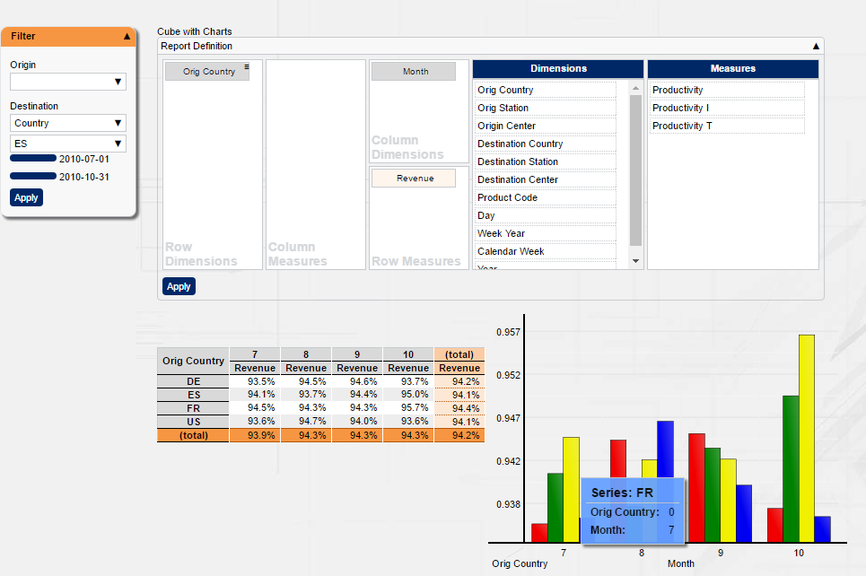

[[DocAbout]]
== About BCD-UI 5

=== Overview

BCD-UI 5 is a full-stack framework for building rich enterprise level web applications.
It bases on HTML5 and Java technologies and provides many artifacts typically needed in such environments.
BCD-UI can be used in any regular Java EE application, web profile of Java EE like Tomcat is already enough.

BCD-UI targets at developers who already today deliver or plan to deliver such applications
and find it hard to develop all functionality based on jQuery or Angular only, for example.

Some of BCD-UI's artifacts are:

* Configurable server side <<DocBindings,database access>> and data exchange via ready-to-use <<DocXmlData,web services>>
* Client-side <<DocCoreArtifacts,models>>, called DataProviders for retrieving, <<DocXsltLibrary,working>> with and displaying data
* Several elaborated <<DocWidgets,widgets>> needed in enterprise environments plus, menu, context menu, tooltips etc
* Ready-to-use components like <<DocCube,pivot reports>>, <<DocCharts,charts>> and <<DocScorecard,scorecards>>
* Export of <<DocExports,WYSIWYG and detail data>>
* Infrastructure for <<DocI18n,internationalization>>, <<DocSecurity,security>>, <<DocThemes,themeing>>

and many more as you will learn in this tutorial.

Assume you want to provide the user with the option of setting up a report
by defining dimensions and measures shown himself and filter on time and location like this:

You will be surprised how easy that is achieved with BCD-UI 5.
And going further and tweak the application to your needs is where BCD-UI continues supporting you,
so you can provide solutions with higher complexity and with less effort and less bugs than in the past.

With BCD-UI you are free to extend in any direction needed using standard technologies
and you are not limited to BCD-UI's components,
but often you will find an 80% solution already provided ready-to-use.

=== What about jQuery or Angular?

Good question, should you not rather use jQuery?
In fact, when using BCD-UI you will be using jQuery a lot directly and indirectly as BCD-UI itself is built with the help of jQuery and understands jQuery objects.
And while not using Angular directly, BCD-UI uses _web-components_, the same base that Angular is using for their modules
and you will find, the basic approach of Angular of dealing with data the on client and building reusable modules is very similar.

Yet, both libraries, like many others, limit themselves low-level development issues.
jQuery thankfully provides an API, which should have been part of the browser already, plus a rich set of UI-widgets.
Angular brings architecture to a javascript client, where before many solutions tried without.
Both is very important for emerging enterprise applications.

But in the end, they do not provide you with database access, components on higher abstraction levels,
security or ready-to-use components and leave these complex parts still for you.
Still, BCD-UI combines freely with of today's standard libraries, as it itself is only comprised by standard technologies and where necessary, glue ware can be built.

=== What about support?

Commercial support for BCD-UI 5 if necessary can be provided by http://www.business-code.de[BusinessCode GmbH^], a german based independent software vendor.
We already delivered literally hundreds of solutions in the past 10 years based on different versions of BCD-UI,
ranging from temporary installations to cover transitions of other solutions up to a number of large scale installations
with over 10.000 distinct user for enterprise-critical scenarios.
There is even a BCD-UI Enterprise Edition: BCD-UI-EE available, providing even more features and full life-cycle support.
In most cases we think, this is not needed and you will be fully enabled with the open-source edition.
