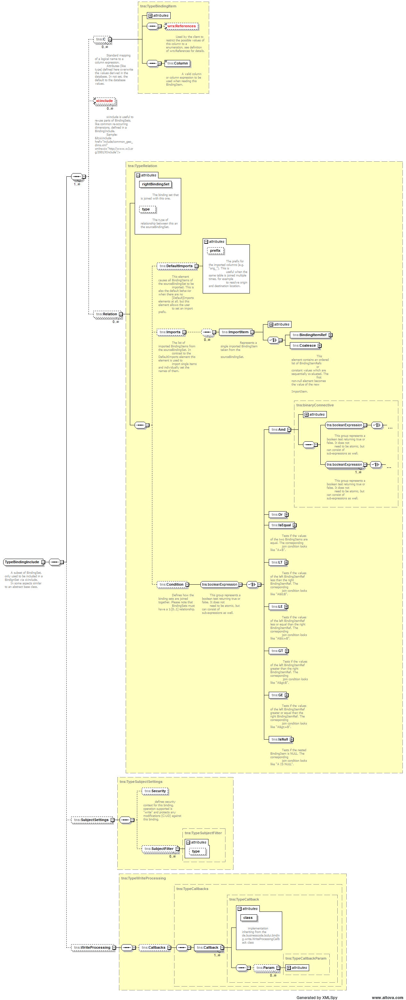

[[DocBinding]]
== Bindings

=== Bindings Overview

A binding defines the logical view of the application on the database.
Bindings are maintained in simple XML files and introduce the following capabilites:

Logical naming:: Logical names for views, tables (BindingSet) and columns (BindingItem) ease the user's understanding and allow to harmonize the data model.
Logical data types:: Logical type of a BindingItem (column) and other meta information beyond database's capability allow to adopt to a physical database.
Aggregation hierarchies - BindingGroups:: The option to choose best fit among multiple tables depending on the actual BindingItems (columns) needed, similar to a materialized view or join view,
i,e, for the current request the best fit (highest aggregationed) table is chosen
Relations, i.e. Joins:: The option to do join only if needed based on the actual BindingItem (column) addressed
Row level security:: The option to enforce constraints (Filter) on the SQL queries like user rights or language
Server values:: The option to enforce values server-side, for example the user's id.
Write pre- and processing:: The option to enforce additional processing of accesses to the database, for example application specific historization
Datasource:: Each BindingSets can refer to a different database.

Only tables and columns with a binding can be accessed by a BCD-UI application.
This mechanism enables the server to limit the data access of the front end
and provides meta information about the database columns.

=== Bindings Implementation

Bindings are maintained as xml files in WEB-INF/bcd/bindings in the following form:
A simple binding looks like the following:

[source,xml]
----
<b:BindingSet xmlns:b="http://www.businesscode.de/schema/bcdui/bindings-1.0.0" id="t_demo_options" table="T_DEMO_OPTIONS">
  <b:C id="country_code" caption="Country name">
    <b:Column>ctr_code</b:Column>
  </b:C>
  <b:C id="country_name">
    <b:Column>ctr_name</b:Column>
  </b:C>
</b:BindingSet>
----

A more complex sample:

[source,xml]
----
<b:BindingSet xmlns:b="http://www.businesscode.de/schema/bcdui/bindings-1.0.0" id="t_demo_options" table="T_DEMO_OPTIONS">
  <!-- Include a set of standard dimensions -->
  <xi:include xmlns:xi="http://www.w3.org/2001/XInclude" href="include/t_default_dimensions.xml"/>
  <!-- Left outer join only executed when mo_caption is requested -->
  <Relation rightBindingSet="filterServices" type="leftOuter">
    <Imports>
      <ImportItem name="mo_caption">
        <BindingItemRef name="service_scope"/>
      </ImportItem>
    </Imports>
    <Condition>
      <IsEqual>
        <BindingItemRef name="mo" side="left"/>
        <BindingItemRef name="mo" side="right"/>
      </IsEqual>
    </Condition>
  </Relation>
  <!-- BindingItem with additional list of allowed values, evaluated by the grid -->
  <b:C id="country_code" caption="Country name" display-size="0" scale="0" type-name="FLOAT" nullable="0" signed="true">
    <b:Column>ctr_code</b:Column>
    <!-- can also be an bRef -->
    <b:References>
      <!-- Can be any XML fragment. The values itself or as shown an include For foreign key relations This will be added to Column in Wrs ClientInclude is replaced by the server, client receives an xi:include instead, pointing to the inlined request client receives: <xi:include href="/webapp/model?guiStatusGZ=dsfjsalfjsaldkfj" xpointer="xpointer(/*/*)"/> if the model delivering this is registered at /webapp/model, alternatevly ClientInclude can hav a href attribute -->
      <b:ClientInclude xpointer="xpointer(/*/*)">
        <wrq:WrsRequest xmlns:wrq="http://www.businesscode.de/schema/bcdui/wrs-request-1.0.0">
          <wrq:Select id="a">
            <wrq:Columns>
              <wrq:C bRef="ctr_code"/>
              <wrq:C bRef="mo">
                <wrq:A bRef="monthName" name="caption"/>
              </wrq:C>
            </wrq:Columns>
            <wrq:From>
              <wrq:BindingSet>bd_ctr</wrq:BindingSet>
            </wrq:From>
          </wrq:Select>
        </wrq:WrsRequest>
      </b:ClientInclude>
    </b:References>
  </b:C>
  <!-- Standard list of BindingItems -->
  <b:C id="mo" type-name="NUMERIC">
    <b:Column>case when kpi_code is not null kpi_code else 'UnknonwKpi' end</b:Column>
  </b:C>
  <b:C id="kpi">
    <b:Column>kpi_code</b:Column>
  </b:C>
  <b:C id="i" type-name="NUMERIC">
    <b:Column>i</b:Column>
  </b:C>
  <b:C id="t" type-name="NUMERIC">
    <b:Column>t</b:Column>
  </b:C>
  <!-- Well-known BindingItem used by standard write-pre-processing -->
  <b:C id="updateStamp">
    <b:Column>bcdUpdateStamp</b:Column>
  </b:C>
  <!-- Used below to select only entries based on the user's language setting -->
  <b:C id="lang">
    <b:Column>language</b:Column>
  </b:C>
  <!-- Together with the right SubjectFilterType definition in subjectSettings.xml, this will enforce a filter on BindingItem lang -->
  <b:SubjectSettings>
    <b:SubjectFilter type="lang"/>
  </b:SubjectSettings>
  <!-- Enforce that each record written through this BindingSet will have the user and date set correctly -->
  <b:WriteProcessing>
    <b:Callbacks>
      <!-- refer to class documentation for more information. -->
      <b:Callback class="de.businesscode.bcdui.wrs.save.WrsModificationLog"/>
    </b:Callbacks>
  </b:WriteProcessing>
</b:BindingSet>
----

=== BindingSet features

==== Row-level-security

When reading from a BindingSet via Wrs, the access can be limitted for a user on row-level.
For example a user may only see entries for UK even if the query does not have this restriction.
With the same method, a user's language setting can be applied to a i18n caption lookup table in the background.
This is done via a server-side added where constraint depending on user settings.
This is configured by cooperation of the following three artifacts:

. A scc:SubjectFilterType definition
+
A SubjectFilterType in WEB-INF/bcdui/subjectSettings.xml defines the BindingItem on which to apply the restriction
and a BindingSet with the user's rights, default is bcd_sec_user_settings.
+
[source,xml]
----
<SubjectSettingsConfig xmlns="http://www.businesscode.de/schema/bcdui/subjectsettings-1.0.0">
  <SubjectFilterTypes>
    <SubjectFilterType name="geo:ctr">
      <Caption>Countries</Caption>
      <BindingSet>countryRights</BindingSet>
      <BindingItems>
        <C bRef="country"/>
      </BindingItems>
    </SubjectFilterType>
  </SubjectFilterTypes>
  <!-- ... -->
</SubjectSettingsConfig>
----
+
The SubjectFilterType "geo:ctr" defines a check on country. countryRights will hold one row per allowed country.
+
[options="header"]
|===
|Column|Content
|bcd_user_id|Id of the user this permission is assigned to.
|bcd_right_type|Optional. Id of the permission the values relate to. if not present, all values are expected to belong to geo:ctr
|bcd_right_value|An allowed values.
|===

. A reference to such a definition in BindingSet.
+
In the restricted BindingSet you just need to refer to such a SubjectFilterType and have the BindingItem with the correct id country.
+
[source,xml]
----
<BindingSet xmlns="http://www.businesscode.de/schema/bcdui/bindings-1.0.0" id="rowLevelBs">
  <!-- all C's etc ... -->
  <C id="country">..</C>
  <!-- all C's etc ... -->
  <SubjectSettings>
    <SubjectFilter type="geo:ctr"/>
  </SubjectSettings>
</BindingSet>
----
+
. Assigned values regarding this permission to the current user in bcd_sec_user_settings.
+
Well-known BindingSet bcd_sec_user_settings is expected to have three BindingItems: user_id, right_type and right_value.
Each row assigns an allowed country to a user for the geo:ctr right.

==== References

References define lists of values for BindingItems like enumerations in Java. The values can either be directly specified
in the BindingSet XML or loaded via an XInclude. The latter is useful when the list of values comes from another database
table so that it behaves like a foreign key relationship in SQL. This is transformed to the full Wrs format by the server.
The name of the columns (attributes) are dynamic, the names of the Elements WrsSimple, R are mandatory.

[source,xml]
----
<b:References xmlns:b="http://www.businesscode.de/schema/bcdui/bindings-1.0.0">
  <w:WrsSimple xmlns:w="http://www.businesscode.de/schema/bcdui/wrs-1.0.0">
    <w:R caption="Mon" value="1"/>
    <w:R caption="Tue" value="2"/>
    <w:R caption="Wed" value="3"/>...</w:WrsSimple>
</b:References>
----

The relationship is to be evaluated by the client and not enforced by the server.

==== Bindings write-protection

If (and only if) a WEB-INF/bcdui/subjectSettings.xml is present in a project, all BindingSets are write protected when accessed via Wrs.
To allow a user to insert into or update a view/table behind a BindingSet, you must

. Define that the BindingSet is write-able via an bnd:SubjectSettings/bnd:Security/bnd:Operation entry
+
To configure security on your binding do the following:
+
[source,xml]
----
<BindingSet xmlns="http://www.businesscode.de/schema/bcdui/bindings-1.0.0">
  <!-- all C's etc ... -->
  <SubjectSettings>
    <Security>
      <Operation name="write" permission="perms1 perms2:ctx1 perms2:ctx2"/>
    </Security>
    <!-- possible SubjectFilter elements ... -->
  </SubjectSettings>
</BindingSet>
----
+
. Provide the user with sufficient rights

Currently Binding understands only one operation called _write_ which protects ANY modification to a table (C-UD),
the _permission_ takes a list (space separated) of permissions which are evaluated by Shiro, hence Shiro's syntax
can be applied here. *Note:* the list is inclusive, meaning that the operation is granted only in case the user
retains ALL permissions listed. The permission list may also be empty or be absent at all, in such a case NO check is
done for this operation, thus it effictively disables write-protection.

==== Write pre-processing

The optional write pre-processing allows to enforce additional processing of data before it is written to the BindingSet.
A project specific callback derived from the  `de.businesscode.bcdui.binding.write.WriteProcessingCallback` 
can be called to modify the data to be written, for example for security reasons.
When multiple callbacks are configured, they are called in given order.
An callback receives the following events:

* endHeader
* endDataRow

See above configuration for an example.

===== WrsModificationCallback

WrsModificationCallback is a general implementation of de.businesscode.bcdui.binding.write.WriteProcessingCallback offering WRS values manipulation on the server.
The class is setup using parameters in the Binding definition document. Please consult the API documentation on class de.businesscode.bcdui.binding.write.WrsModificationCallback for
further information.

In short, this callback allows you to provide server-side or constant values for WRS data, to either coalesce it with data sent from client and
even to assure the data to exist whether is has been send from client or not. A sample:

[source,xml]
----
<BindingSet xmlns="http://www.businesscode.de/schema/bcdui/bindings-1.0.0" id="bcd_test_table" table="bcd_test_table">
  <C id="someValue_name" type-name="VARCHAR" isKey="true">
    <Column>TEST_NAME</Column>
  </C>
  <C id="someOtherValue" type-name="NUMERIC">
    <Column>TEST_VALUE</Column>
  </C>
  <SubjectSettings>
    <Security>
      <Operation permission="" name="write"/>
    </Security>
  </SubjectSettings>
  <WriteProcessing>
    <Callbacks>
      <Callback class="de.businesscode.bcdui.binding.write.WrsModificationCallback">
        <!-- for someValue_name binding item the value is either taken from client or (if null) the value 'server value' will be written to database -->
        <Param bindingItemId="someValue_name" expression="server value"/>
        <!-- since coalesce is set to false, someOtherValue binding-item will always be written value: 'session: ...' to database -->
        <Param bindingItemId="someOtherValue" expression="session: ${bcdBean.sessionId}" isCoalesce="false"/>
      </Callback>
    </Callbacks>
  </WriteProcessing>
</BindingSet>
----

===== Ready to use WrsModificationLog

WrsModificationLog is a convenience implementation of de.businesscode.bcdui.binding.write.WrsModificationCallback offering WRS modification logs.
It maintains the items:

* bcdUpdateStamp
* bcdUpdateBy
* bcdCreateStamp
* bcdCreateBy

as appropriate. See class documentation for more information.

[source,xml]
----
<BindingSet xmlns="http://www.businesscode.de/schema/bcdui/bindings-1.0.0" id="bcd_test_table" table="bcd_test_table">
  <C id="someValue_name" type-name="VARCHAR" isKey="true">
    <Column>TEST_NAME</Column>
  </C>
  <C id="someOtherValue" type-name="NUMERIC">
    <Column>TEST_VALUE</Column>
  </C>
  <C id="bcdUpdateStamp" type-name="TIMESTAMP" isReadOnly="true">
    <Column>update_stamp</Column>
  </C>
  <C id="bcdUpdateBy" type-name="VARCHAR" isReadOnly="true">
    <Column>update_by</Column>
  </C>
  <C id="bcdCreateStamp" type-name="TIMESTAMP" isReadOnly="true">
    <Column>create_stamp</Column>
  </C>
  <C id="bcdCreateBy" type-name="VARCHAR" isReadOnly="true">
    <Column>create_by</Column>
  </C>
  <SubjectSettings>
    <Security>
      <Operation permission="" name="write"/>
    </Security>
  </SubjectSettings>
  <WriteProcessing>
    <Callbacks>
      <Callback class="de.businesscode.bcdui.binding.write.WrsModificationLog"/>
    </Callbacks>
  </WriteProcessing>
</BindingSet>
----

==== BindingSetGroup

This is a EnterpriseEdition extension, not available in the CommuniteEdition.
A BindingSetGroup allows to be treated as a BindingSet but the actual BindingSet used depends on the list of BindingItems being requested.
The first BindingSet in order providing all BindingItems is chosen. This allows for example to

* Redirect a request to the table with the highest aggregation level providing all required dimensions
* Redirect a request to a table with the right dimensions, for example cw vs. month.

Therefore this feature is very useful for optimizing database performance.

[source,xml]
----
<b:BindingSetGroup xmlns:b="http://www.businesscode.de/schema/bcdui/bindings-1.0.0" id="shipmentCube">
  <b:BindingSetRef idRef="t_demo_shipment_kpi_mo"/>
  <b:BindingSetRef idRef="t_demo_shipment_kpi_cw"/>
  <b:BindingSetRef idRef="t_demo_shipment_detail"/>
</b:BindingSetGroup>
----

==== Caching

Per default Bindings are parsed during application start only and cached for subsequent accesses.
By <<DocCaching,disabling caching>>, a binding are re-parsed on every access to it, allowing to change bindings on the fly during development.

==== BindingInclude / XInclude

Recurring groups of BindingItems, for examples sets of levels of a dimension or sets of measures do not need to be repeated in all
BindingSets but can be included on xml level via xi:include. If you use  `b:BindingInclude`  as root, the BindingSet will not
be instantiated itself but is only for importing it elsewhere.

==== Relations

Relations allow for optionally left-outer-joining lookups if the BindingItem defined in a relation is requested.

==== Details

