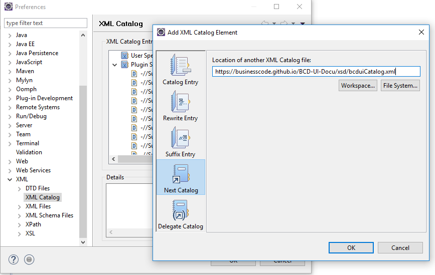
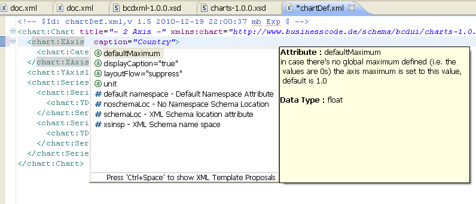
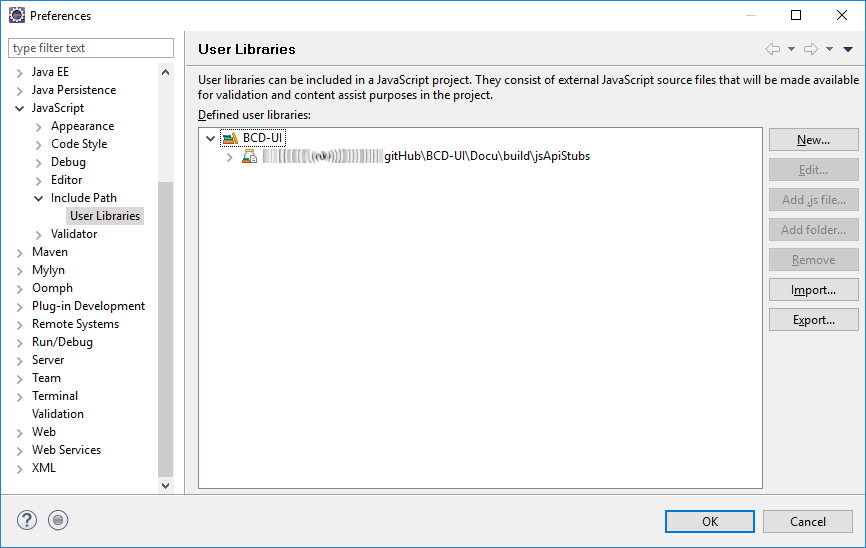
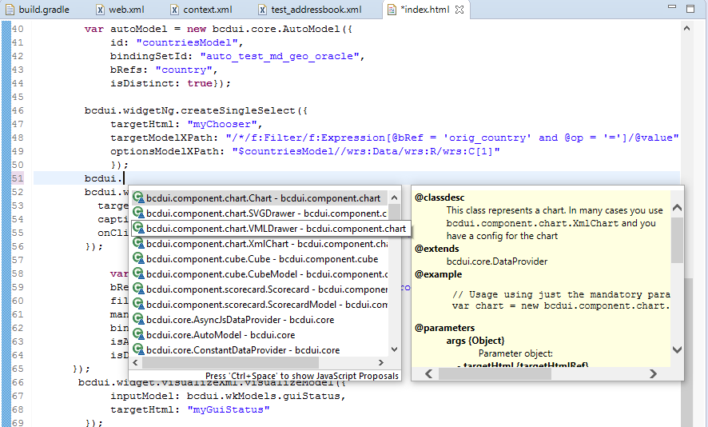
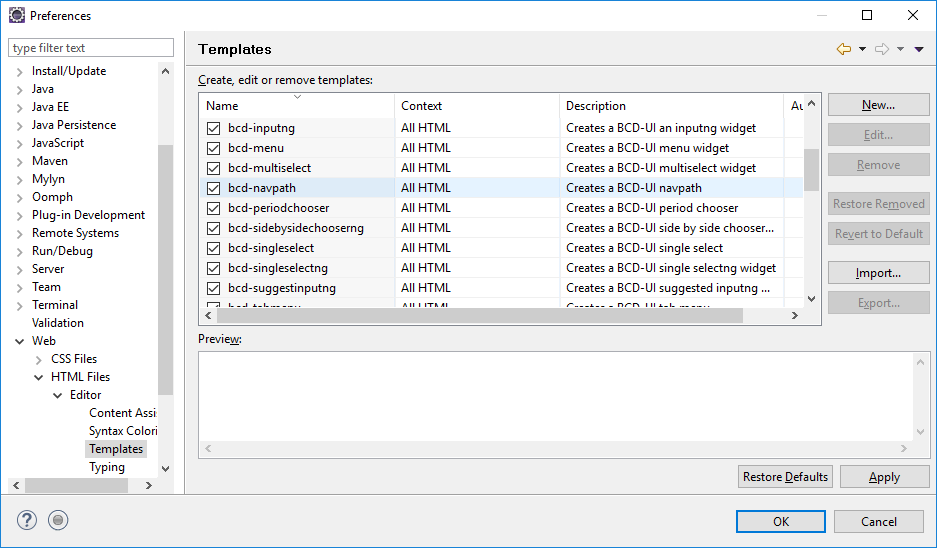
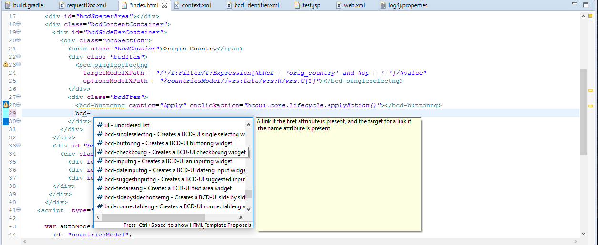

[[DocBootstrap]]
== Bootstrap

This chapter guides you through the steps of initially setting up your development environment.
Often you will have this already and you can skip the first part.

=== Get the tools

To start development with BCD-UI, first get the tools:

* Make sure you have jdk 8 or higher.
* Install an IDE of your preference, we assume Eclipse in our samples +
At the time of writing this document, the Eclipse Neon is not recommended, because JavaScript support is not working properly.
* Install a Java EE web server like Oracle Weblogic, IBM Websphere or JBoss, we assume Tomcat 8 in our examples
* Add Tomcat as a server to Eclipse menu:File[New > Server > Apache > Tomcat]
* Make sure you use IE 11, Chrome or FireFox for the tutorial +
MS Edge or older IE browser versions are only partly supported, please contact us for details.

For performance reason you should allow compression for static resources for Tomcat change in server.xml,
see link:https://github.com/businesscode/BCD-UI/blob/master/Server/configFiles/tomcat/server.xml[BCD-UI/Server/configFiles/tomcat/server.xml, window="_blank"]
There the compression is turned on for a list of mime/types.

=== XML schema xsd catalog

Adding the XML schema catalog of BCD-UI to your workspace will support you in creating xml configuration files for BCD-UI
by linking to `https://businesscode.github.io/BCD-UI-Docu/xsd/bcduiCatalog.xml`

For Tomcat, follow these steps:

will bring you:

==== Javascript Api stubs

BCD-UI provides JavaScript API. Add these to your IDE and you will have auto-complete while editing JavaScript.
The Javascript files can be obtained here: "ADD_LOCATION".
For Eclipse the stubs can be added via menu:Preferences[JavaScript > Include Path> User Library].
First add a new library 'BCD-UI' and then add the folder containing the stubs you downloaded. (Add Folder...)

will bring you, code completion and help tooltips while hovering with your mouse:

==== HTML 5 Custom Elements

The Eclipse IDE has a feature to allow code templates to be inserted for html files.
It is possible to add the custom elements registered by BCD-UI as templates so that there is a kind of code completion.
To achieve this, import bcdui-templates.xml via menu:Preferences[Web > HTML Files > Editor > Templates].
The elements should then appear in the template list.

While editing html files the templates popup can be opened with kbd:[CTRL+SPACE] and the list of BCD-UI elements should be found as shown here:

