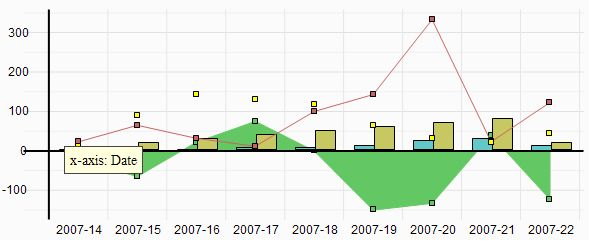
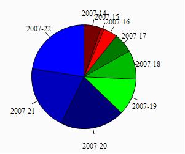
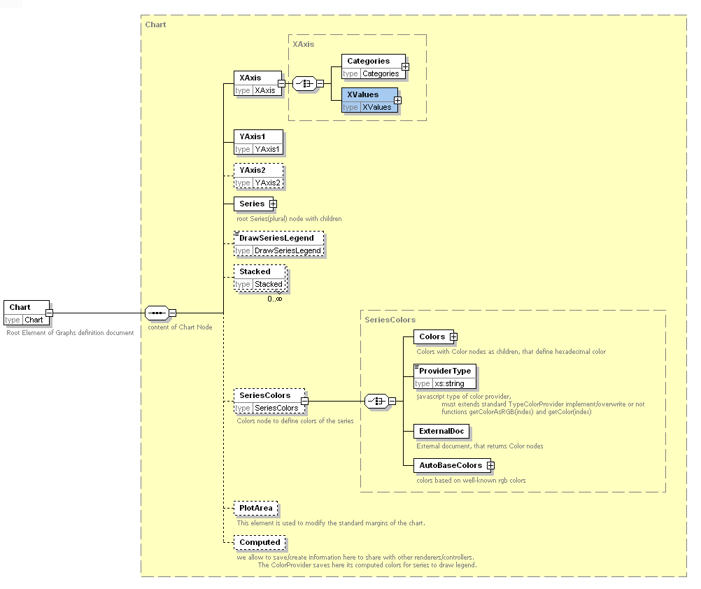
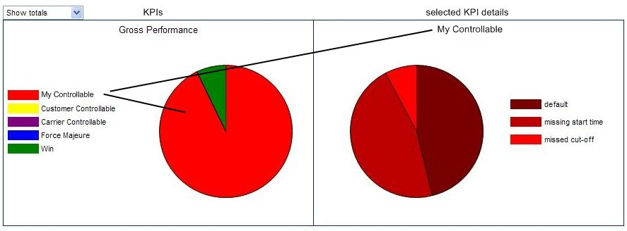
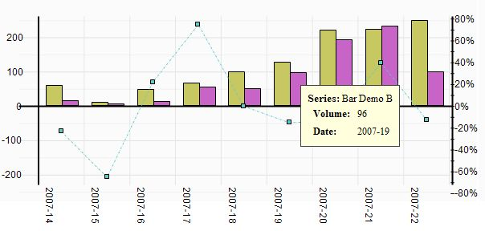
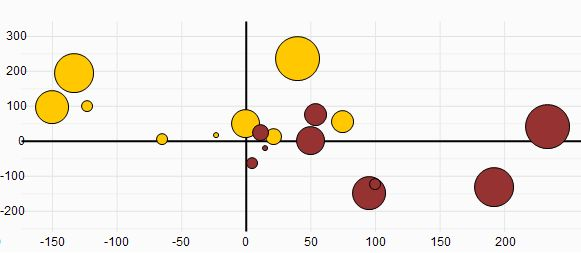
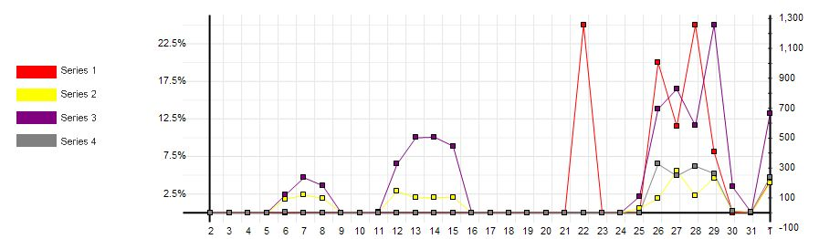
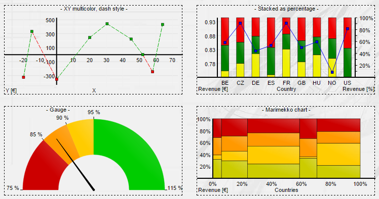
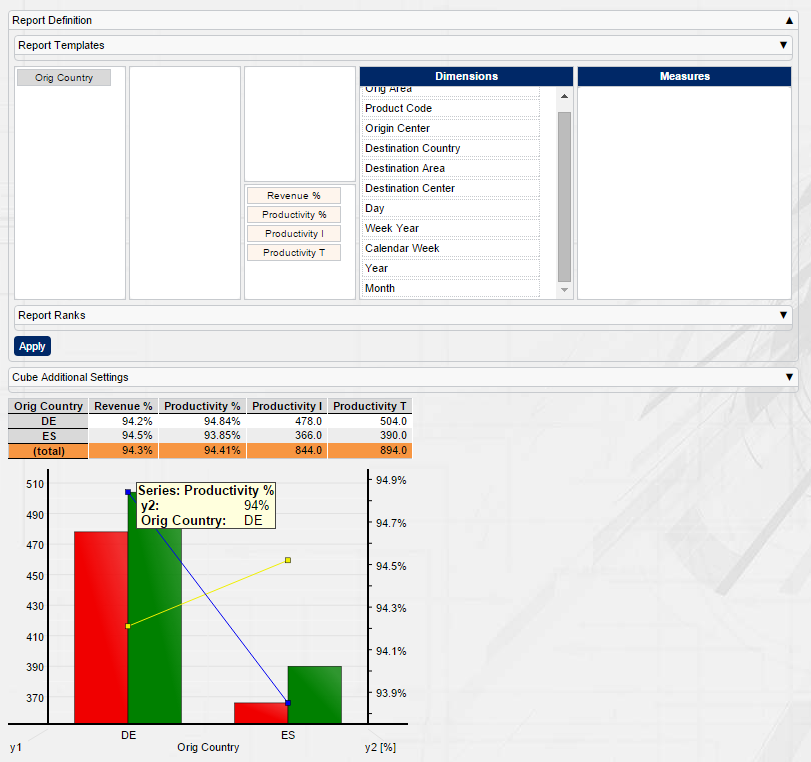

[[DocCharts]]
== Charts

=== Charts

BCD-UI supports all standard chart types for reporting

The charts can be easily integrated into pages and support all dynamics provided by the library.
For example a report allowing to order or filter data can be enhanced by a chart reflecting these changes
immediately. Also, it is possible to use the chars for drilling or selecting as they are sensitive to user interaction.
Some of the core features of BCD-UI graphs are

* Supporting all standard chart types: Pie, Line, Point, Area, Bar, Scattered, Stacked Bar and Stacked Area with 1 and 2 y-axes
* Sensitive to user interaction like hover and click on individual bars or pieces in a pie chart
* Supporting on-the-fly dynamics and re-rendering on the client
* Export to Excel as charts and to PDF as vector graphics
* Easy integration with existing reports with custom calculations, as it is re-using client data and sensitive to client side data manipulations
* Appearance can be controlled via a dynamic model allowing for switching layout and data source on the fly
* Customer tool tips, on click actions, customer and automatic colors and scaling
* Development support with error checking via Eclipse plugin
* Support for IE6+, FireFox, Chrome, Safari

=== Usage

To include a chart into a page a jsp tag is available.
The chart definition itself, the chart type and the source of the data and all other aspects are given in a Chart XML document.
The chart definition document can be loaded from the server, created on the fly or given explicitly inside the chart tag.
The chart is displayed in a given HTML tag or at the place corresponding to the jsp chart tag.

*For charts it is mandatory to set a canvas.* Its either set inside the chart definition document (see sample) or its taken
from implicitly set html element size, assigned wither via CSS or via style attribute.

[source,xml]
----
<html xmlns:cmp="jsp taglib" xmlns:core="jsp taglib" xmlns:b="jsp taglib">
  <!-- Chart data model for example with the country code in column 1 and the revenue % in column 4 -->
  <core:model id="data" source="./myChartData.xml"/>
  <!-- The chart itself -->
  <cmp:chart id="chart1">
    <cmp:metaData>
      <b:inlineModel>
        <chart:Chart xmlns:chart="http://www.businesscode.de/schema/bcdui/charts-1.0.0" width="320" height="200">
          <chart:XAxis caption="CW">
            <chart:Categories modelId="data" nodes="/wrs:Wrs/wrs:Data/wrs:R/wrs:C[1]"/>
          </chart:XAxis>
          <chart:YAxis1 caption="Revenue %"/>
          <chart:Series>
            <chart:Series caption="Revenue" chartType="BARCHART">
              <chart:YData modelId="data" nodes="/wrs:Wrs/wrs:Data/wrs:R/wrs:C[4]"/>
            </chart:Series>
          </chart:Series>
        </chart:Chart>
      </b:inlineModel>
    </cmp:metaData>
  </cmp:chart>
</html>
----

For a full list of options, please check the xsd for the charts.

=== Sample charts

More samples for charts

==== Sensitive chart

Charts are sensitive to user activity. For Example a click on a piece in the left pie chart will flip the content of the right one.
The right one will immediately show a break down of the piece clicked on in the left part.
Furthermore a change in the drop down box from "Show totals" to "Show failed" will also flip the charts immediately.

==== Charts with 2 axes

This sample shows a graph with to different axes and a fly-over on the a chart line when hovering with the mouse over the chart.

==== Scattered chart

A scattered chart can display three values at a time, here the x-position of a circle shows the size of the customer,
the y position shows the revenue done with the customer and the size of the circle shows the growth of the revenue done
with the customer in the last 12 months.

==== Pie charts

This sample shows that chart can be created with auto-coloring or printer friendly in black-and white.

image::images/charts_pieCharts_ColorPlusBw.png[]

==== Legend

Of course, charts can have legends.

==== More examples

There are even more charts available, like stacked bar charts, gauge, marimekko and multi color line charts.

=== Auto Charts

BCD-UI also offers functionalities to quickly visualize e.g. cube results as a chart. There are some restrictions for automatic charts on cubes:

* One Measure and one row plus one column dimension= column dimension, row dimension determines the series.
* One Measure and two row-dimensions. Categories = Outer dimension, inner dimension determines the series.
* One Measure and two column-dimensions. Categories = Outer dimension, inner dimension determines the series.
* Multiple Measures and one row dim. Each measure becomes a series. Allows bar, line, point and area (pie in case of 1 measure)
* Multiple Measures and one column dim. Each measure becomes a series. Allows bar, line, point and area (pie in case of 1 measure)
 
See the following tiny example for an automated chart area for a cube. We got some container divs holding the cube, the cube configurator and the charts.
Then we use javascript to create the cube and the cube configurator (see cube documentation for details). A model wrapper generates the cube model out
of the cube data. Finally we create the chart. 

[source,html]
----

  

  

  

----

