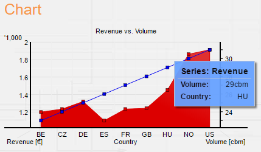
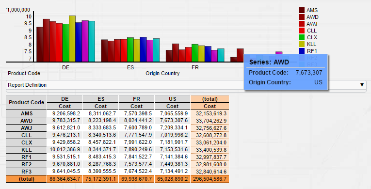
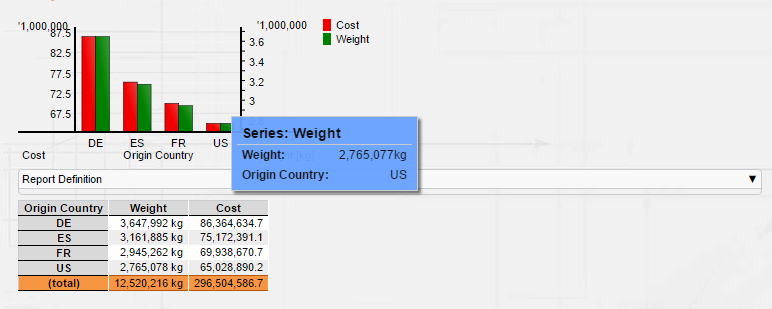

[[DocCharts]]
== Chart Component

=== Charts Overview

Charts can be easily integrated into pages and support the dynamic user experience of BCD-UI.
For example a report allowing to order or filter data can be enhanced by a chart reflecting these changes immediately.
Charts do also support for user interaction.
For example drilling from an item of the chart or exporting data can be developed.

.Some of the core features of BCD-UI graphs are
* Supporting all standard chart types: Pie, Line, Point, Area, Bar, Scattered, Stacked Bar and Stacked Area with 1 and 2 y-axes
* Sensitive to user interaction like hover and click on individual bars or pieces in a pie chart
* Supporting on-the-fly creation and modification on the client
* Export as images and to PDF
* Easy integration with existing reports with custom calculations, as it is re-using client data and sensitive to client side data manipulations
* Appearance can be controlled via a dynamic model allowing for switching layout and data source on the fly
* Customer tool tips, on click actions, customer and automatic colors and scaling

=== Usage

To use a chart, you need to setup a chart configuration, provide the data and create the chart itself.

Create a file with a sample chart configuration like this:
[source,xml]
----
include::../../../BCD-UI-Tutorial/web/charts/chartConfig.xml[]
----
<1> This controls the x-axis, which model the data comes from and which nodes to include
<2> This controls the y-axis, like unit, size and caption
<3> Each data series can have a different appearance

Then add this to your page:
[source,html]
----
include::../../../BCD-UI-Tutorial/web/charts/index.html[tag=chartTH]
----
<1> Note that we assigned an explicit size.

NOTE: Charts require an explicit size of their target HTML element.
Set it either inside the chart definition or assign it via CSS.
Otherwise 'No data' may be shown though there is data

And add this Javascript code:
[source,javascript]
----
include::../../../BCD-UI-Tutorial/web/charts/index.html[tag=chartJs]
----
<1> In our sample we are using the Wrs, which is shown in <<DocSimpleReq,Your first BCD-UI page>>, you may also use that and create a file chartData.xml from it.
Note that we assigned an explicit id to the data as it is referenced via id from within chartConfig.xml
<2> The link:../jsdoc/bcdui.component.chart.XmlChart.html[bcdui.component.chart.XmlChart^] takes a configuration XML

These few lines already result in

=== Sample charts

==== Charts with 2 axes

This sample shows a graph with to different axes and a fly-over on the a chart line when hovering with the mouse over the chart.

image::images/charts_chart2Axes.png[]

==== Scattered chart

A scattered chart can display three values at a time, here the x-position of a circle shows the size of the customer,
the y position shows the revenue done with the customer and the size of the circle shows the growth of the revenue done
with the customer in the last 12 months.

image::images/charts_scattered.png[]

==== Pie charts

This sample shows that chart can be created with auto-coloring or printer friendly in black-and white.

image::images/charts_pieCharts_ColorPlusBw.png[]

==== Legend

Charts can have legends.

image::images/charts_chartWithLegend.png[]

==== More examples

There are even more charts available, like stacked bar charts, gauge, marimekko and multi color line charts.

image::images/charts_examples.png[]

=== Auto Charts

Sometimes you may not even need an explicit chart configuration, if a useful chart can be derived from Wrs data alone.

Auto charts provide the following heuristics:

One Measure and one row plus one column dimension:: column dimension, row dimension determines the series.
One Measure and two row-dimensions. Categories:: Outer dimension, inner dimension determines the series.
One Measure and two column-dimensions. Categories:: Outer dimension, inner dimension determines the series.
Multiple Measures and one row dim:: Each measure becomes a series. Allows bar, line, point and area (pie in case of 1 measure)
Multiple Measures and one column dim:: Each measure becomes a series. Allows bar, line, point and area (pie in case of 1 measure)

.Where to place the chart
[source,html]
----
include::../../../BCD-UI-Tutorial/web/minimalCube/index.html[tag=chartTH]
----

.Create the chart itself
[source,javascript]
----
include::../../../BCD-UI-Tutorial/web/minimalCube/index.html[tag=chartFromCube]
----

This chart is dynamically derived from the cube without predefined chart config:

.Sample AutoChart with two dimensions and one measure

After the user did some new selections in the cube's drag and drop area, this one is created.
Note how a second axis was created because the measures have different units.

.Sample AutoChart with one dimensions the measure

=== Options

For a full list of options, please check the xsd for the charts
link:https://github.com/businesscode/BCD-UI/blob/master/Docu/xsd/charts-1.0.0.xsd[charts-1.0.0.xsd^].

image::images/charts_chartsXsd.png[]

