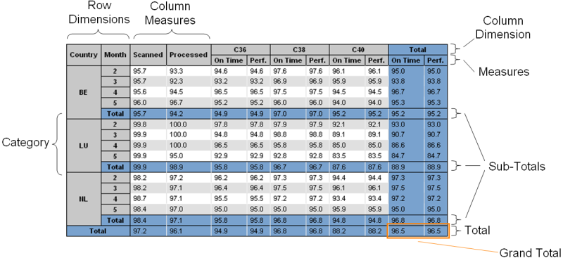
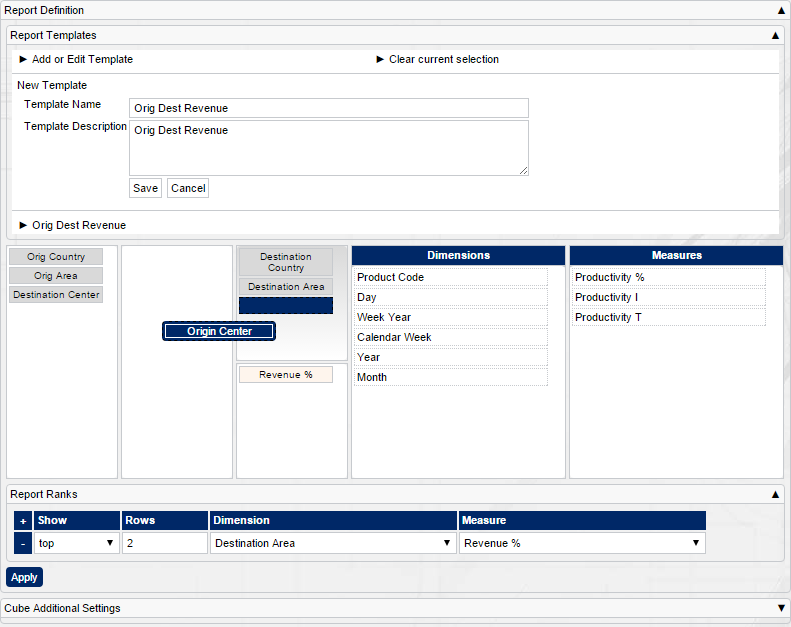
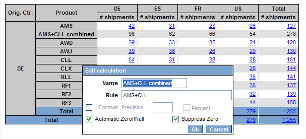
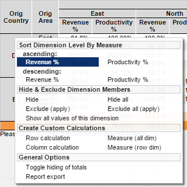
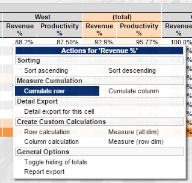
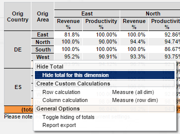

[[DocCube]]
== Cubes

=== Cubes

Cubes allow to slice and dice data by free dimensions easily and quick in a pivot-like manner. For a quick page setup with a cube, please check this <<DocMinimalCube,tutorial>>.

The dimensions and measures can either be preset by the administrator or the user can be given a choice of dimensions and measures for his own selection.
Each cell can have detail export functionality, which takes the cell's position and the choosers into account.
So the user will get exactly the data behind the numbers in the cell. If for example an order related KPI is shown, it is possible to only export the failed orders.

==== Features

This sample shows the drag and drop interface for the definition of the cube's dimensions and measures:

Besides simple singe drag'n drop operations, the interface allows multi item drag'n drop via mouse and keyboard and other features like select items by typing.

BCD-UI cube and cube configurator offer a variety of features:

Free selectable or preset dimensions and measures:: Whether the administrator allows free selection of dimensions or measures partly or totally can be configured
WYSIWYG export into PDF and spread sheets:: The spread sheet export allows to further work wih the numbers. User formulas are be replaced by the calculation results.
Sorting:: Sorting can be done without the need to re-run the report
Ranking:: Allows top or bottom n rows dimension/measure selections
Subtotals and grand totals:: Can be added on the fly without the need to re-run the report
User editable formulas for cell values:: Can be added on the fly without the need to re-run the report
Detail export on cell level:: The choosers as well as the cell's position is taken into account. This allows to exactly export those details which are behind the cell's number. For percentage numbers it is possible to export only the failed details.
Easy combination with graphs:: Multi measures or multi-dimensions can easily be turned into series in the graphs. Fly-over graphs are also possible.
Templates for selected dimensions and measures to limit the options or to make selecting common scenarios faster:: Named templates allow to store often used selections
Multi row and column dimensions are possible:: None, one or many break down dimensions can be selected independently for rows and columns. In addition measures can be shown so that they are only broken down be row dimensions even if also column dimensions are selected
Show numerator and denominator of percentage numbers and fractions in tool tips:: This nice feature allows to understand the volumes behind the percentage without running a new report.
Optimized performance behavior:: Cubes can choose different data base tables with best/highest aggregation available for the report dynamically with the help of <<DocBinding,BindingSetGroups>> for performance optimization

Various actions can be executed on the shown cube. For this you have a default (and custom) cube context menu which support actions like sorting, cumulation, hiding totals, etc.

==== Cube Configuration Document

The cube needs a configuration file (by default: cubeConfiguration.xml) which lists the data source (binding set), the current layout (selected dimensions and measures) and the measure definitions. Here you can see a sample cube definition document:

[source,xml]
----
<CubeConfiguration xmlns="http://www.businesscode.de/schema/bcdui/cube-2.0.0" xmlns:cube="http://www.businesscode.de/schema/bcdui/cube-2.0.0" xmlns:calc="http://www.businesscode.de/schema/bcdui/calc-1.0.0" xmlns:dm="http://www.businesscode.de/schema/bcdui/dimmeas-1.0.0" xmlns:wrq="http://www.businesscode.de/schema/bcdui/wrs-request-1.0.0">
  <wrq:BindingSet>vw_data</wrq:BindingSet>
  <Layout>
    <cube:Measures>
      <cube:RowDims/>
      <cube:AllDims>
        <dm:MeasureRef idRef="meas1"/>
        <dm:MeasureRef idRef="meas2"/>
      </cube:AllDims>
    </cube:Measures>
    <Dimensions hideTotals="false">
      <Rows>
        <dm:LevelRef total="trailing" bRef="country" caption="Country"/>
      </Rows>
      <Columns>
        <dm:LevelRef total="trailing" bRef="product_code" caption="Product Code"/>
      </Columns>
    </Dimensions>
  </Layout>
  <dm:Measures>
    <dm:Measure id="meas1" caption="Measure 1">
      <calc:Calc type-name="NUMERIC">
        <calc:Add>
          <calc:ValueRef idRef="val1" aggr="sum"/>
          <wrq:Count>
            <wrq:Distinct>
              <wrq:Concat>
                <wrq:ValueRef idRef="val2"/>
              </wrq:Concat>
            </wrq:Distinct>
          </wrq:Count>
        </calc:Add>
      </calc:Calc>
    </dm:Measure>
    <dm:Measure id="meas2" caption="Measure 2">
      <calc:Calc type-name="NUMERIC">
        <calc:Add>
          <calc:ValueRef idRef="val1" aggr="sum"/>
          <calc:ValueRef idRef="val4" aggr="avg"/>
        </calc:Add>
      </calc:Calc>
    </dm:Measure>
  </dm:Measures>
</CubeConfiguration>
----

==== Cube Configurator

The link:#dnd[drag'n drop interface, window="_blank"] is the so called cube configurator which actually prepares a layout for you. Additional features are template management, ranking editing and a cube summary display.
This configurator also needs a configuration file (by default: dimensionsAndMeasures.xml) which references dimensions and measures which can be picked by the front end user.
Here you can see a sample file which lists several dimension and measure references with custom captions, trailing totals and it also includes predefined layouts from the virtual file system which will
be presented in the cube template manager section. 

[source,xml]
----
<DndOptions xmlns:bcdxml="http://www.businesscode.de/schema/bcdui/bcdxml-1.0.0" xmlns:cube="http://www.businesscode.de/schema/bcdui/cube-2.0.0" xmlns:dm="http://www.businesscode.de/schema/bcdui/dimmeas-1.0.0">
  <cube:Dimensions>
    <dm:LevelRef bRef="orig_country" total="trailing" caption="Orig Country"/>
    <dm:LevelRef bRef="orig_area" total="trailing" caption="Orig Area"/>
    <dm:LevelRef bRef="product_code" total="trailing" caption="Product Code"/>
    <dm:LevelRef bRef="orig_center" total="trailing" caption="Origin Center"/>
    <dm:LevelRef bRef="dest_country" total="trailing" caption="Destination Country"/>
    <dm:LevelRef bRef="dest_area" total="trailing" caption="Destination Area"/>
    <dm:LevelRef bRef="dest_center" total="trailing" caption="Destination Center"/>
    <dm:LevelRef bRef="dy" total="trailing" caption="Day"/>
    <dm:LevelRef bRef="cwyr" total="trailing" caption="Week Year"/>
    <dm:LevelRef bRef="cw" total="trailing" caption="Calendar Week"/>
    <dm:LevelRef bRef="yr" total="trailing" caption="Year"/>
    <dm:LevelRef bRef="mo" total="trailing" caption="Month"/>
  </cube:Dimensions>
  <cube:Measures>
    <dm:MeasureRef idRef="mRevenue" caption="Revenue %"/>
    <dm:MeasureRef idRef="mProductivity" caption="Productivity %"/>
    <dm:MeasureRef idRef="mProductivity_i" caption="Productivity I"/>
    <dm:MeasureRef idRef="mProductivity_t" caption="Productivity T"/>
  </cube:Measures>
  <bcdxml:include isRequired="false" href="../../vfs/reports/CubeWithCharts/layouts.xml"/>
</DndOptions>
----
