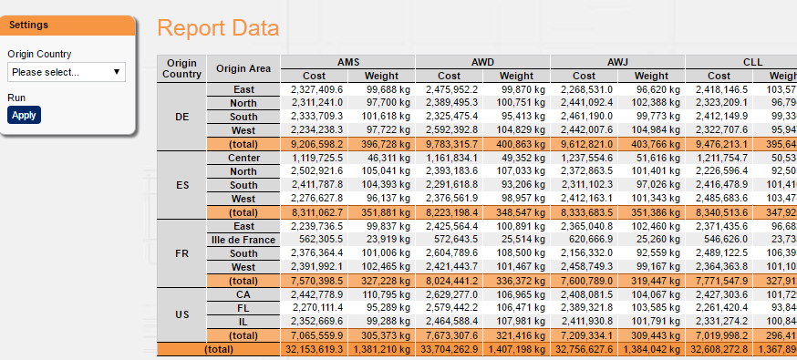

[[DocCube]]
== Cube Component

=== Cubes

Cubes allow to slice and dice data by free dimensions easily and quick in a pivot-like manner.
For a sample page setup with a cube, please check this <<DocMinimalCube,tutorial>>.

image::images/cube_cubeBody.png[]

The dimensions and measures can either be preset during development or the user can be given a choice of dimensions and measures for his own selection.

==== Features

BCD-UI cube and cube configurator offer a variety of features:

Free selectable or preset dimensions and measures:: Whether the administrator allows free selection of dimensions or measures partly or totally can be configured
Row and column dimensions are possible:: None, one or many break down dimensions can be selected independently for rows and columns. In addition measures can be shown so that they are only broken down be row dimensions even if also column dimensions are selected.
WYSIWYG export into PDF and spread sheets:: The spread sheet export allows to further work wih the numbers. User formulas are be replaced by the calculation results.
Sorting:: Sorting can be done without the need to re-run the report
TOP-N:: Allows top or bottom n rows dimension/measure selections
Subtotals and grand totals:: Can be added on the fly without the need to re-run the report
User editable formulas for cell values:: Can be added on the fly without the need to re-run the report
Detail export on cell level:: The choosers as well as the cell's position is taken into account. This allows to exactly export those details which are behind the cell's number. For indicator-like percentage numbers it is possible to export only the failed details.
Easy combination with graphs:: Multi measures or multi-dimensions can easily be turned into series in the graphs.
Named templates:: Named templates allow to offer common selections to the user
Show numerator and denominator of percentage numbers and fractions in tool tips:: This feature allows to understand the volumes behind the percentage without running a new report.
Optimized performance behavior:: Cubes can dynamically choose different data tables with highest aggregation available for the report dynamically with the help of <<DocBinding,BindingSetGroups>> for performance optimization.

image::images/cube_cubeCalculation.png[]

A context menu supports several actions on the cube or a cell, depending on where it opens.

image::images/cube_context1.png[]

image::images/cube_context2.png[]

image::images/cube_context3.png[]

==== Cube Configuration Document

The cube needs a configuration file (by default: `./cubeConfiguration.xml`) which lists the data source (binding set), the current layout (selected dimensions and measures) and the measure definitions. +
You can provide a static one like this or let the user build one with the CubeConfigurator, see below.

[source,xml]
----
include::../../../BCD-UI-Tutorial/web/cube/cubeConfiguration.xml[]
----
<1> This is the actual layout of the cube, its elements references items defined in the next sections
<2> This are the actual applied dimensions of the report, they can be row, column or both (all)
<3> This are the actual applied measures
<4> This is the BindingSet from which to get the data, it connects to the database
<5> These are the dimensions in principle available. In most cases this included via is `xi:include` because it is reused
<6> These are the measures in principle available. In most cases this included via is `xi:include` because it is reused

If you add a link:../jsdoc/bcdui.component.cube.Cube.html[bcdui.component.cube.Cube^], this sample leads to:

See link:https://github.com/businesscode/BCD-UI/blob/master/Docu/xsd/cube-2.0.0.xsd[cube-2.0.0.xsd^] for the exact format and options.

==== CubeConfigurator

The cube:Layout part above can also be defined by the user via a drag-and-drop area.
This sample shows the drag and drop user interface, also supporting ranking editing and a cube summary display.

image::images/cube_cubeDnD.png[]

This configurator also needs a configuration file (by default: `./dimensionsAndMeasures.xml`) which references dimensions and measures available to the user.
Often, this information is simply derived from `cubeConfiguration.xml`

[source,xml]
----
include::../../../BCD-UI-Tutorial/web/minimalCube/dimensionsAndMeasures.xml[]
----
