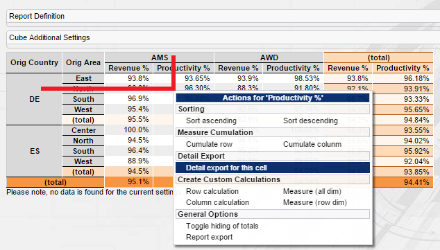
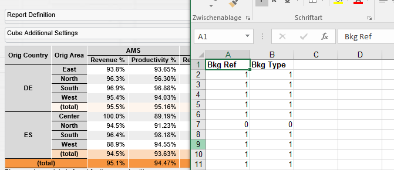

[[DocExportDetails]]
== Detail exports

=== Detail exports

The BCD-UI supports the export of detail data to spread sheets.
Often process detail data for processes failing in regards of a certain KPI is further evaluated in external tools. Another
scenario is that the selected data may be used in presentations or other reporting.
A main issue with exports is keeping information about the data type.
Often csv exports are incorrectly shown in spread sheets but work when loaded into other data bases.
To address this issue, BCD-UI supports both exports in csv format and in a format keeping information about the data format.

==== Exporting

Exporting to CSV or Excel (Sylk) is done by calling the detailExport function and providing a <<DocXmlData,webRowSet>> request. Optionally
you can provide a filename and define the type (by default it's Excel/Sylk)

[source,javascript]
----
bcdui.component.exports.excel.detailExport( { wrq: modelName, type: 'sylk', fileName: fileName } );

----

==== Cube Detail Export

When working with cubes you might want a detail export for a specific cell within the cube. A webRowSet request should be
created which takes the page's general (sidebar) filters plus the filters coming from the specific cell (e.g. you've selected
a value in a specific country column and in a specific product row). And there might be additional report based filters needed
for the cell (e.g. you want a failure-only export for a specific KPI value).

Luckily BCD-UI provides you everything to quickly setup such a cube cell detail export.
First of all you need a way to execute the detail export on a specific cell. This is done by having the Detail Export functionality
given in the context menu. The default context menu lists it, too.
Secondly your report configuration needs to list what columns should be exported. This is done in the cubeConfiguration.xml file's
Detail Export section:

[source,xml]
----
<dm:DetailDataDefaults xmlns:dm="http://www.businesscode.de/schema/bcdui/dimmeas-1.0.0">
  <dm:DetailData>
    <dm:AppendColumns>
      <wrq:C xmlns:wrq="http://www.businesscode.de/schema/bcdui/wrs-request-1.0.0" bRef="m02_i" caption="Bkg Ref"/>
      <wrq:C xmlns:wrq="http://www.businesscode.de/schema/bcdui/wrs-request-1.0.0" bRef="m02_t" caption="Bkg Type"/>
    </dm:AppendColumns>
  </dm:DetailData>
</dm:DetailDataDefaults>
----

In this case two columns are exported when you export a cell's value.

==== More On Export

You only want to export specific values. Define a detail export filter on measure level:

[source,xml]
----
<dm:Measure xmlns:dm="http://www.businesscode.de/schema/bcdui/dimmeas-1.0.0" xmlns:calc="http://www.businesscode.de/schema/bcdui/calc-1.0.0" xmlns:f="http://www.businesscode.de/schema/bcdui/filter-1.0.0" id="m01_i" caption="Bkg Ref">
  <calc:Calc type-name="NUMERIC">
    <calc:ValueRef idRef="m01_i" aggr="sum" caption="Bkg Ref"/>
  </calc:Calc>
  <dm:DetailData>
    <f:Filter>
      <f:Expression op="=" value="1" bRef="m01_i"/>
    </f:Filter>
  </dm:DetailData>
</dm:Measure>
----

You don't want a general export list but a measure specific one:

[source,xml]
----
<dm:Measure xmlns:dm="http://www.businesscode.de/schema/bcdui/dimmeas-1.0.0" xmlns:calc="http://www.businesscode.de/schema/bcdui/calc-1.0.0" xmlns:f="http://www.businesscode.de/schema/bcdui/filter-1.0.0" id="m01_i" caption="Bkg Ref">
  <calc:Calc type-name="NUMERIC">
    <calc:ValueRef idRef="m01_i" aggr="sum" caption="Bkg Ref"/>
  </calc:Calc>
  <dm:DetailData>
    <dm:Columns xmlns:wrq="http://www.businesscode.de/schema/bcdui/wrs-request-1.0.0">
      <wrq:C bRef="m01_i_sub_a"/>
      <wrq:C bRef="m01_i_sub_b"/>
    </dm:Columns>
  </dm:DetailData>
</dm:Measure>
----

Put static colums at the start or end of a detailExport list is also possible:

[source,xml]
----
<dm:DetailDataDefaults xmlns:dm="http://www.businesscode.de/schema/bcdui/dimmeas-1.0.0" xmlns:wrq="http://www.businesscode.de/schema/bcdui/wrs-request-1.0.0">
  <dm:DetailData>
    <dm:PrependColumns>
      <wrq:C bRef="yr" caption="Year"/>
      <wrq:C bRef="mo" caption="Month"/>
    </dm:PrependColumns>
    <dm:AppendColumns>
      <wrq:C bRef="orig_country" caption="Origin Country"/>
      <wrq:C bRef="dest_country" caption="Dest Country"/>
    </dm:AppendColumns>
  </dm:DetailData>
</dm:DetailDataDefaults>
----

Exporting data as Excel Hyperlink cells is also possible. You only need to specify how the url behind the cell value is created.
You can do this by adding a wrq:A attribute named "bcdSylkUrl" to the cell and it its body we concatenate a static url with the cell's value.
If the url starts with a /, the current application path is used as a prefix.

[source,xml]
----
<dm:Measure xmlns:dm="http://www.businesscode.de/schema/bcdui/dimmeas-1.0.0" id="mProductivity_t" caption="Productivity T">
  <calc:Calc xmlns:calc="http://www.businesscode.de/schema/bcdui/calc-1.0.0" type-name="NUMERIC" scale="1">
    <calc:ValueRef idRef="m02_t" aggr="sum"/>
  </calc:Calc>
  <dm:DetailData>
    <dm:Columns>
      <wrq:C xmlns:wrq="http://www.businesscode.de/schema/bcdui/wrs-request-1.0.0" bRef="m02_t">
        <wrq:A name="bcdSylkUrl" bRef="bcdSylkUrl">
          <wrq:Calc type-name="VARCHAR">
            <wrq:Concat>
              <wrq:Value>/myPage/myPageController.jsp?ref=</wrq:Value>
              <wrq:ValueRef idRef="m01_t"/>
            </wrq:Concat>
          </wrq:Calc>
        </wrq:A>
      </wrq:C>
    </dm:Columns>
  </dm:DetailData>
</dm:Measure>
----
