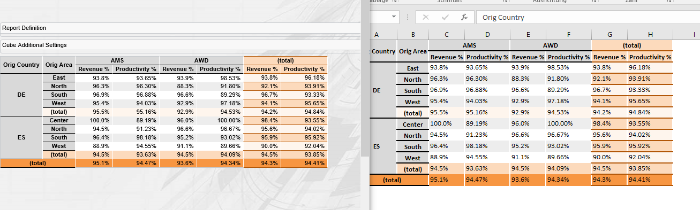

[[DocExportWysiwyg]]
== WYSIWYG exports

=== WYSIWYG exports

The BCD-UI contains two kinds of WYSIWYG (what-you-see-is-what-you-get) exports:

Spread sheet:: Spread sheet WYSIWYG exports are useful when the exported numbers are to be used in further calculations and when beyond the core WYSIWGY
additional numbers are requested. For example one sheet may contain the percentages shown, a second one shows the absolute values behind
the percentages. In the web front-end these values are often shown in the tool tip.

PDF:: PDF WYSIWYG exports are useful when the formatting of the report including coloring is the core requirement.

==== Spread sheet

You can export a HTML Element and its context to a spreadsheet by specifying the HTML source and calling:

[source,javascript]
----
bcdui.component.exports.exportWysiwygAsExcel({rootElement: "myDiv"});

----

The following picture shows a cube on the left and on the right you see this cube exported to Excel.

==== PDF

The PDF Export not only allows exporting to a PDF file but also to a image file like e.g jpg. So you can for example export whole report
pages as pdf files or charts as images. It also allows specifying an own css file which is used only during export which allows pdf specific
tuning of the layout and style. For more details, please consult the link:../jsdoc/bcdui.component.exports.html#.exportWysiwygAsPdf[pdfExport API, window="_blank"].
