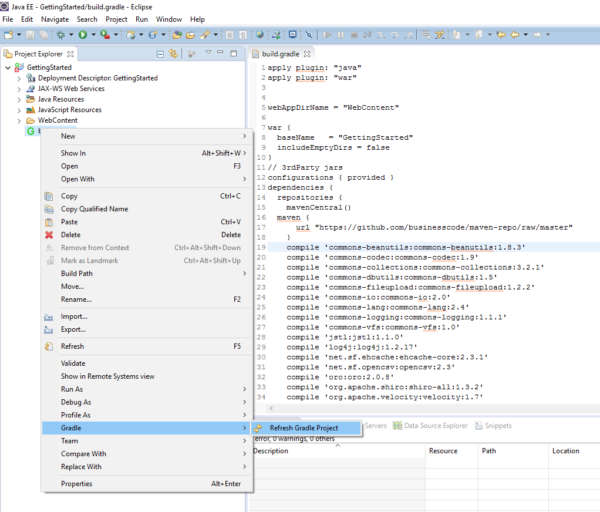
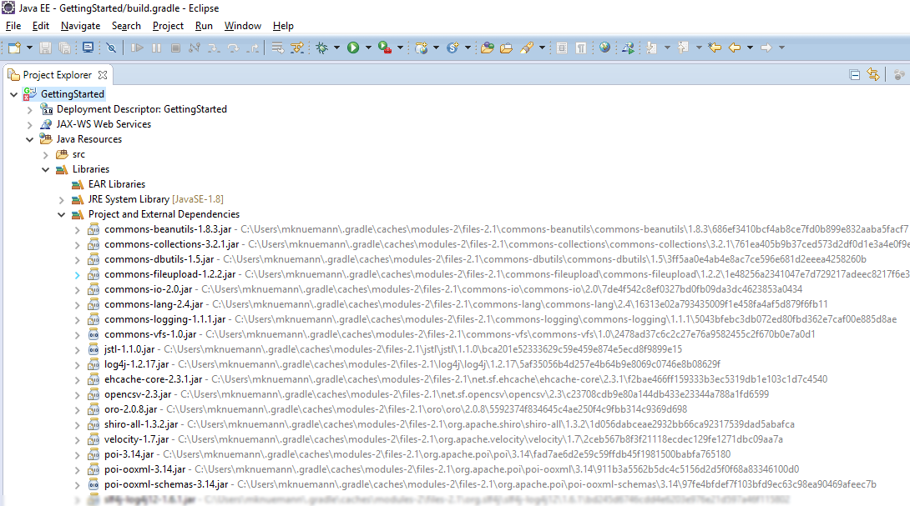

[[DocGradle]]
== Use Gradle to setup a BCD-UI project

=== Overview

This section it about building a simple BCD-UI project with link:https://gradle.org/[gradle, window="_blank"].
All libraries required are
specified as dependencies and it is therefore easy to get the application setup.

The following steps are necessary in general:

. Install Gradle plugin if necessary
. Add gradle.build to the project
. Configure gradle support for the project
. Refresh dependencies

Each step is described in the following sub chapters.

=== Step by Step

==== Gradle plugin

Install a gradle plugin. The following steps depend on the BuildShip plugin. Other gradle plugins might be different.

==== Add Gradle.build to the project

The BCD-UI build process is implemented with gradle as an example, but can be built with any tool.
So we first create a empty build.gradle file in the root directory of the GettingStarted project.
Open the file for editing and paste the following content into the build.gradle file. The important part is that the configuration of webAppDirName is right.
The biggest part of the build file are the dependencies.

[source,javascript]
----

apply plugin: "java"
apply plugin: "war"

webAppDirName = "WebContent"

war {
  baseName   = "GettingStarted"
  includeEmptyDirs = false
}
// 3rdParty jars
configurations { provided }
dependencies {
  repositories {
    mavenCentral()
  maven {
      url "https://github.com/businesscode/maven-repo/raw/master"
    }
    runtime 'commons-beanutils:commons-beanutils:1.8.3'
    runtime 'commons-codec:commons-codec:1.9'
    runtime 'commons-collections:commons-collections:3.2.1'
    runtime 'commons-dbutils:commons-dbutils:1.5'
    runtime 'commons-io:commons-io:2.0'
    runtime 'commons-lang:commons-lang:2.4'
    runtime 'commons-logging:commons-logging:1.1.1'
    runtime 'commons-vfs:commons-vfs:1.0'
    runtime 'log4j:log4j:1.2.17'
    runtime 'net.sf.ehcache:ehcache-core:2.3.1'
    runtime 'org.apache.shiro:shiro-all:1.3.2'
    runtime 'org.apache.velocity:velocity:1.7'
    runtime 'org.apache.poi:poi:3.14'
    runtime 'org.apache.poi:poi-ooxml:3.14'
    runtime 'org.apache.poi:poi-ooxml-schemas:3.14'
    runtime 'org.slf4j:slf4j-api:1.6.1'
    runtime 'org.slf4j:slf4j-log4j12:1.6.1'
    runtime 'de.businesscode.bcdui:bcd-ui-theme-bcd:5.0.0'
    compile 'de.businesscode.bcdui:bcd-ui-core:5.0.0'
  }
}

----

==== Configure Gradle support for the project

Before we can use the gradle file within eclipse, we have to add the "Gradle Nature" to the GettingStarted project. So select the project,
open the context menu and choose Configure-&gt;Add Gradle Nature.

==== Refresh dependencies

Afterwards the context menu has a new entry for gradle and there we can invoke grade refresh. The menu entry is only visible when on project root or
gradle.build file.
This might take some time, because all libraries specified
by the dependencies above will be loaded.

After the gradle refresh, the GettingStarted project has its dependencies and these can be found in the project tree as shown in the following image.

