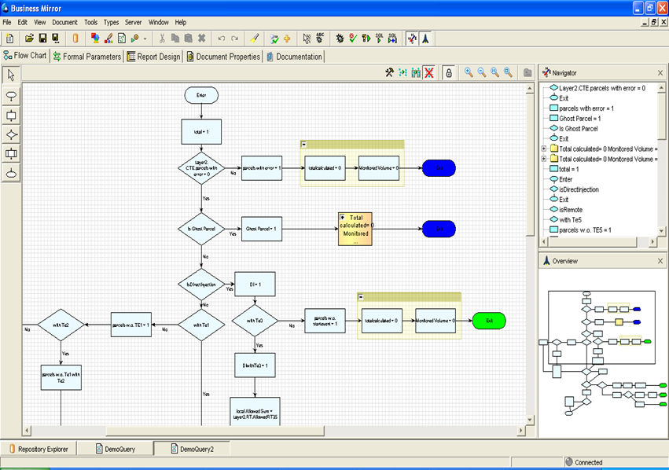
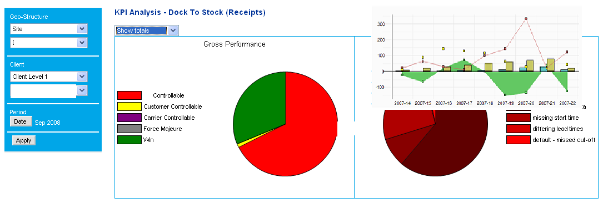
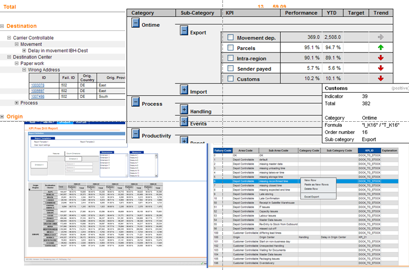
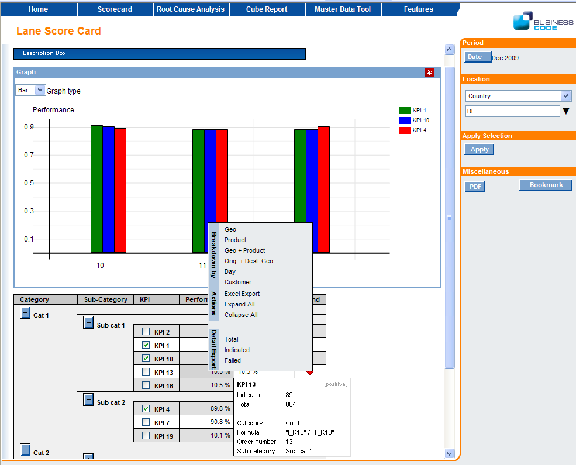
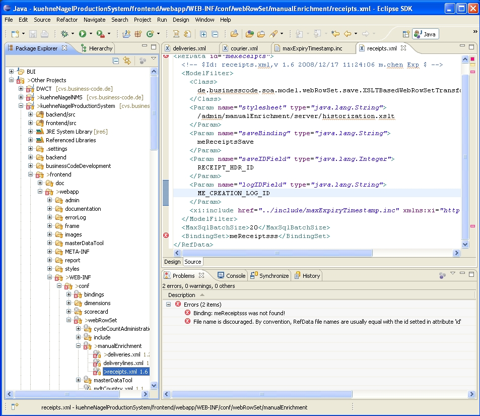

[[DocLevelOfComponents]]
== Levels of components

=== Levels Of Components Overview

BCD-UI runs on top of BCD-BM BusinessMirror and BCD-JC JobControl. Both take care of the database to be in the right state.
BCD-UI UserInterface, BCD-BM BusinessMirror and BCD-JC JobControl are all part of the BCD-Suite.
All three components, BCD-UI, BCD-BM and BCD-JC can be used separately and in cooperation as well.

==== BCD-BM BusinessMirror

BusinessMirror allows to define complex database logic in a graphical, easy and maintainable way.
BusinessMirror is particularly useful in reporting environments.
It creates the implementation of application logic and the respective documentation simultaneously and significantly eases communication between business users and technical staff.
All logic defined in the BusinessMirror is executed within the database as BusinessMirror generates the appropriate database views.

For more information please refer to BCD-BusinessMirror documentation.

==== BCD-JC Jobcontrol

JobControl is a Java framework for loading data and processing calculations.
It allows to define a sequence of processing steps, data transformations from various formats
and to connect to various systems, like Oracle, Teradata, email, ftp and so on.
Developers can add their own functionality by implementing custom steps.

[source,javascript]
----

public class RunningEngineIndicatorFileStep implements Step {
  private File file;

  public RunningEngineIndicatorFileStep(Batch batch) {
    this.file = new File(batch.getConfigName() + ".ind");
  }

  @Override public String description() {
    return String.format("indicator file path: %s", file.getAbsolutePath());
  }

  /*
   * delete existing file
   */
  @Override public void kill() {
    if(file.exists())
      file.delete();
  }

  /*
   * create a file
   */
  @Override public void start() {
    try {
      file.createNewFile();
      file.deleteOnExit();
    } catch (IOException e) {
      throw new RuntimeException( String.format("failed to create file %s", file.getAbsolutePath()), e );
    }
  }
}

----

For more information please refer to BCD-JobControl documentation.

=== Binding

BCD-UI Bindings define the logical view of the user interface on the database.
This logical view allows to centrally define what BCD-UI sees of the database and to augment information, which cannot be derived from the database.
The Bindings are not exposed to users, developers will need to created binding xml files for configuring the logical view on the database.
Bindings are defined on the server and cannot be overwritten by the client. A basic Binding file can look like:

[source,xml]
----
<BindingSet name="t_demo_options" table="T_DEMO_OPTIONS">
  <C id="country_code">
    <Column>ctr_code</Column>
  </C>
  <C id="country_name">
    <Column>ctr_name</Column>
  </C>
  <C id="country_population">
    <Column>ctr_pop</Column>
  </C>
</BindingSet>
----

For more information see BCD-UI <<DocBinding,Bindings>> documentation.

=== WebRowSet

The WebRowSet is the general data exchange format of BCD-UI between and within server and client.
This common format for various content allows to reuse transformations and to exchange the reports being used to display the data easily.
Users are not exposed to WebRowSets, developers may need to understand it to provide custom transformations.
A basic WebRowSet can look like:

[source,xml]
----
<Wrs xmlns="http://www.businesscode.de/schema/bcdui/wrs-1.0.0">
  <Header>
    <MetaData>
      <BindingSet bindingSetIdRef="country_table"/>
    </MetaData>
    <Columns>
      <C pos="1" bref="ctr_code">
        <A name="caption">
          <C id="country_name" bRef="ctr_name"/>
        </A>
      </C>
      <C pos="2" bRef="ctr_pop"/>
    </Columns>
  </Header>
  <Data>
    <R id="id0">
      <C caption="Australia">AU</C>
      <C>16000000</C>
    </R>
    <R id="id1">
      <C caption="Austria">AT</C>
      <C>10000000</C>
    </R>
    <!-- This is a sample for a row to be removed -->
    <D id="id3">
      <C caption="France">FR</C>
      <C>50000000</C>
    </D>
  </Data>
</Wrs>
----

For more information see the BCD-UI <<DocXmlData,WebRowSet>> documentation.

=== Core Components

The Core Components of BCD-UI are the low level components on server and client.
They take care for low level exchanging data between the front end and the backend as well as processing the data on the client.
Each core component represents an atomic piece of functionality dealing with receiving, sending and processing data, mainly WebRowSets.
They cover all aspects from cross browser capability, Ajax to event handling and SQL generation for database access.
They consist of a set of server side Java classes, a set of client side JavaScript types and an XSLT library.
Users are not exposed to the core components, developers will usually only get in contact with it when there is the need for high customization.
For more information see BCD-UI Core Components documentation.

=== UI Core Components

UI Core Components consist of client side widgets and charts are visual representations of data and allow interaction with the data.
For that purpose, input widgets and charts are bound to XML data.
Input widgets can be used XSLT embedded for highly dynamic interaction as well as wrapped into jsp for easy usage as choosers on pages.
Developers will need to understand the UI Core Components to place them on a page and to connect them to the right data.
Charts are rendered on the client, so changes to selections or data will be immediately reflected.

For more information see BCD-UI Core Components documentation.

=== Composite Components

BCD-UI's Composite Components are high-level aggregations of Core Components plus a set of functionality specific for the component on the client.
The goal of Composite Components is to provide ready-to-use building blocks for the most common purposes in reporting and data maintenance applications.
They have a compact interface, an XML configuration file, can be easily put on a page and together with a Binding are ready to run.
As such, they can often fulfill the requirements directly or act as the basis for customized solutions.
Users often interact with Composite Components as the main component on a page,
developers will need to understand the configuration of the composite components.

For more information see BCD-UI link:../index.html[Composite Components, window="_blank"] documentation.

=== Templates and BCD-Suite demo

BCD-UI Templates are built on top of Composite and Core Components to show how a specific business functionality like a user
administration page can build.
Templates are composed into a running demo application to allow seeing them at work and to cover all aspects of BCD-Suite in one place.
Templates are only intended to show the capabilities of the BCD-UI library and to help developers to jump start development.

For more information see BCD-UI Templates documentation.

=== Development support

BCD-Suite comes with Tooling to ease the development of BCD-UI applications.
This Tooling is Eclipse-based and comprises of

* Online documentation of the main components and the API
* A complete set of XML Schemas to support auto-completion in the IDE and easy checking of configuration files for correctness
* Eclipse Plugins for application or page creation, creation and checking of Bindings
* Support for automatic testing of BCD-Applications based on Selenium

For more information see BCD-UI development support documentation.
