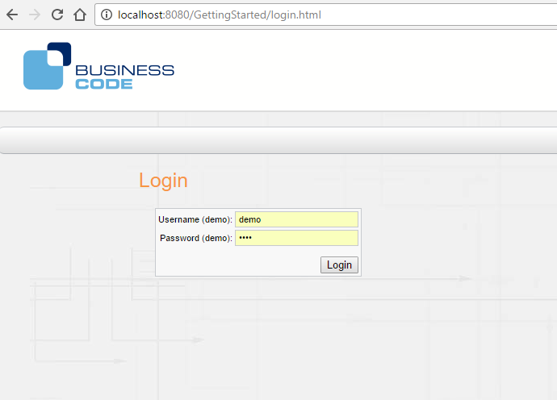

[[DocLogin]]
== Login

=== Overview

This tutorial shows how to enable user authentication in our simple tutorial application. 

The following steps are necessary in general:

1. Enable the security section in web.xml:: Uncomment the shiro components and add a user, password 
2. Create a simple login page:: Create a simple formular to enter user name and password.
3. Logout:: Create a simple menu item to make a logout.

Each step is described in the following subsections.

=== Step by step

==== Enable the security section in web.xml

The first step is to enable the security filter in the web.xml file. BCD-UI uses the Shiro framework for this. A very simple static configuration
can be seen below. There is one user 'demo' enabled. The login is form-based and the form is in login.html, which is explained in the next section.
Please note that some resources are public, so that the login page can access the theme stylesheets.

[source,javascript]
----

<!-- Security filter, enable if needed -->
<filter>
  <filter-name>bcdui4.ShiroFilter</filter-name>
  <filter-class>org.apache.shiro.web.servlet.IniShiroFilter</filter-class>
  <init-param>
    <param-name>config</param-name>
    <param-value></doc:xml>
    <pre>
      [main]
      
        cacheManager = org.apache.shiro.cache.ehcache.EhCacheManager
        securityManager.cacheManager = $cacheManager
        shiro.loginUrl      = /login.html
        authc.successUrl    = /simpleReq/index.html
        logout.redirectUrl = /login.html
        # Users and their roles
        # format: username = password, role1, role2, ..., roleN
        [users]
        demo = demo
        
        # Rules and their permissions
        # format: roleName = permission1, permission2, ..., permissionN
        [roles]
      
        # URLs which require login, users not logged in will be sent to /login.html
        # format: /reports/budget/** = authc, perms["pages:budget"]
        [urls]
        /bcdui/theme/**       = anon
        /login.html           = authc
        /simpleReq/**         = authc
        /logout               = logout
        
    </param-value>
  </init-param>
</filter>
<filter-mapping>
  <filter-name>bcdui4.ShiroFilter</filter-name>
  <url-pattern>/*</url-pattern>
</filter-mapping>

----

The configuration uses shiro filters for authentication (authc) and also to for ending the session (logout). In the url section the url /logout is
mapped to the logout filter. 
The filter setting above turns on the shiro filter. Shiro starts its own EHCache, and in order to stop this properly, the following listener needs to be
activated in web.xml. 

[source,javascript]
----

!-- This listener must be present when EHCache is used, because EHCache registers
a thread which keeps the application from shutting down
EHcache is for example used by shiro, check your web.xml -->
<listener>
  <listener-class>net.sf.ehcache.constructs.web.ShutdownListener</listener-class>
</listener>

----

==== Enable the security section in web.xml

The login.html page is kept in the webApp directory as configured in the shiro section above. The action is empty and the redirection is made by
the shiro filter. 
 
[source,javascript]
----
 authc.successUrl    = /simpleReq/index.html

----

[source,xml]
----

----

==== Create a simple login page

[source,html]
----

<!DOCTYPE html>
<html>
  <head>
    <meta charset="UTF-8"></meta>
    <title>BCD-UI Tutorial</title>
    <link rel="stylesheet" type="text/css" href="bcdui/theme/css/allStyles.css"></link>
  </head>
  <body>
    

    

    

    

      

        

      

      

      

      

        

        

        

          
Login

            

              

                <form name="loginform" action="" method="post" style="margin: 20px 0px 0px 20px;">
                  <table>
                    <tr>
                      <td>Username (demo):</td>
                      <td><input type="text" name="username" maxlength="30"/></td>
                    </tr>
                    <tr>
                      <td>Password (demo):</td>
                      <td><input type="password" name="password" maxlength="30"/></td>
                    </tr>
                    <tr>
                      <td colspan="2" align="right" style="padding-top:10px;">
                        <button name="Login">Login</button>
                      </td>
                    </tr>
                  </table>
                </form>
                
              
    
            

        

       

      

    
  </body>
</html>     

----

The form action in the login page above is empty and the redirection is configured in the web.xml:

[source,javascript]
----

[main]
  cacheManager = org.apache.shiro.cache.ehcache.EhCacheManager
  securityManager.cacheManager = $cacheManager
  shiro.loginUrl      = /login.html
  authc.successUrl    = /simpleReq/index.html
  ...

----

These configuration tell the shiro system which the login page is and where to redirect in case of a successful login.

This is the page we just created:

==== Logout
The shiro filter we configured above offers a logout, when the url/logout is invoked. A simple logout can be added to the menu bar.
 `` 