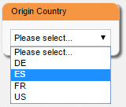
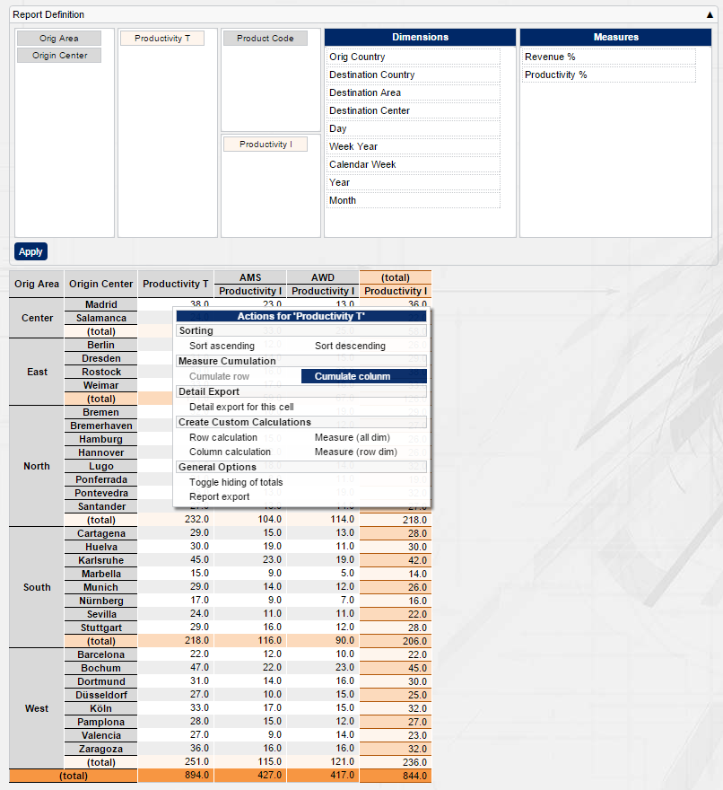

[[DocMinimalCube]]
== Minimal cube setup

=== Overview

Cubes allow to slice and dice data by free dimensions easily and quickly in a pivot-like manner. This tutorial explains how to set up a simple cube.
If you want to learn more about what a cube is, please read link:../../components/cube/doc.html[this, window="_blank"] first. 
Starting BCD-UI development requires only a few steps shown below. At the end of the page you will be able to run your new cube report.
The following steps are necessary in general:

Development environment setup:: Get Java, Eclipse and Tomcat to set up your development environment.
Set up an application:: A standard J2EE application must be set up, and BCD-UI capability is to be added to the application.
Define the logical data model:: To access the database, you define Bindings as the application's logical view to the database.
Set up a page:: Each report or edit page has a carrier HTML or JSP, which hosts choosers, menu, report etc.. This carrier page will also load BCD-UI libraries.
Add a filter on the page:: This allows you to define which data is taken into account for the report.
Add a cube report on the page:: This allows you to choose the dimensions and measures you want to see.
Use the report:: You are done, use the report to analyze the data!
Where to go from here:: Some links for further studies

Each step is described in the following subsections.

=== Step by step

==== Development environment setup

This step is required only once, when starting to work with BCD-UI; subsequent projects can re-use the same environment.
To start working with BCD-UI you need some tools installed, mainly Java, Eclipse and Tomcat.
Follow the <<DocBootstrap,bootstrap>> description.

==== Application setup

This step is only required once when starting a new BCD-UI application, subsequent pages or reports will re-use the same environment.

* copy of dependencies.gradle to project root folder and execute "gradle refresh dependencies"
* entries to web.xml
* entries to context.xml

That's all, see more details in these <<DocAppsetup,instructions>>.

In addition, please uncomment the following servlet in your web.xml

[source,xml]
----
<servlet>
  <servlet-name>bcdui4.Html2ExcelServlet</servlet-name>
  <servlet-class>de.businesscode.bcdui.toolbox.MirrorServlet</servlet-class>
  <init-param>
    <param-name>header:Content-Type</param-name>
    <param-value>application/vnd.ms-excel</param-value>
  </init-param>
  <!-- turning on the following init parameter on can cause issues in IE11 Excel will open but stays blank -->
  <!-- <init-param> <param-name>header:Content-Disposition</param-name> <param-value>attachment; filename=excel.xls</param-value> </init-param> -->
</servlet><servlet-mapping>
  <servlet-name>bcdui4.Html2ExcelServlet</servlet-name>
  <url-pattern>/bcdui/servlets/Html2ExcelServlet/*</url-pattern>
</servlet-mapping>
----
This enables a servlet to create excel files from the data shown.

==== Definition of the logical data model

BCD-UI uses BindingSets to access the underlying database.
A BindingSet defines the logical names and constraints, which apply when using BCD-UI to access the data.
To define a binding for the table (or view) holding the data that shall be shown in a cube, create a file WEB-INF/bcdui/bindings/auto_test_wrs_oracle.xml
with the following content:

[source,xml]
----
<BindingSet xmlns="http://www.businesscode.de/schema/bcdui/bindings-1.0.0" id="auto_test_wrs_oracle" table="mb_test_demo_shipment">
  <C isKey="true" id="transport_id" caption="Transport Id" type-name="VARCHAR">
    <Column>ITEM_ID</Column>
  </C>
  <C id="orig_country" caption="Origin Country" type-name="VARCHAR">
    <Column>ORIG_CTR</Column>
  </C>
  <C id="orig_area" caption="Origin Area" type-name="VARCHAR">
    <Column>ORIG_GEO_1</Column>
  </C>
  <C id="orig_center" caption="Origin Center" type-name="VARCHAR">
    <Column>ORIG_GEO_2</Column>
  </C>
  <C id="dest_country" caption="Destination Country" type-name="VARCHAR">
    <Column>DEST_CTR</Column>
  </C>
  <C id="dest_area" caption="Destination Area" type-name="VARCHAR">
    <Column>DEST_GEO_1</Column>
  </C>
  <C id="dest_center" caption="Destination Center" type-name="VARCHAR">
    <Column>DEST_GEO_2</Column>
  </C>
  <C id="product_code" caption="Product code" type-name="VARCHAR">
    <Column>PRODUCT</Column>
  </C>
  <C id="dy" type-name="DATE">
    <Column>DY</Column>
  </C>
  <C id="cwyr">
    <Column>CWYR</Column>
  </C>
  <C id="cw">
    <Column>CW</Column>
  </C>
  <C id="yr">
    <Column>YR</Column>
  </C>
  <C id="mo">
    <Column>MO</Column>
  </C>
  <C id="m01_i" caption="Rev. Win">
    <Column>CASE WHEN F_K01 IS NULL THEN 0 ELSE F_K01 END</Column>
  </C>
  <C id="m01_t" caption="Rev. Total">
    <Column>CASE WHEN F_K01 IS NULL THEN 0 ELSE 1 END</Column>
  </C>
  <C id="m02_i" caption="Prod. Win">
    <Column>CASE WHEN F_K02 IS NULL THEN 0 ELSE F_K02 END</Column>
  </C>
  <C id="m02_t" caption="Prod. Total">
    <Column>CASE WHEN F_K02 IS NULL THEN 0 ELSE 1 END</Column>
  </C>
</BindingSet>
----

For this example we assume you have a table named mb_test_demo_shipment in your default database which holds the columns listed inside the Column elements.
In addition to the data itself, we also create a logical model for the country reference data, which we will use in a report filter.
Do this by creating a file WEB-INF/bcdui/bindings/auto_test_md_geo_oracle.xml with the following content:

[source,xml]
----
<BindingSet xmlns="http://www.businesscode.de/schema/bcdui/bindings-1.0.0" id="auto_test_md_geo_oracle" table="mb_test_md_geo">
  <C id="country" isKey="true">
    <Column>country</Column>
  </C>
</BindingSet>
----

Again, for our example, we're using a table mb_test_md_geo with the column country.
You can find more information on this step at <<DocBinding,Bindings>>.

==== Page setup

BCD-UI can be used in any regular J2EE web application.
To create a HTML carrier page, add a file WebContent/minimalCube/index.html to your application.
To add BCD-UI capability for JavaScript to your page, start with the following code.
It basically holds the BCD-UI theme layout containers and includes the library.

[source,javascript]
----
<!DOCTYPE HTML>

----

[source,xml]
----
<html>
  <head>
    <meta charset="UTF-8"/>
    <title>Example Cube</title>
    
  </body>
</html>
----

==== Define a report filter

Report filters are widgets allowing the user to restrict data to be shown in a report.
Many filters show values to choose from based on reference data.

The filter in this example uses a list of countries. This list is first loaded into a model.
A BCD-UI model holds data in the from of XML for further use.
To add a model with the available data, add the following code to your script block:

[source,javascript]
----
var autoModel = new bcdui.core.AutoModel({id: "countriesModel", bindingSetId: "auto_test_md_geo_oracle", bRefs: "country", isDistinct: true});

----

The AutoModel used in this example takes distinct country information from the binding set auto_test_wrs_oracle.
First we need a container where the widget should appear. A header line telling what the widget is all about would be nice, too.
So update your bcdSideBarContainer container with:

[source,xml]
----

  

    Origin Country
    

      

    

  

----

And add the following to your script block after creating the AutoModel:

[source,javascript]
----
bcdui.widgetNg.createSingleSelect({
  targetHtml: "myChooser"
, targetModelXPath: "/*/f:Filter/f:Expression[@bRef = 'orig_country' and @op = '=']/@value"
, optionsModelXPath: "$countriesModel//wrs:Data/wrs:R/wrs:C[1]"
})

----

This creates a single select drop down box which appears at the given target html.
				
The chosen item will be stored in the guiStatus (default) target model using the targetXPath position. In this case we
write a "orig_country" filter (so you filter the cube's orig_country dimension). OptionsModelXPath tells the widget where it gets its values from.
*Please note that we use the id of the automodel, and not the javascript variable autoModel.*

You can find more about widgets <<DocWidgets,here>>.

==== Define the cube

Let's define where the cube should appear. Change the bcdBodyContainer div to:

[source,xml]
----

  

----

And change the script block to:
	
[source,javascript]
----

// Create Cube component
var cube = new bcdui.component.cube.Cube({
  targetHtml: "myCube"
 });

----

By default, the cube looks for a file called cubeConfiguration.xml in the same folder as your HTML page.
This configuration file holds the information about which binding set is responsible for the cube data and holds the definitions of measures
and dimensions.

[source,xml]
----
<cube:CubeConfiguration xmlns:cube="http://www.businesscode.de/schema/bcdui/cube-2.0.0" xmlns:dm="http://www.businesscode.de/schema/bcdui/dimmeas-1.0.0" xmlns:f="http://www.businesscode.de/schema/bcdui/filter-1.0.0" xmlns:wrq="http://www.businesscode.de/schema/bcdui/wrs-request-1.0.0" xmlns:wrs="http://www.businesscode.de/schema/bcdui/wrs-1.0.0" xmlns:xp="http://www.businesscode.de/schema/bcdui/xsltParams-1.0.0">
  <wrq:BindingSet>auto_test_wrs_oracle</wrq:BindingSet>
  <cube:Dimensions>
    <dm:LevelRef total="trailing" caption="Origin Country" bRef="orig_country"/>
    <dm:LevelRef total="trailing" caption="Origin Area" bRef="orig_area"/>
    <dm:LevelRef total="trailing" caption="Product Code" bRef="product_code"/>
    <dm:LevelRef total="trailing" caption="Origin Center" bRef="orig_center"/>
    <dm:LevelRef total="trailing" caption="Destination Country" bRef="dest_country"/>
    <dm:LevelRef total="trailing" caption="Destination Area" bRef="dest_area"/>
    <dm:LevelRef total="trailing" caption="Destination Center" bRef="dest_center"/>
    <dm:LevelRef total="trailing" caption="Day" bRef="dy"/>
    <dm:LevelRef total="trailing" caption="Calendarweek Year" bRef="cwyr"/>
    <dm:LevelRef total="trailing" caption="Calendar Week" bRef="cw"/>
    <dm:LevelRef total="trailing" caption="Year" bRef="yr"/>
    <dm:LevelRef total="trailing" caption="Month" bRef="mo"/>
  </cube:Dimensions>
  <dm:Measures>
    <dm:Measure id="mRevenue" caption="Revenue">
      <calc:Calc xmlns:calc="http://www.businesscode.de/schema/bcdui/calc-1.0.0" type-name="NUMERIC" scale="1" unit="%">
        <calc:Div>
          <calc:ValueRef idRef="m01_i" aggr="sum"/>
          <calc:ValueRef idRef="m01_t" aggr="sum"/>
        </calc:Div>
      </calc:Calc>
    </dm:Measure>
    <dm:Measure id="mProductivity" caption="Productivity">
      <calc:Calc xmlns:calc="http://www.businesscode.de/schema/bcdui/calc-1.0.0" type-name="NUMERIC" scale="2" unit="%">
        <calc:Div>
          <calc:ValueRef idRef="m02_i" aggr="sum"/>
          <calc:ValueRef idRef="m02_t" aggr="sum"/>
        </calc:Div>
      </calc:Calc>
    </dm:Measure>
    <dm:Measure id="mProductivity_i" caption="Productivity I">
      <calc:Calc xmlns:calc="http://www.businesscode.de/schema/bcdui/calc-1.0.0" type-name="NUMERIC" scale="1">
        <calc:ValueRef idRef="m02_i" aggr="sum"/>
      </calc:Calc>
    </dm:Measure>
    <dm:Measure id="mProductivity_t" caption="Productivity T">
      <calc:Calc xmlns:calc="http://www.businesscode.de/schema/bcdui/calc-1.0.0" type-name="NUMERIC" scale="1">
        <calc:ValueRef idRef="m02_t" aggr="sum"/>
      </calc:Calc>
    </dm:Measure>
  </dm:Measures>
</cube:CubeConfiguration>
----

These settings declare a cube with the declared dimensions and metrics, basically some indicators divided by total values as percentage values.
Further options available for cubes are described <<DocCube,here>>.

To have an user interface to select dimensions and measures, BCD-UI offers you a drag'n drop cube configurator.
We add a container to hold the drag'n drop area. Update your bcdBodyContainer to:

[source,xml]
----

  

  

----

And update your script area with: 

[source,javascript]
----

// Cube Configuration defines dimensions and metrics
var cubeConfiguration = new bcdui.core.SimpleModel({
  id: "cfg_id",
  url: "cubeConfiguration.xml"
});
// Create Cube Drag and Drop Area
bcdui.component.createCubeConfigurator({
  targetHtml: "myDNDArea",
  cubeRenderer: cube.id,
  config:      cubeConfiguration.id,
  contextMenu: true,
  isDefaultHtmlLayout: true});

----

The cube configurator needs a configuration file which tells it which measures and dimensions can be used
in its drag'n drop area. In this example we can use the cubeConfiguration.xml that is used by the cube component already.
So we create in javascript a simpleModel and provide the id of our configuration when we create the CubeConfigurator.

==== Use the report

Congratulations. These were all steps required to setup a reporting cube.
You can now go to http://localhost:8080/demoApp/index.html to use the report.

==== Where to go from here

* link:../../exports/detail/doc.html[Detail Export, window="_blank"]
* link:../../exports/wysiwyg/doc.html[WYSIWYG Export, window="_blank"]
* link:../../components/charts/doc.html[Charts, window="_blank"]
* link:../menu/doc.html[Menu, window="_blank"]
