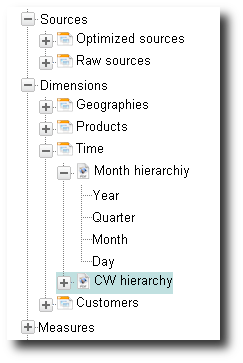

[[DocRepository]]
== Repository

=== Repository Overview

BCD-UI Repository holds all structural information about the available data like available dimensions, Measures and database bindings.
The repository holds information about:

Dimensions:: The _dimension tree_ of the repository contains a description of the available dimensions and their _hierarchies_.
Measures:: Measures are beside dimensions the key data items in the data warehouse.
A Measures represents a measurable fact about a business object. Its semantic is described in the repository.
Attributes:: An attribute represents a fact about a business object, which may not be measured or aggregated, like an address or name.
Database bindings:: Database bindings provide a logical model of the views and tables in access of the solution and link the dimensions, measures and attributes to the database.

On top of this information, reports, ScoreCards or editors are build

image::images/repository_repositoryLevels.png[]

=== Dimensions

Dimensions, like Geo, group their members, i.e. their actual values like 'Munich', in levels of a hierarchy tree.
Each member has exactly one parent in the parent level of the hierarchy and all members of the same distance to the root are at the same level.
Member can appear in multiple hierarchies.
Dimension:: Geo, Time and Customer are all dimensions. Each dimension can have one or more hierarchies.
Hierarchy:: A hierarchy forms a tree with different levels, Calendar Week and Month are two hierarchies of the dimension time.
Level:: A level is one level in the hierarchy tree, for example Year, Quarter, Month and Day are levels of hierarchy month.
A level can occur in multiple hierarchies but only in one dimension.
Member:: A member is an actual value, a dimension can have, for example 2011 is a member of level year in hierarchy month in dimension time.
A member can be in only one level.
Properties:: A property is an attribute of a dimension member.
A property can be a long name, a caption or the sorting order of the member within the siblings, being children of the same parent member.

The aggregation level of data within a specific view of table is known to the system via _database bindings_, which link _hierarchies_ to databse columns.

==== Definition document

Dimension definition element:: The Dimension element only has an id and contains one or more hierarchies.
Level definition element:: A level definition defines a level of a dimensions.
Its member will often occur in multiple places in the data warehouse, the link between level and bindings is the bindingId.
All bindings with the bindingId identical to the bindingIdRef of the level indicate that the corresponding column holds members of the level.
As levels cover the common parts of these elements, they can have all attributes, which are common to the corresponding Bindings, like _jdbc.column.type_ and so on.
The id of a level is unique within the dimension.

Member-Property:: 
A dimension can declare properties for its members. These attributes can be for example long names or oder information for the members.
Such properties can be uniquely identified from the value of the member, the opposite is not necessarily true.
A property element declares the common part of its occurrences and its bindingIdRef links it to the Bindings.
In a query asking for a hierarchical output form for a hierarchy, the properties are returned to attributes of the elements representing the level.
The id of a property is unique within the dimension.
Each level has to define the bindingIdRef for its member properties. If no definition is given, the member value itself is used.

Hierarchy definition element:: The Hierarchy element has an id unique within the dimension and contains one or more LevelRef elements. Each LevelRef refers to a level definition of the dimension.
This allows two hierarchies of one dimension to refer both to the same Level element and thus allows navigating between hierarchies.

[source,xml]
----
<Dimensions>
  <Dimension id="Geo">
    <Property id="caption" column-type-name="VARCHAR"/>
    <Levels>
      <Level id="Region" bindingIdRef="reg_code" column-type-name="VARCHAR">
        <Property idRef="caption" bindingIdRef="reg_name"/>
      </Level>
      <Level id="Country" bindingIdRef="ctr_code">
        <Property idRef="caption" bindingIdRef="ctr_name"/>
      </Level>
      <Level id="City" bindingIdRef="cty_code"/>
      <Level id="Center" bindingIdRef="cen_code"/>
      <Level id="SalesRegion" bindingIdRef="sale_reg"/>
    </Levels>
    <Hierarchies>
      <Hierarchy id="Geo" bindingSet="tb_md_geo">
        <LevelRef ref="Region"/>
        <LevelRef ref="Country"/>
        <LevelRef ref="City"/>
        <LevelRef ref="Center"/>
      </Hierarchy>
      <Hierarchy id="GeoSales" bindingSet="tb_md_geosales">
        <LevelRef ref="Region"/>
        <LevelRef ref="SalesRegion"/>
        <LevelRef ref="Center"/>
      </Hierarchy>
    </Hierarchies>
  </Dimension>
  <Dimension id="Time">
    <Levels/>...<Hierarchies>
      <Hierarchy id="MO"/>...<Hierarchy id="CW"/>
    </Hierarchies>
  </Dimension>
</Dimensions>
----

Each _hierarchy_ is assigned a chooser, which can allow selecting one or many members of one or multiple levels of a hierarchy.
Different hierarchies of a dimension will often have the same chooser appearance, the selection of a member may implicitly select a hierarchy.
For example the period chooser allows selecting month or calendar week, implicitly switching the hierarchy of the dimension time.

==== Time

Time is a specific dimension and well-known to the system.
It's chooser does not need a reference data table with the values and the implementation provides built-in functions to work with time.
These are

YTD - year to date:: 
PY - previous year:: 
PP - previous period:: 

=== Measures

Measures represent the measurable facts contained in the data warehouse being known about the dimension members and derived information.
A Measure can be of two types:

Plain Measure:: A plain Measure is an value, which can be rolled up, like a weight or the number of packaged items
Indicator Measure:: An indicator Measure is a calculated boolean indicating whether a business object succeeded in regards of a business rule.
For example an indicator Measures will say whether an order has been processed properly in terms of time or process.
The calculator rule behind the indicator can be simple as _order is closed_, or as complex as, _was the order processed according to the business process rules?_
Complex indicator Measures can be defined with the <<DocLevelOfComponents,BusinessMirror>> and run in the warehouse, especially if process logic is to be taken into account.
Because indicator Measures can be rolled up, they can of course also be sums of indicator Measures.

Each Measure is assigned to exactly one business object, the id of the Measure is globally unique within a business object.
They are linked to actual database values via their bindindIdRef.
All Bindings with the same bindingId represent the same Measure.

==== Definition document

[source,xml]
----
<Measures>
  <BusinessObject id="order" caption="Order">
    <Measure id="orderVolume" bRef="order_vol" column-type-name="INTEGER" description="In local currency"/>
    <Measure id="orderCompleted" bRef="order_completed" column-type-name="INTEGER" rollup="childAvg">
      <HtmlDescription>Orders are &lt;i&gt;completed&lt;/i&gt; when the invoice was payed or customer service agreed to drop the claim or the order was cancelled by customer or customer service.</HtmlDescription>
      <Indicator rcBRef="order_completed_rc" rcTree="order_completed_rctree" iBRef="order_completed_i" tBRef="order_completed_t"/>
      <MeasureDetailExport bRefs="order_completed_rc"/>
    </Measure>...<DetailExport bindingId="tb_order_details" bRefs="order_id order_date order_volume"/>
  </BusinessObject>
  <BusinessObject>...</BusinessObject>
</Measures>
----

The definition of a BusinessObject and its Measures composes out of the following elements:

BusinessObject:: The business object provides information about itself and information common for all Measures, like detail export columns
DetailExport:: Provides bindingIds to be exported along with Measures of the Business Object

Measure:: A Measure is a measured element of a business object. Which kind of Measure it is is derived from its child elements.

* rollup: defines standard aggregation, can be sum, min, max, distinct, childAvg, count, none. Default is sum
* column-type-name: defines the data type properties, overwrites values given in Bindings

HtmlDescription:: The optional HtmlDescription is an HTML enabled free text shown in fly-overs
Indicator:: The optional Indicator element declares that the Measure is an _Indicator Measure_ and provides additional information

* iBRef: Indicator
* tBRef: Total
* rcBRef: Optional id of bindingItems of Bindings holding the root cause value
* rcTree: Optional id of the root cause tree

MeasureDetailExport:: Provides bindingIds to be exported along with the Measure in addition to what is already declared for the Business Object

* bRefs: Space separated list of binding items to be exported in addition to the bindingItems given for the BusinessObject

=== Drilling

Drilling up/down:: The knowledge about the hierarchies allows the system to offer the user to drill-up and within a hierarchy
Drilling through:: 
Drilling across hierarchies:: Since levels are shared between hierarchies, it is possible to drill over from one hierarchy in to another within a dimension.
This is supported when the system knows the target hierarchy.
When drilling over, it switches to the lowest common level shared between the source and the target level, this can be the very same level currently selected for the source hierarchy.
