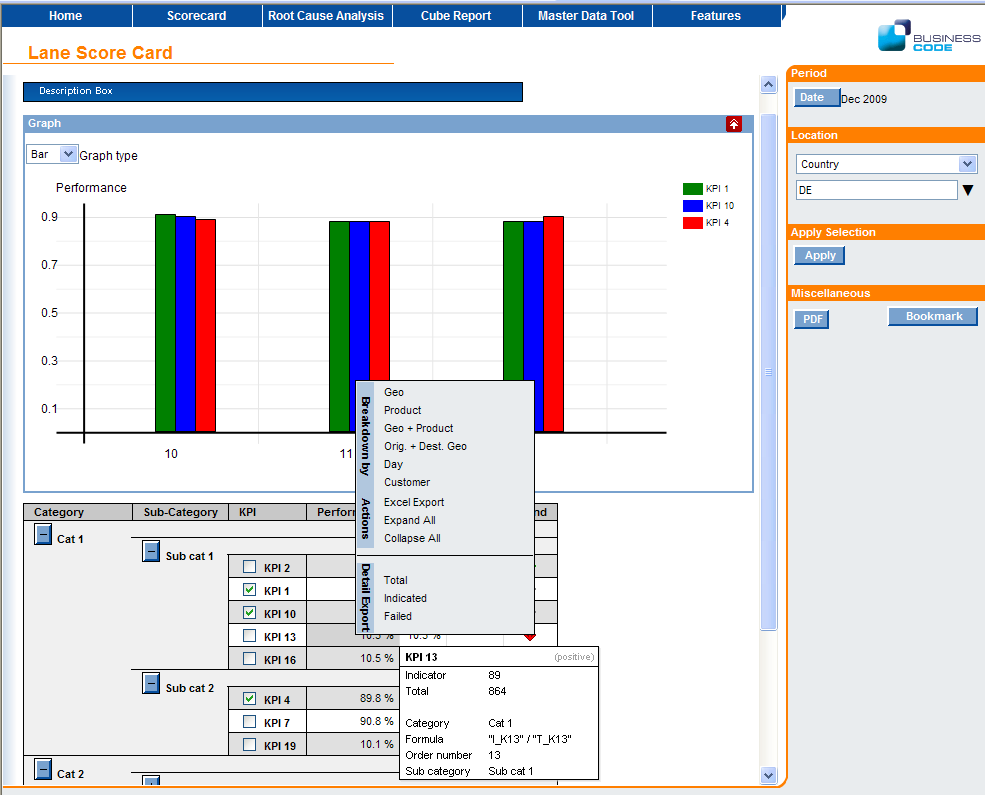

[[DocScorecard]]
== ScoreCard Component

=== Scorecard overview

A ScoreCard is a KPI based, one-stop, comprehensive overview of all aspects of an area of responsibility. +
KPIs - key performance indicators - are aggregated values of performance, volumes, productivity, process compliance and other aspects shown plain or in a break-down, often with a target.
Because a ScoreCard covers overview about different aspects and different business objects, a ScoreCard often serves as the entry point into reporting and supports drilling into further analysis.

image::images/scorecard_scoreCardPart.png[]

.Some Terminology

Measures:: Measures are aggregatable, often calculation, values, representing a measurable quantity like a count of pieces or sum of weight.
Measures and indicator measures form the base of KPIs.

Indicator measures:: Indicator measures are special boolean measures, representing for example a process compliance.
For example, whether a contract process was closed in planned time.
Indicator measures inherit all possibilities from ordinary measures but allow additional features.

KPI:: A KPI represents a key performance value and is calculated based on measures.
A KPI has a calculation definition, a unit, which is often percent and a description.
Often it is associated with targets and other attributes.

Aspects:: They describe what aspects of KPIs are shown on a ScoreCard.
Typical aspects are performance or YTD, trends or achievements.
Calculation rules of aspects are not dependent on a specific KPI but they can make use of KPI specific data and calculations.
There are three types of aspects:

* Kpi aspects modify the KPI calculation in some way, for example YTD or previous-period performance and re-execute the clients KPI calculation.
* Attribute aspects load additional data like targets or comments for each KPI. They don't aggregate up.
* Meta aspects only use other aspects in their calculation, like trend, using the performance and the previous-period performance.

KPI Targets:: Targets are KPI aspects indicating, what value a KPI should have.
The comparison of a KPI value with the target provides the achievement.

ScoreCard:: A ScoreCard or dashboard shows a set of KPIs together with their attributes and aspects and provides drill over possibilities.

=== Configuration

To set up a scorecard, the following steps are required:

* Create the definition for the aggregators, i.e. define where and how to find the measures based on BindingSets
* Optionally create the definition for aspects, i.e. define where and how to find additional information about KPIs like targets or previous-period performance
* Create the definition for all KPIs, i.e. define the calculation rules for KPIs based on the available measures.
* Create an HTML page with a link:../jsdoc/bcdui.component.scorecard.Scorecard.html[bcdui.component.scorecard.Scorecard^]

The scorecard is configured with following schema link:https://github.com/businesscode/BCD-UI/blob/master/Docu/xsd/scorecard-1.0.0.xsd[scorecard-1.0.0.xsd^].
A typical scorecard configuration has the following structure:

[source,xml]
----
include::../../../BCD-UI-Tutorial/web/scorecard/scConfig.xml[]
----
<1> This is the actual layout, referencing the definitions below
<2> List of KPIs to be included in the scorecard
<3> List of aspects to be shown, applied to each KPI
<4> Dimensions if a break-down is requested
<5> KPI definitions, usually, this is included via xi:include from a separate file because it is reused
<6> Each KPI comes with its formula
<7> `bcdSum` refers to a built-in aggregation, using sum and going on BindingSet bcd_sc_kpi
<8> Categories allow to group KPIs in the layout
<9> Beside build-in scc:Aspects and scc:Aggregators, you can setup your own here

The content of the scc:ScorecardConfiguration is straight forward can easily be setup by a user or the wizard. +
The underlying definitions for scc:Aggregators and scc:Aspects can be seen in the source code and taken as a templyte for own ones.

==== Aggregators

An aggregator describes how the system can retrieves measures from the database.
It does so by providing a XSLT generating a <<DocXmlData,WrsRequest>>.
The scorecard provides input to this XSLT at runtime, informing about the measures needed.
It is also providing an optional `xsl:param name="customParameterModel"`, allowing to provide free additional information.
In many cases, using the built-in scc:Aggregators will be sufficient.

==== Aspects

Aspects are additional information about KPIs like targets, trends or year-to-date values.
An aspect definition is valid across all KPIs. Aspects can provide their information in three forms.

Aspect WrqModifier:: Provides a means of generating a new request from an aggregator's request, for example to the KPI table for previous period performance.
Aspect WrqBuilder:: Provides a means of generating a new request from scratch, for example to a table with target information.
Aspect Calc:: A calculation on to of KPI performance and other aspects, for example the trend based on (performance) / (previous period performance) or the achievement based on performance and target.
The calculation can reference values via:
* `calc:KpiRef` refers to the KPIs performance, i.e. to the KPI's definition.
* `calc:AspectRef idRef="asp_` refers to the result of the aspect with the id _aspId_ for the current KPI.
* `calc:AggregatorRef idRef="agg_` refers to a property of the lead measure of the current KPI, taken from the aggregator @aggrId.
* `calc:AggregatorRef idRef="asp_` refers to a property of the lead measure of the current KPI, taken from the aggregator @aggrId.

.Sample for a trend Aspect:
[source,xml]
----
<scc:Aspect xmlns:scc="http://www.businesscode.de/schema/bcdui/scorecard-1.0.0" xmlns:calc="http://www.businesscode.de/schema/bcdui/calc-1.0.0" id="trend" caption="Trend">
  <calc:Calc>
    <calc:Div>
      <calc:KpiRef/>
      <calc:AspectRef idRef="asp_previousPeriod_kpi_$"/>
    </calc:Div>
  </calc:Calc>
</scc:Aspect>
----

=== Data storage

Measures for the scorecard are stored in columns.
Beside the dimensions and the measure columns, there is a mandatory column @bRef='bcd_measure_id' indicating the measure.
Measures may have multiple properties. In such cases, a row holds one column per such property.

