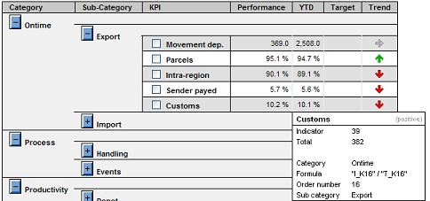
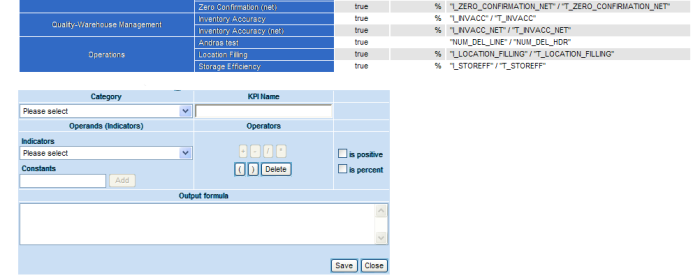
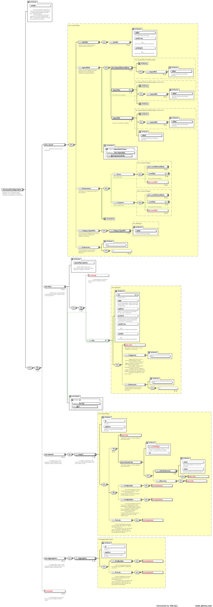

[[DocScorecard]]
== ScoreCard report

=== Scorecard overview

A ScoreCard is a KPI based, one-stop, comprehensive overview of all aspects of an area of responsibility.
Such an area can be a branch, a center, a customer relation, a set of products or a network.
KPIs - key performance indicators - are aggregated values of performance, volumes, productivity, process compliance and other aspects shown with their history, trend and often a target value.

To complete a KPI, a KPI break down can be attached and even a root cause analysis, providing information, which actions will have the highest improvement impact on the KPI's value.

Because a ScoreCard covers different aspects as well as different business objects, like order and movement,
and provides the best overview often associated with an incentive schema, the ScoreCard often serves as the entry point into reporting.
This is supported via drilling over from KPIs to related reports like KPI analysis and Root cause analysis.

ScoreCard report:: The ScoreCard report itself provides a comprehensive overview over the state of an area of responsibility based on all important business aspects.
KPI analysis:: From a KPI in the ScoreCard, a drill over can be made available and the KPI can be further broken down by geography, time, weight or product for example.
Each KPI visible on the ScoreCard can be broken down by various criteria like time or geography.
To support this, from the ScoreCard via context menu the user can jump to a KPI analysis report.
This view can give important insight into which parts participated most to the failures or which were the most successful.
Root cause analysis:: From a KPI in the ScoreCard, a drill over can be made available and the indicator measures, which are part of an KPI formula, can be broken down by their root cause tree, if a root cause calculation is attached.
The root cause calculation gives the best indication what activities will have the highest impact in improving a KPI's value.
A break down of responsibilities for issues into the following process roles is often possible:

* Company
* Business partners
* Force majeur
* Customer

In that sense a ScoreCard is part of a set of reports.

=== Terminology

A ScoreCard shows its KPIs and their attributes and aspects.

Measures:: Measures are aggregatable values, often calculation results, representing a measurable quantity like a count or sum of weight.
Measures and indicator measures form the base of KPIs.
Indicator measures:: Indicator measures are special measures, which are boolean on atomic level, representing the result of a calculation for example regarding process compliance or time compliance.
For example whether a contract process was closed in planned time.
Indicator measures inherit all possibilities from ordinary measures but allow additional features.
Reporting settings:: The reporting settings are for example selected period, product, organizational and geographical settings for which a ScoreCard is shown,
for example: Paris, May 2011. This is kept in guiStatus.
Targets:: Targets are company defined values what value a KPI should have. The comparison of a KPI value with the target provides the achievement.
Setting the right target can be difficult. If no targets are available, they can be left away or the previous' year performance can be chosen.
Targets are always KPI specific and often vary between different areas of responsibility for the same KPI,
for example different centers can have a different targets for the same productivity KPI.
Aspects:: Aspects describe what aspects of KPIs are shown on a ScoreCard, for example performance or YTD figures, trends or achievements.
Calculation rules of aspects are not dependent on a specific KPI but they can make use of KPI specific data and calculations.
There are three types of aspects:

* KpiAspects modify the KPI calculation in some way, for example YTD or previous-period performance and re-execute the clients KPI calculation.
* AttributeAspects load additional data like targets or comments for each KPI.
* MetaAspects only use other aspects in their calculation, like trend, using the performance and the previous-period performance.

Attributes:: Attributes are non-aggregatable values attached to a KPI, like comments or targets.
Attributes are usually specific for a KPI and the point of reporting and are derived from the database.
KPI:: A KPI represents a key performance indicator number, calculated from measures. It is often associated with targets and attributes.
A KPI has a calculation definition, a unit, which is often percent and a description.
The calculation definition defines how to derive the KPI from the measures for a given point of reporting, most often it is the ratio of two measures, which are up-front aggregated to the point of reporting.
ScoreCard:: A ScoreCard or dashboard shows a set of KPIs together with their attributes and aspects and provides drill over possibilities.
Break down:: A ScoreCard can contain a break down for KPIs regarding a dimension like geography or time.

=== ScoreCard configuration

To set up a scorecard, the following steps are required:

* Create the definition for the aggregators, i.e. define where and how to find the measures
* Optionally create the definition for aspects, i.e. define where and how to find additional information about Kpis like targets or previous-period performance
* Create the definition for all Kpis, i.e. define the calculation rules for Kpis based on the available measures.
* Create a page an put the component:scorecardModel tag into the body and provide it with an scc:ScorecardRefData model
* Add a renderer to the page, visualizing the score card data

The scorecard is configured with the help of a meta data model following schema http://www.businesscode.de/schema/bcdui/scorecard-1.0.0.
A typical scorecard configuration has the following structure:

[source,xml]
----
<scc:ScorecardRefData xmlns:scc="http://www.businesscode.de/schema/bcdui/scorecard-1.0.0" xmlns:calc="http://www.businesscode.de/schema/bcdui/calc-1.0.0" xmlns:f="http://www.businesscode.de/schema/bcdui/filter-1.0.0" xmlns:wrs="http://www.businesscode.de/schema/bcdui/wrs-1.0.0" xmlns:wrq="http://www.businesscode.de/schema/bcdui/wrs-request-1.0.0" xmlns:xi="http://www.w3.org/2001/XInclude" id="sampleScorecard">
  <!-- This defines the parts making up the current scorecard -->
  <scc:Scorecard>
    <!-- Which kpis should show up on the current scorecard, usually different per scorecard -->
    <scc:KpiRefs>
      <scc:KpiRef idRef="kpi1"/>..</scc:KpiRefs>
    <!-- Which aspects are to be shown in which order, for example YTD, target and so on -->
    <scc:AspectRefs>
      <scc:AspectRef idRef="aspect1"/>...</scc:AspectRefs>
    <!-- Which categories are to be used to group the KPIs -->
    <scc:CategoryTypeRefs>
      <scc:CategoryTypeRef idRef="cat1"/>...</scc:CategoryTypeRefs>
  </scc:Scorecard>
  <!-- This defines the KPIs, all Kpis referenced in Scorecard need to be defined here. -->
  <scc:Kpis>
    <scc:Kpi id="kpi1">
      <calc:Calc id="calc1"/>
    </scc:Kpi>...</scc:Kpis>
  <!-- This defines the aggregators, all aggregators referenced in Kpis used on the scorecard need to be defined here -->
  <xi:include href="myScDefinitions/aggregators.xml"/>
  <!-- This defines the aspects, all aspects used on the scorecard need to be defined here -->
  <xi:include href="myScDefinitions/aspects.xml"/>
</scc:ScorecardRefData>
----

The content of the scc:Scorecard element varies from scorecard to scorecard and is straight forward can easily be setup by a user or the wizard.

In opposite to this, the underlying definitions for Aggregators and Aspects need some explanation and are setup once when using
the scorecard module and only extended when new Aggregators or Aspects are introduced to the installation.

==== Aggregators

An aggregator describes how the system can retrieve measures from the database.
It does so by providing a template to generate an <<DocXmlData,WrsRequest>> in form of an XSLT template.
The scorecard provies input to this XSLT on runtime, informing about the measures needed and is also providing an optional
 `&lt;xsl:param name="customParameterModel"/&gt;`  to allow the user of the scorecard model to provide any additional information.
A sample aggregators definition looks like the following:

[source,xml]
----
<scc:Aggregators xmlns:scc="http://www.businesscode.de/schema/bcdui/scorecard-1.0.0" xmlns:calc="http://www.businesscode.de/schema/bcdui/calc-1.0.0" xmlns:f="http://www.businesscode.de/schema/bcdui/filter-1.0.0" xmlns:wrs="http://www.businesscode.de/schema/bcdui/wrs-1.0.0" xmlns:wrq="http://www.businesscode.de/schema/bcdui/wrs-request-1.0.0" xmlns:xi="http://www.w3.org/2001/XInclude">&lt;!-- An aggregator definition --&gt;<scc:Aggregator id="1" caption="default">&lt;!-- Description on how to create a requests in the form of an XSLT --&gt;<scc:WrqBuilder>
      <xsl:stylesheet xmlns:xsl="http://www.w3.org/1999/XSL/Transform" version="1.0" wrq:d="" f:d="">
        <xsl:output method="xml" version="1.0" encoding="UTF-8"/>
        <xsl:param name="guiStatus"/>
        <xsl:param name="customParameter"/>
        <xsl:template match="/*">
          <wrq:WrsRequest>
            <wrq:Select>
              <wrq:Columns>
                <wrq:C bRef="country"/>
                <xsl:copy-of select="/*/Aggr[@id=1]/Columns/*"/>
              </wrq:Columns>
              <wrq:From>
                <wrq:BindingSet>kpi_cw</wrq:BindingSet>
              </wrq:From>
              <f:Filter>
                <f:Expression bRef="measure" op="in">
                  <xsl:attribute name="value">
                    <xsl:value-of select="/*/Aggr[@id=10]/MeasuresAsList"/>
                  </xsl:attribute>
                </f:Expression>
                <xsl:copy-of select="$customParameter/*/f:Filter/*"/>
              </f:Filter>
              <wrq:Grouping>
                <wrq:C bRef="depot"/>
                <wrq:C bRef="process_code_kpi"/>
                <wrq:C bRef="measure"/>
              </wrq:Grouping>
            </wrq:Select>
          </wrq:WrsRequest>
        </xsl:template>
      </xsl:stylesheet>
    </scc:WrqBuilder>
  </scc:Aggregator>
</scc:Aggregators>
----

==== Aspects

Aspects are additional information about KPIs like targets, trends ot year-to-date values.
An aspect definition is valid across all KPIs. Aspects can provide their information in three forms.

WrqBuilder:: Provides a means of generating a new request from scratch, for example to a table with target information.
WrqModifier:: Provides a means of generating a new request from an aggregator's request, for example to the kpi table for previous period performance.
Calc:: A calculation on to of kpi performance and other aspects, for example the trend based on (performance) / (previous period performance).
A calc can use the operators Mul, Div, Plus, Minus. The calculation can reference values via
 `&lt;KpiRef/&gt;` ,  `&lt;AspectRef/&gt;`  and  `&lt;AggregatorRef/&gt;` .
Keep in mind that aspects apply to each KPI.

*  `&lt;KpiRef/&gt;`  refers to the KPIs performance, i.e. to the Kpi's defintion.
*  `&lt;AspectRef idRef="asp_`  refers to the result of the aspect with the id _aspId_ for the current kpi.
*  `&lt;AggregatorRef idRef="agg_`  refers to the property _prop_ of the lead measure of the current kpi, taken from the aggregator _aggrId_.
*  `&lt;AggregatorRef idRef="asp_`  refers to the property _prop_ of the lead measure of the current kpi,taken from the aggregator _aggrId_

A sample for the trend could look like:
+
[source,xml]
----
<scc:Aspect xmlns:scc="http://www.businesscode.de/schema/bcdui/scorecard-1.0.0" xmlns:calc="http://www.businesscode.de/schema/bcdui/calc-1.0.0" id="trend" caption="Trend">
  <calc:Calc>
    <calc:Div>
      <calc:KpiRef/>
      <calc:AspectRef idRef="asp_previousPeriod_kpi_$"/>
    </calc:Div>
  </calc:Calc>
</scc:Aspect>
----
+

The scorecard provides input to this XSLT on runtime, and is also providing an optional
 `&lt;xsl:param name="customParameterModel"/&gt;`  to allow the user of the scorecard model to provide any additional information.
A sample Aspects definition looks like the following:

[source,xml]
----
<scc:Aspects xmlns:scc="http://www.businesscode.de/schema/bcdui/scorecard-1.0.0">
  <!-- Sample aspect retrieving additional data by modifying an aggregator request -->
  <scc:Aspect id="prevPeriod" caption="PreviousPeriod">
    <scc:WrqModifier>
      <xsl:stylesheet xmlns:xsl="http://www.w3.org/1999/XSL/Transform" xmlns:f="http://www.businesscode.de/schema/bcdui/filter-1.0.0" xmlns:wrq="http://www.businesscode.de/schema/bcdui/wrs-request-1.0.0" version="1.0" wrq:d="" f:d="">
        <xsl:output method="xml" version="1.0" encoding="UTF-8"/>
        <xsl:template match="node()|@*">
          <xsl:copy>
            <xsl:apply-templates select="node()|@*"/>
          </xsl:copy>
        </xsl:template>
        <xsl:template match="f:Expression[@bRef='mo']">
          <f:Expression>
            <xsl:attribute name="bRef">
              <xsl:value-of select="@bRef"/>
            </xsl:attribute>
            <xsl:attribute name="op">
              <xsl:value-of select="@op"/>
            </xsl:attribute>
            <xsl:attribute name="value">
              <xsl:value-of select="@value - 1"/>
            </xsl:attribute>
          </f:Expression>
        </xsl:template>
      </xsl:stylesheet>
    </scc:WrqModifier>
  </scc:Aspect>
  <!-- Sample for an Aspect calculating a value on top of data existing at the client -->
  <scc:Aspect id="trend" caption="Trend">
    <Calc xmlns="http://www.businesscode.de/schema/bcdui/calc-1.0.0">
      

        <KpiRef/>
        <AspectRef idRef="asp_prevPeriod_kpi_$"/>
      

    </Calc>
  </scc:Aspect>
</scc:Aspects>
----
*Note* that due to restrictions of firefox, you need to create dummy attribues like  `wrq:d=""` 
 for each used namespace in embedded xslts at each xslt's root node (xsl:stylesheet).

=== How to set up a ScoreCard and its KPIs

To setup a ScoreCard just go into the ScoreCard wizard as a central or local administrator.
In the wizard, the user defines the KPIs to be shown on the ScoreCard together with attributes like their name and formula,
for example  `kpi:= (customsFailures-keyCustomerOrders)/totalHighValueOrders` .
Where necessary the targets for each level of responsibility, like center and region, will also be setup for important KPIs.

In addition, a specific order can be defined and KPIs can be assigned to a place in a tree of categories.
Defining KPIs on this level is an easy task and can be done by local administrators via the front end wizard.
The following aspects are configured in the ScoreCard wizard for once for the ScoreCard

[options="header"]
|===
|Property|Semantics
|ScoreCard name|Shown in navigation
|BindingGroup|A <<DocBinding,BindingGroup>> to connect to tables in the database
|Validity time range|Optional. Allows to restrict the time, for when the ScoreCard is available
|Roles*|Optional. If one or more roles are given, the ScoreCard is restricted to users with this role.
|===

The following aspects are configured in the ScoreCard wizard for each KPI

[options="header"]
|===
|Property|Semantics
|KPI id|Id of the KPI, unique for the ScoreCard
|KPI name|Caption for the default language
|Positive or Negative|For positive KPIs high values are better, for negative KPIs low values are better. This controls trend and failure export
|Is percent|Formatting
|Calculation|A formula based on measures, for example  `kpi:= highValueOrders/totalHighValueOrders for product='P01'` 
|Unit|Optional. Unit caption.
|Precision|Optional. For formatting, default is 1 digit after colon.
|Description|Optional. Free formatted text, shown in the KPI's tool tip
|Weight|Optional. If weights and targets are given for one or more KPIs, an overall score is calculated based on the achievement.
|Additionalproperties*|Optional. One or more additional fix-string properties for solution-specific usage, can be additional information used for drill-over or layout
|===

The values for the KPIs derived by the formula are not materialized but calculated on the fly, so that the front end can show the individual values going into the formula of the KPI.
The ScoreCard tree can be defined free locally for the new ScoreCard or a central function can enforce the use of a pre-defined tree of categories.

=== How to setup business measures - plain and Indicator

Business measures form the basis for KPI calculation formulas of a ScoreCard.
Each such measure is attached to a business object like a movement, or an order. Measures can be aggregated.

If measures are stored on aggregated levels, the information about available measures is maintained centrally.
Information about available measures is usually set up on release basis, while ScoreCard definition above can be changed on the fly.

Two base types of measures are to be considered

Plain measures:: Plain measures are straight facts like the height of an order in Dollars, the weight of a shipment in kg or number of shipments.
Indicator measures ("Indicators"):: Indicator measures are calculated (or sums of) booleans indicating whether a business object succeeded in regards of a business rule.
For example an indicator measure will say whether an order has been processed properly in terms of time or process.
The calculation forming an indicator can be simple as _order is closed_, or as complex as, _was the order processed according to the business process rules?_
Complex indicator measures can be defined with the BusinessMirror and run in the warehouse, especially if process logic is to be taken into account.

Both above types of business measures can be provided on atomic as well as on aggregated level(s).
Providing measures on a more detailed level will allow to drill down from the ScoreCard, though.

==== Definition of measures

Each business measure definition contains information about

[options="header"]
|===
|Property|Semantics
|Id|Unique id
|Name|Caption in default language
|Business object, it applies to|for example order
|Plain or indicator| Boolean, whether the measure is of plain or of indicator type.
|BindingItemRef|<<DocBinding,BindingItem>> to connect it to the base table of orders in the database.
 Postfixes _i, and _t determine the BindingItem for  `i`  and  `t`  values.
 Postfixes _o, _b, _f, _c represent the  `i`  value for those which failed in responsibility of
 company's operations, business partners, force majeur and customer
|Validity time range|Optional. Allows to restrict the time, for when the indicator calculation is available.
|Description|Optional. Free HTML formatted text, shown in tool tips to end user
|Admin description|Optional. Free formatted text, shown KPI wizard to administrator
||
|Aggregation|Optional. Can be sum(), max(), min(). Default is sum()
|Inheritance strategy*|Optional. Per default indicators are given at exactly one level and are aggregated up from that level.
For each dimension an aggregation strategy is set, the data is inherited from there downwards.
On the level itself and above, only values on exactly matching levels will be used.
This implies, if the level given is the lowest of the dimension, only exact matches are taken into account for all levels.
If an aggregation strategy is given, settings for "Detail" are ignored.
||
|Detail BindingSet|Optional. A <<DocBinding,BindingSet>> to connect to the detail table of orders in the database. Can but must not be part of BindingGroup above.
|Detail additional BindingItems*|Optional. One or more <<DocBinding,BindingItem>> in the detail BindingSet to be included in detail exports.
||
|Detail root cause BindingItem|Optional. For indicator measures with root causes, this values stores the root cause id.
|Detail root cause calculation id|Optional. For indicator measures this allows to jump into the root cause calculation.
|Detail root cause tree XInclude|Optional. For indicator measures with root cause calculation this is the root cause tree.
|DetailBusinessMirrorcalculation|Optional. For indicator measures used for displaying the BCD-BM WebDebugger flow chart for the calculation
|===

==== Measures on aggregated level

Business measures can be stored on aggregated level, this can be done because of performance requirements or simply because the indicators are only available down to a certain level.

Plain measures are simply aggregated or provided aggregated to the appropriate level.

Indicator measures are provided or aggregated up into two distinct values,  `i`  and  `t`  values,
where  `i`  indicates the number of succeeded business objects and  `t`  indicates how many instances form the base quantity.

If the measures are also provided on less aggregated levels, a drill down can be done.
The ScoreCard and its associated reports, like KPI analysis, will choose the best fit/highest level of aggregation for each report run.
This is done with the help of <<DocBinding,BindingSetGroups>> and needs only to be set up once.
If it is also provided on atomic level, even a detail export for successful or failed business objects is provided.

==== Measures on atomic level

Providing business measures on detail level allows much more insight into the status than aggregated measures do.
Plain measures are just stored together with the detail object's id at an appropriate place.

Indicator measures on the other hand contain information about how the object complied to a certain business rule.
Values of indicator measures on detailed level can be one of the following

* Success - Business object did succeed regarding the business rule associated with the indicator
* Failure / root cause id - Business object did fail regarding the business rule with an optional failure root cause id and other additional information
* N/A - business rule calculation does not apply

An indicator measure calculation can also set additional values, for example where did the failure happen
and even which area of responsibility caused the later failure. The latter would allow a root cause analysis.
Information about detail level indicator, if available, is listed in the above property list.

=== Multidimension KPI attributes

A ScoreCard often will have attributes attached to a KPI beyond its properties, value and derived values like trend.
Such attributes can be targets for the KPI as well as the weight a KPI is given in an overall score.
Such an attribute does not depend on the KPI alone, but also on the specific selections of the ScoreCard in terms of time and area of responsibility.
BCD-UI ScoreCard supports such attributes.
Targets can be maintained on the same granularity as the associated KPIs or at a higher level, in the latter case the targets are inherited to lower levels.
For example for one KPI the target can be given on center level, for another KPI only on global level to be applied downwards.

=== Additional configuration information

Business object:: Its id, name and <<DocBinding,BindingSet>> where the object's base data is stored, in other words the detail data table for orders for example

BCD-BusinessMirror calculation:: Id and information for which time frame which calculation was applied for the calculation

=== Data storage

ScoreCard data is stored in measure terms in the ware house.
The ScoreCard data can be stored on multiple aggregation levels, the reporting engine will always search for the level which best suites the required aggregation, i.e. the level with the highest possible aggregation.
Optionally measures can be stored on atomic business object level, where each individual order for example is stored with its measures.
Dimensions and plain measures can be as columns of the tables, indicator measures can also be stored as rows to extend flexibility.

Sample aggregated table for orders with horizontal KPIs, vertical KPIs and manual KPIs:
|===
|mo|location|type|m_credit_i|m_credit_t|m_handled_i|m_handled_t
|2010-01|FRA|A|580|538|557|530
|2010-01|SFO|B|450|448|437|420
|2010-01|FRA|A|120|118|117|110
|...
|===

|===
|measure|mo|location|type|i|t
|claim|2010-01|FRA|A|223|222
|claim|2010-01|SFO|B|224|200
|claim|2010-01|FRA|A|334|331
|delivered|2010-01|SFO|B|1343|1322
|...
|===

|===
|measure|mo|location|type|i|t
|man_2|2010-01|FRA|A|545|545
|man_3|2010-01|FRA|B|234|220
|man_4|2010-01|SFO|A|325|312
|man_5|2010-01|SFO|B|4657|4623
|...
|===

Optional intermediate sample aggregated table for orders:
|===
|date|location|customer|type|m_credit_i|m_credit_t|m_handled_i|m_handled_t
|2010-01-01|FRA|C1|A|220|210|215|210
|2010-01-01|FRA|C1|B|230|210|225|210
|2010-01-01|SFO|C2|B|120|118|117|110
|2010-01-02|SFO|C2|B|120|118|117|110
|...
|===

|===
|measure|date|location|customer|type|i|t
|claim|2010-01-01|FRA|C1|A|123|122
|customs|2010-01-01|FRA|C1|A|145|123
|delivered|2010-01-01|SFO|C1|A|322|123
|claim|2010-01-01|SFO|C1|B|124|100
|claim|2010-01-02|HHY|C1|A|234|231
|customs|2010-01-02|HHY|C2|B|133|122
|delivered|2010-01-02|FRA|C2|B|1243|1222
|...
|===

Sample detail table for orders:
|===
|orderid|date|location|value|customer|account|items|agent|remarks|type|m_credit|m_handled
|123|2010-01-01|FRA|10.000|C1|acc_01|46|BCC|urgent|A|1|0
|124|2010-01-01|HHY|15.000|C2|acc_213|1224|ALK||A|1|1
|125|2010-01-02|SFO|1.000|C1|acc_i_6453|754|HHV||B|0|NULL
|...
|===

|===
|measure|order_id|location|i|t|add_info_1|add_info_n
|claim|123|FRA|1|1|broken|
|customs|123|FRA|1|1||
|delivered|123|FRA|0|1|2nd try|
|claim|124|SFO|null|0|missing|
|claim|125|HHY|1|1||
|customs|125|SFO|1|1||
|delivered|125|FRA|0|1||
|...
|===

Sample detail table for stock items:
|===
|location|item_id|instorage|count|packsize|location|m_newpackage|m_front
|FRA|X123|2010-01-01|3453|A|loc_01|1|0
|HHY|Y124|2010-01-01|234|SX|loc_213|1|1
|FRA|Y3344|2010-01-02|54|L|loc_i_6453|0|NULL
|...
|===

|===
|measure_id|location|item_id|i|t|date|add_info_1|add_info_n
|checked|FRA|X123|1|1|2010-01-01||
|complete|HHY|X123|1|1|2010-01-01||
|ok|FRA|X123|0|1|2010-01-01||
|claim|SFO|Y124|null|0|2010-01-05||
|claim|HHY|Y3344|1|1|2010-01-06||
|customs|HHY|Y3344|1|1|2010-01-02|re-packed|
|delivered|FRA|Y3344|0|1|2010-01-02||
|...
|===

Detail summary lines:: The layout support inserting summary lines for details as long as granularity is at least the same as the lowest aggregation
Column vs row oriented indicator measures:: Measures can be stored as columns as well as rows. While the first eases building measures on top of others and is best for performance,
the row option introduces greater flexibility as new measures can be introduced without the need to change the data model.
Virtual measures via. BindingSet:: Measures can represent 1:1 column values of the underlying table or view.
In addition as the <<DocBinding,BindingSet>> allows column expressions, even without changing the data model virtual measures can be created.
Indicator measures in one value _'f'_:: Indicator measures store whether the measure applies to the business object, whether the business object succeeded in regards of the measure and if not the root code id, which also allows to derive the responsible party.
These states are either stored in i, t, and r values or can be stored in one  `f`  value, which can be null, 0, 1 or &gt; 1.
This is the most compact storage. To allow  `i`  and  `t`  representing a higher multiplicity for example for summary rows,  `f`  needs to be extended to i, t, r then on BindingSet level.
Manual KPIs:: Manual measures can be stored in vertical manner on aggregated level and are treated no different from measures derived from the details.
Predefined KPIs:: Instead of allowing administrators to define KPIs from scratch, it is also possible to pre-define KPIs by the super administrator and only allow local administrators to choose from a KPI list for his/her Scorecard definition.
KPI detail export:: If configured, the detail data behind the measures of a KPI can be exported from the ScoreCard and the KPI analysis, taking all filters into account.
This detail export can also be restricted to a failure-detail export.

=== Some background

* The ScoreCard as all other parts of BCD-UI does not require proprietary storage. All data is stored in the assigned data warehouse and is accessible to other applications.
* All calculations including root cause are done in the data warehouse with the help of elaborated SQL.

=== Sample configurations

The following document shows a sample ScoreCard in XML

Configuration of a ScoreCard is done in the following format.

[source,xml]
----
<ScoreCard name="Standard" id="default">
  <Roles>
    <!-- Optional restriction -->
    <Role>Manager</Role>
    <Role>Reporter</Role>
  </Roles>
  <Categories>
    <XInlude href="/categories/defaultCategories.xml"/>
  </Categories>
  <Kpi id="simple" category="ALL">
    <Value>
      <ValueRef bRef="t_volume" caption="# shipments"/>
    </Value>
    <DefaultAttributes positive="true" description="Total shipments"/>
  </Kpi>
  <Kpi id="pickupOntime" name="ACB Ontime" category="Product specific">
    <Value>
      <Calc operation="div" precision="1" unit="#" for="product='ACB'">
        <!-- This is evaluated on the client -->
        <ValueRef measureRef="ontime_i"/>
        <ValueRef measureRef="ontime_t"/>
      </Calc>
    </Value>
    <DefaultAttributes positive="true" description="Percentage of shipments being picked up ontime"/>
    <HTMLDescription>&lt;![CDATA[This KPI takes all<b>non-ghost</b>shipments for ABC products into account]]&gt;</HTMLDescription>
    <AdditionalAttributes direction="OB"/>
    <!-- Application specific -->
  </Kpi>
  <Kpi>...</Kpi>
</ScoreCard>
----

Configuration of an indicator is done in the following format.

[source,xml]
----
<Indicators id="Order">
  <Indicator id="CustomsFailed">
    <Name>Success in customs handling</Name>
    <BusinessObject>Order</BusinessObject>
    <IsIndicator>true</IsIndicator>
    <BindingItemRef>customsFailed</BindingItemRef>
    <BindingGroup>ScoreCardBG</BindingGroup>
    <DetailBindingSet>OrdersBS</DetailBindingSet>
    <DetailBindingItemRefs>
      <DetailBindingItemRef>date</DetailBindingItemRef>
      <DetailBindingItemRef>customer</DetailBindingItemRef>
      <DetailBindingItemRef>value</DetailBindingItemRef>
      <DetailBindingItemRef>customsFailure</DetailBindingItemRef>
    </DetailBindingItemRefs>
  </Indicator>
  <Indicator>...</Indicator>
</Indicators>
----

Configuration of dimensions for drilling is done as follows:

[source,xml]
----
<DimensionType typeId="timeMo" axis="time">
  <Year bindingItem="yr">
    <Month bindingItem="mo">
      <Date bindingItem="dy"/>
    </Month>
  </Year>
</DimensionType><DimensionType typeId="timeCw" axis="time">
  <CwYear bindingItem="cwyr">
    <Cw bindingItem="cw">
      <Date bindingItem="dy"/>
    </Cw>
  </CwYear>
</DimensionType><Dimension id="reportTimeMo" type="timeMo"/><Dimension id="reportTimeCw" type="timeCw"/><Dimension id="puTimeMo" type="timeMo" prefix="pu_"/><Dimension id="puTimeCw" type="timeCw" prefix="pu_"/><Dimension id="delTimeMo" type="timeMo" prefix="del_"/><Dimension id="delTimeCw" type="timeCw" prefix="del_"/>
----

Details:

