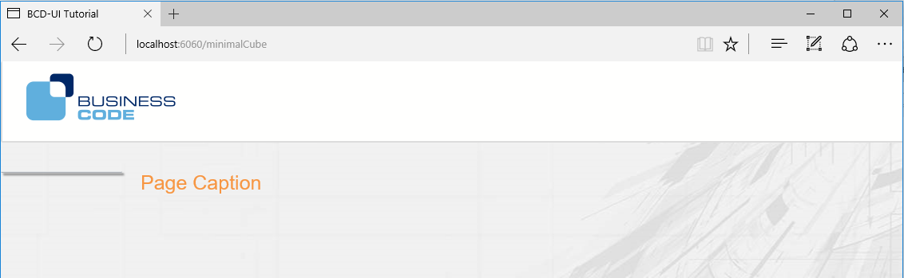

[[DocSimpleReq]]
== Your first BCD-UI page

In this section we start creating a small BCD-UI application and explain some core concepts. +
Before you start, make sure you have a Java EE web application with BCD-UI prepared. +
In case you start from scratch, you may follow <<DocGettingStarted,these>> steps to set you environment up.

=== Overview

This section shows how to setup a BCD-UI page, load some data and display it.

These are the steps of this section:

. Page Setup: Set HTML frame for over-all layout
. Use a _SimpleModel_: to load static daa from an XML file
. Add a _Renderer_: The Renderer transforms the xml data to HTML
. Use an _AutoModel_: The AutoModel dynamically loads data from the database
. Add a _PeriodChooser_: Add a date chooser and an apply button that reloads the page with the selected date period
. Add a _SingleSelect_: This allows you to define which data is taken into account for the report.
. Run the report and use the filters to

Later we will add a login and continue extending tha app.

=== Step by step

==== Set the page up

To create an HTML carrier page, add WebContent/simpleReq/index.html to your application.
To add BCD-UI capability for JavaScript to your page, start with the following code.
It basically holds the BCD-UI theme layout containers and includes the library, you may ignore some parts for now.
During the next steps in this section, we will add some components.

// tag::blankBcduiPage[]
.A blank BCD-UI page
[source,html,linenums,highlight='6,19-20,25-26,31']
----
include::../../../BCD-UI-Tutorial/web/blankPage.html[]
----
<1> Load BCD-UI library
<2> This we call 'SideBar', this is where we will later place the report filters
<3> Here we will place the data output and show the guiStatus' content
<4> Any of your local Javascript code goes here
// end::blankBcduiPage[]

Now you already have an empty but styled page, open it in a browser.

If you lack the styling, it is likely that bcdui/bcdui.js could not be loaded.
In that case, your application lacks bcdui.jar, see <<DocAppsetup,application setup>>.
For more information about the blank carrier page, see <<DocThemes,theme>>.

==== Add some static data

We start by loading a static file and displaying its content.

Create a file `myData.xml` with the following content:

[source,xml]
----
include::../../../BCD-UI-Tutorial/web/sampleWrs.xml[]
----

NOTE: Above XML is a sample of a BCD-UI _Web Row Set_ Wrs, which is per default used to transfer data from and to the client.
Many parts of BCD-UI understand this format and show smart behaviour if you use it.

Now add the following code to the script block at end of the page:

.Fastes way to load static data
[source,javascript]
var fixData = new bcdui.core.SimpleModel( "myData.xml" );

A link:../jsdoc/bcdui.core.SimpleModel.html[bcdui.core.SimpleModel^] is used to load data from the server or a file.
It will not start loading, until the data is actually used, which is the case when you add a renderer in the next step.

==== Add a Renderer

The next step is to create a link:../jsdoc/bcdui.core.Renderer.html[bcdui.core.Renderer^] and let it display our data.
The renderer accepts any DataProvider like the SimpleModel from the previous section plus an HTML element id (targetHtml) where
the output is to be displayed.

NOTE: The link:../jsdoc/bcdui.core.DataProvider.html[bcdui.core.DataProvider^] is a core concept.
It is the base class of all models, which are able to provide data for processing or rendering, like SimpleModel or AutoModel (see below).
Understanding DataProviders is a big step towards understanding BCD-UI client side.

By default the result is rendered as simple table. It is possible to write custom xslt files to create different html.
Add this to the script section or your page:

.A typical renderer
[source,javascript]
var renderer =  new bcdui.core.Renderer({
  inputModel: fixData,
  targetHtml: "myData"
});

The page now looks like this:

image::images/simpleReq_renderer_only.png[]

Congratulation, This is already your first BCD-UI page!

==== Load data from database

Instead of reading the data from a static file, we will now access the database.

===== Add a BindingSet

<<DocBinding,BindingSets>> connect BCD-UI to yout database. Each table or view accessed is covered by a BindingSet.

[source,xml]
----
<BindingSet xmlns="http://www.businesscode.de/schema/bcdui/bindings-1.0.0"
  id="testData" table="test_data"> <!--1--> <!--2-->

  <C id="id" caption="Id" isKey="true"> <!--3-->
    <Column>id</Column> <!--4-->
  </C>
  <C id="dy" caption="Dy">
    <Column>dy</Column>
  </C>
  <C id="yr" caption="Year">
    <Column>EXTRACT( YEAR from dy)</Column> <!--5-->
  </C>
  <C id="country" caption="Country">
    <Column>country</Column>
  </C>
  <C id="station" caption="Station">
    <Column>station</Column>
  </C>
  <C id="carsSold" caption="Cars sold">
    <Column>cars_sold</Column>
  </C>
  <C id="carsRepaired" caption="Cars repaired">
    <Column>cars_repaired</Column>
  </C>
</BindingSet>
----
<1> `id`: The BindingSet's logical name in the application
<2> `table`: The real table name in your database
<3> A logical BindingItem name
<4> The real column name in you database
<5> You may also use a valid column expression here

Create a similar file in `WEB-INF/bcdui/bindings` and name it testData.xml.

NOTE: By convention, the BindingSet's filename is the same as the binding set's `id` plus `.xml` extension.

The BindingSet is validated and enriched by database catalog information during the startup of the web application.
So typos in column names or not existing columns are detected already. The output can be found in the tomcat console.

----
2017-03-08 10:59:31  ReadBindingSet: BindingSet 'test_data': org.postgresql.util.PSQLException: ERROR: column t3.unicorns_feeded does not exist
----

In case a binding set is not correct, it is ignored by BCD-UI so that any access to it would lead to a BindingNotFoundException.

===== Add an AutoModel

The following javascript code creates an link:../jsdoc/bcdui.core.AutoModel.html[bcdui.core.AutoModel^].
The AutoModel sends a WRS-Request referencing the BindingSet and retrieves the columns dy, country, station, carsSold and carsRepaired from our test data.
Please adjust the column names and binding set id to the ones you used before. +
The requested data can be filtered by country or dy. We will create the filters later in this section.
Please note that the AutoModel is not limiting data so far, everything is loaded.

Add this to the script block at the end of the page:

.For simple requests, AutoModels may be enough
[source,javascript]
----
var myModel = new bcdui.core.AutoModel({
  bRefs: "dy country station carsSold carsRepaired",
  filterBRefs: "country dy",
  bindingSetId: "testData",
  isDistinct: true
});
----

To let the renderer show this data instead of the static XML above, change the renderer's input parameter to `inputModel: myModel`. +

Reload the page: Now you are already using your database!

==== Add a PeriodChooser
In this section we add a period chooser link:../jsdoc/bcdui.widget.PeriodChooser.html[bcdui.core.PeriodChooser^] to our page so that we can retrieve a subset of our data by specifying a date range and an apply button to start the reload of the page with the filter set by the user.

[source,html]
----

  Date
  

    

  

  

    

  

----

To place the period chooser and the apply button widget, add the two divs to your bcdSideBarContainer.
The chooser and the button are then created via the JavaScript API as follows:

.Sample for creating widgets via JavaScript
[source,javascript]
----
bcdui.widget.createPeriodChooser({
  targetModelXPath: "$guiStatus/*/f:Filter/f:And[@id = 'myPeriodChooser']", <1>
  targetHtml: 'periodChooser', <2>
  isWeekSelectable: true <3>
});
bcdui.widgetNg.createButton({
  onClickAction: bcdui.core.lifecycle.applyAction,
  targetHtml: 'apply',
  caption: 'Apply'
});
----
<1> This does tell the PeriodChooser to write its selected result into the model named guiStatus
<2> This is the HTML element where the widget is displayed
<3> These are further widget specific settings

The PeriodChooser works on well-known bRef, like `dy, mo, yr` with an optional postfix to support date field detection in calculations.
Assuming you have a date column in your data, name it `dy`.

.It is mandatory to mame date related columns `dy, cw, cwyr, mo, qr, yr` with an optional postix
[source,xml]
..<C id="dy"><Column>booking_date</Column></C>

Please add the above javascript snippets to the script section.
The arguments for both are the targetHtml, which are the respective divs inside which we want to create the widgets.
For the period chooser there is also targetModelXPath, which specifies the root node of the period filter in the guiStatus model (which is by default the target xml model for our widgets).
To get an impression on how this guiStatus model looks like, we add the following debugging utility to the javascript section in our page:

[source,javascript]
----
bcdui.widget.visualizeXml.visualizeModel({
  inputModel: bcdui.wkModels.guiStatus, 
  targetHtml: "myGuiStatus"
});
----

This utility widget simply displays the content of the guiStatus singleton to div#myGuiStatus.
A sample guiStatus with a specified period is shown here:

[source,xml]
----
<guiStatus:Status xmlns:guiStatus="http://www.businesscode.de/schema/bcdui/guiStatus-1.0.0"> <!--1-->
  <f:Filter xmlns:f="http://www.businesscode.de/schema/bcdui/filter-1.0.0"> <!--2-->
    <f:And id="myPeriodChooser" bcdPostfix="" isValid="true" dateFrom="2017-01-01" dateTo="2017-01-31"> <!--3-->
      <f:Expression bRef="dy" op="&gt;=" value="2017-01-01"/>
      <f:Expression bRef="dy" op="&lt;=" value="2017-01-31"/>
    </f:And>
  </f:Filter>
</guiStatus:Status>
----
<1> This model is created by BCD-UI on page load time and can be found at bcdui.wkModels.guiStatus or by name guiStatus
<2> guiStatus:Status/f:Filter is the per convention the default place for widgets. It is controlled by the targetModelXPath parameter that you provide
<3> This node and its children is written by our PeriodChooser once a value is selected

When the apply button is clicked, the guiStatus document is used for loading data once the page is reentered.
You should see than that the url has a guiStatus parameter with the compressed guiStatus.

NOTE: BCD-UI creates a page-wide singleton named `guiStatus`, accessible via bcdui.wkModels.guiStatus
and it serves per convention as the default place to store user interaction.

AutoModel translates f:Filter elements stored in `guiStatus` into an SQL `WHERE` condition clause on the server side, see its `filterBRef` parameter.
So when you setup a widget to create a filter, the targetXPath argument describes what filter elements are written to the guiStatus.
In short the attribute bRef of a f:Filter expression specifies which column we want to use in a filter.
So in our example the filter f:Filter leads translated to

[source,sql]
SELECT ... FROM your_table WHERE .. ( dy_columnname BETWEEN '2017-01-01' AND '2017-01-31' );

Further details on web row set and the filters can be found <<DocXmlData,here>>

==== Add a SingleSelect

The user can limit the data retrieved from the database by using filter widgets.
Many filters show lists of values to choose from that are based on reference data.

The filter in this example is a link:../jsdoc/bcdui.widget.SingleSelect.html[bcdui.core.SingleSelect^], which uses a list of countries from which the user can choose.
A BCD-UI model holds data in the from of XML for further usage.
To add a model with the available data, add the following code to your script block:

.Create a model from small static inline data
[source,javascript]
----
var staticModel = new bcdui.core.StaticModel({
  id: "countriesModel",
  data: '<countries><item caption="Germany">DE</item><item caption="France">FR</item>'+
        '<item caption="USA">US</item><item caption="Spain">ES</item></countries>'
});
----

The link:../jsdoc/bcdui.core.StaticModel.html[bcdui.core.StaticModel^] used in this example has a static string which is parsed and available as DOM document.

[source,xml]
----
<countries>
  <item caption="Germany">DE</item>
  <item caption="France">FR</item>
  <item caption="USA">US</item>
  <item caption="Spain">ES</item>
</countries>
----

The SingleSelect widget we want to use here must be added to the bcdSideBarContainer div, similar for the apply button and the period chooser.

[source,html]
----

  

    Country
    

      

    

    ...
  

----

The SingleSelect widget is again created with javascript in the script block:

[source,javascript]
----
bcdui.widgetNg.createSingleSelect({
  targetHtml: 'country',
  targetModelXPath: "/*/f:Filter/f:Expression[@bRef = 'country' and @op = '=']/@value",
  optionsModelXPath: "$countriesModel/countries/item"
)};
----

The widget has an optionsModelXPath argument that specifies the data source for the options from which the user can select a value.
In our example, the list of countries is taken from a StaticModel, please note that the optionsModelXPath is a string attribute,
therefore we have to set an explicit id for the StaticModel, we choose 'countriesModel'.

NOTE: References to a DataProviders in xpaths are always built with a `$` followed by the DataProvider's id, like `$myDataModel`.

To let the xpath access all countries, we set `$countriesModel/countries/item`.

.Sample for HTML custom elements
[source,html]
----

  Country
  

    <bcd-singleselectng
        targetModelXPath="/*/f:Filter/f:Expression[@bRef = 'country' and @op = '=']/@value"
        optionsModelXPath="$countriesModel/countries/item"/>
  

----

The chosen item will be stored in the guiStatus (default) target model using the targetXPath position.
In this case we write a "country" filter.
You can find more about widgets <<DocWidgets,here>>.

==== Run your report

Congratulations. These were all steps required to setup a filter demo page you can now open
http://localhost:8080/GettingStarted/simpleReq/index.html to see your report. +
(Please adapt the URL, if necessary, if your Tomcat listens on a different port.)

image::images/simpleReq_simpleReq.png[]
