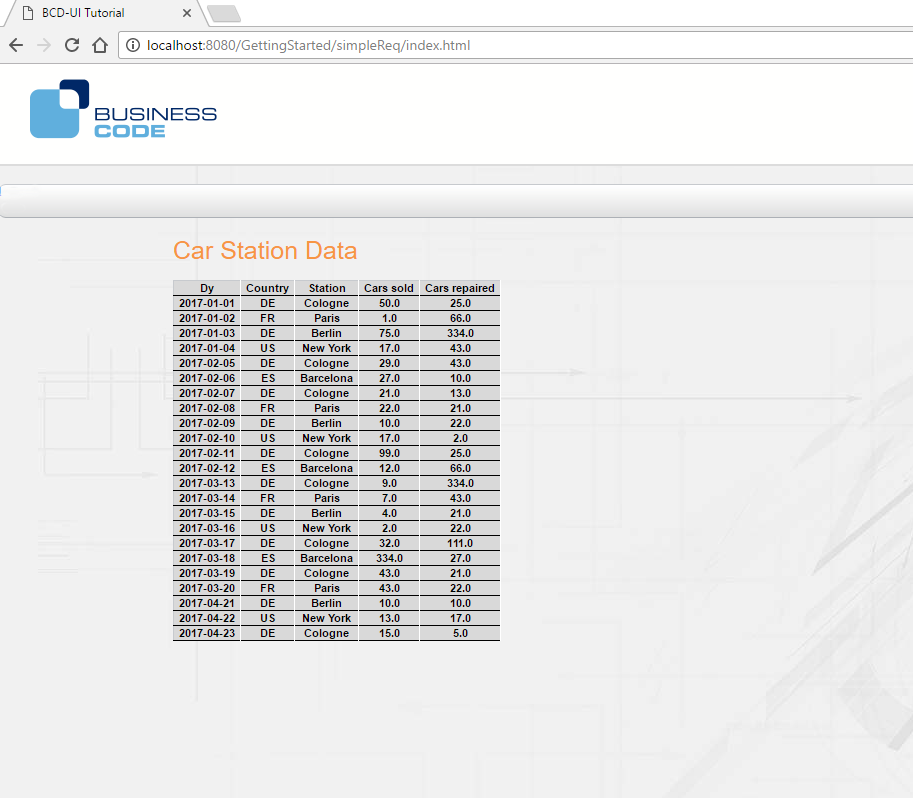
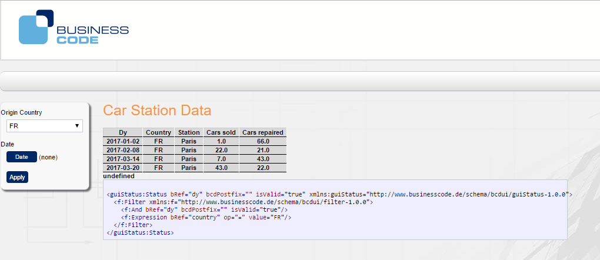

[[DocSimpleReq]]
== Simple Request

=== Overview

This tutorial shows how the sidebar filters are connected to an automodel. The automodel loads data from database applying the user selected filter.
The data is then rendered as an html table, using a renderer component.

These are the steps of this tutorial:

1. Page Setup:: The automodel reacts on user filter and retrieves the data
2. Add an automodel:: The automodel reacts on user filter and retrieves the data
3. Add a renderer:: The link:../jsdoc/bcdui.core.Renderer.html[renderer, window="_blank"] transforms the xml data from the automodel to html
4. Add a period chooser:: Add a chooser and an apply button that reloads the page with the selected date period
5. Add a single select:: This allows you to define which data is taken into account for the report.
Use the filter:: 

Each step is described in the following sub-chapters.

=== Step by step

==== Page setup

BCD-UI can be used in any regular J2EE web application.
To create a HTML carrier page, add WebContent/simpleReq/index.html to your application.
To add BCD-UI capability for JavaScript to your page, start with the following code.
It basically holds the BCD-UI theme layout containers and includes the library.
During the next steps in this tutorial we will add some components.

[source,html]
----
<!DOCTYPE HTML>
<html>
  <head>
    <meta charset="UTF-8"></meta>
    <title>BCD-UI Tutorial</title>
    
  </head>
  <body>
    

    

    

    

      

        

      

     
      

      

        

          

          
  
        

        

          
Car Station Data

            

            

        

       

      

    
  </body>
</html> 

----

==== Add an automodel

The first step is to add a model to our page. 
The following javascript code creates an automodel. The BCD-UI AutoModel creates a WebRowSet request for BindingSet
testData and retrieves the columns dy, country, station, carsSold and carsRepaired from our test data. Please adjust the column names and binding set id to the ones you used before.
The requested data can be filtered by country or dy. We will create the filter later in this tutorial.
The argument isDistinct ensures that only distinct values are retrieved.
Please note that the automodel is not limited so far. So if your table contains a lot of rows, since all of them are loaded.

[source,javascript]
----

----
By now, the data are not shown, when the page is loaded so for that we need a renderer that displays the retrieved data.

==== Add a renderer
The next step is to create a renderer and let it display our data. The renderer accepts an inputModel which is the autoModel we created in the previous section and an html element id (targetHtml) where
 the output is displayed. By default the result is rendered as simple table. It is possible to write custom xslt files to create different html.

[source,javascript]
----

var renderer =  new bcdui.core.Renderer({ 
                 inputModel: myModel,  
                 targetHtml: "myData",
                 parameters : { makeRowSpan: true, sortRows: false } });

----

The page now looks like this: 

 This is very basic and so we want to add some filter widgets to the sidebar. 
 

==== Add a period chooser
In this section we add a period chooser to our page so that we can retrieve a subset of our data by specifying a date range and an apply button to start the reload of the page with the filter set by the user.

[source,xml]
----

  Date
  

    

  

  

    

  

----
To create the period chooser and the apply button widget, we add two div containers from above to our bcdSideBarContainer.
The chooser and the button are then created via the JavaScript API as follows:

[source,javascript]
----

bcdui.widget.createPeriodChooser({
  targetModelXPath: "/*/f:Filter/f:And[@id = 'myPeriodChooser']",
  targetHtml: 'periodChooser',
  isWeekSelectable: true
});
});
bcdui.widgetNg.createButton({
  onClickAction: bcdui.core.lifecycle.applyAction,
  targetHtml: 'apply',
  caption: 'Apply'
});

----
Please add the above javascript snippets to the script section.
The arguments for both are the targetHtml, which are the respective div's inside which we want to create the widgets, and for the period chooser also the targetModelXPath, 
which specifies the root node of the period filter in the guiStatus model (which is by default the target xml model for our widgets). 
To get an impression on how this guiStatus model looks like,
we add the following utility to the javascript section in our page:
More details on PeriodChooser creation can be foundlink:../jsdoc/bcdui.widget.html#.createPeriodChooser[here, window="_blank"].

The PeriodChooser expects that the Binding Set Id of the column on which you want to filter is 'dy'. So, in case your sample data has a different name date column, e.g.

[source,javascript]
----
..<C id="booking_date"><Column>booking_date</Column></C>

----

please either change the id to 'dy', or create an additional entry for a "date" column with id 'dy' in your BindingSet. Restart the tomcat server after changing the a binding set.
 
[source,javascript]
----
..<C id="dy"><Column>booking_date</Column></C>

----

[source,javascript]
----

bcdui.widget.visualizeXml.visualizeModel({
  inputModel: bcdui.wkModels.guiStatus, 
  targetHtml: "myGuiStatus"
});

----

This utility widget simply displays the content of bcdui.wkModels.guiStatus to the html element myGuiStatus.
A sample guiStatus with a specified period is shown here:

[source,xml]
----
<guiStatus:Status xmlns:guiStatus="http://www.businesscode.de/schema/bcdui/guiStatus-1.0.0" bRef="dy" bcdPostfix="" isValid="true" dateFrom="2017-01-01" dateTo="2017-01-31">
  <f:Filter xmlns:f="http://www.businesscode.de/schema/bcdui/filter-1.0.0">
    <f:And id="myPeriodChooser" bcdPostfix="" isValid="true" dateFrom="2017-01-01" dateTo="2017-01-31">
      <f:Expression bRef="dy" op="&gt;=" value="2017-01-01"/>
      <f:Expression bRef="dy" op="&lt;=" value="2017-01-31"/>
    </f:And>
  </f:Filter>
</guiStatus:Status>
----

When the apply button is clicked, the guiStatus document is compressed and the page is reloaded. You should see than that the url has an guiStatus parameter with the compressed guiStatus.
On reload, the guiStatus is uncompressed and all data provider start using the filter settings from guiStatus.

The page has a so called life cycle which is explained in more detail link:../../pageStructure/doc.html[here, window="_blank"].

The filter elements in the guistatus are translated to where condition clauses on the server side. So when you setup a widget to create a filter, 
the targetXPath argument describes what filter elements are writen to the guiStatus. 
In short the attribute bRef of a filter expression specifies which column we want to use in a filter.
So in our example the filter f:Filter leads translated to
 `
            select ... from your_table where .. ( dy_columnname between '2017-01-01' and '2017-01-31' ); 
          ` 

Further details on web row set and the filters can be found link:../../xmlData/doc.html[here, window="_blank"]

==== Add a single select

The user can filter the data retrieved from the database by using filter widgets.
Many filters show lists of values to choose from that are based on reference data.

The filter in this example uses a list of countries from which the user can choose.
A BCD-UI model holds data in the from of XML for further usage.
To add a model with the available data, add the following code to your script block:

[source,javascript]
----

var staticModel = new bcdui.core.StaticModel(
  { id: "countriesModel", 
    data: '<countries><item caption="Germany">DE</item><item caption="France">FR</item><item caption="USA">US</item><item caption="Spain">ES</item></countries>' 
   });

----

The StaticModel used in this example has a static string which is parsed and available as DOM document.(A "dynamical" example, fetching the reference data from a database, will follow in the section on Minimal Cube setup.)

[source,xml]
----
<countries>
  <item caption="Germany">DE</item>
  <item caption="France">FR</item>
  <item caption="USA">US</item>
  <item caption="Spain">ES</item>
</countries>
----

The SingleSelect widget we want to use here must be added to the bcdSideBarContainer div, similar to the apply button and the period chooser.

[source,xml]
----

  

    Country
    

      

    

    Date
    

      

    

    

      

    

  

----

The SingleSelect widget is again created with javascript in the script block:

[source,javascript]
----

getNg.createSingleSelect({
tml: 'country',
odelXPath: "/*/f:Filter/f:Expression[@bRef = 'country' and @op = '=']/@value",
ModelXPath: "$countriesModel/countries/item"

----

 The widget has the argument optionsModelXPath that
specifies the data source for the options from which the user can choose from.
In our example the list of countries is taken from the StaticModel, please note that the optionsModelXPath is a string attribute, we have
to give the staticModel an id 'countriesModel'. So that the xpath to access all countries is then '$countriesModel/countries/item'.
Ids for DataProvider in XPath expressions always start with '$' .

[source,xml]
----

  Country
  

    <bcd-singleselectng targetModelXPath="/*/f:Filter/f:Expression[@bRef = 'country' and @op = '=']/@value" optionsModelXPath="$countriesModel/countries/item"/>
  

----

				
The chosen item will be stored in the guiStatus (default) target model using the targetXPath position. In this case we
write a "country" filter. 
You can find more about widgets <<DocWidgets,here>>.

==== Use the filter

Congratulations. These were all steps required to setup a filter demo page
You can now go to http://localhost:8080/GettingStarted/simpleReq/index.html to use the report.(Please adapt the URL, if necessary, if your Tomcat listens on a port different from 8080.)

