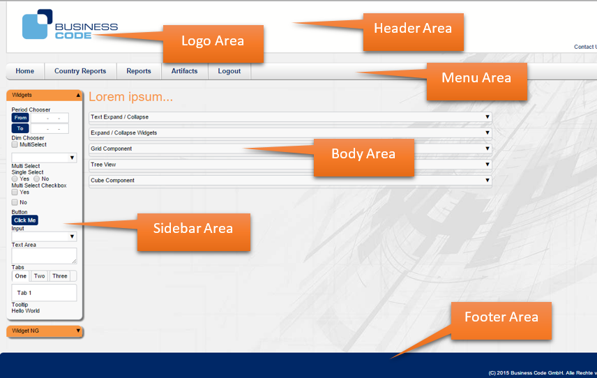

[[DocThemes]]
== Themes

=== Themes overview

In order to support different adjustable look and feel of widgets and components, BCD-UI provides theme support.
This allows it to be adjusted to a corporate standard.

Overall Page layout:: Defines the common page structure and coloring of all pages
This overall structure provides a div for each major page component, like title, menu, sideBar, body, which are identified via their id.
The default page layout uses basic class definitions from the 960 grid system (http://960.gs/).
This is a blank empty page with all major parts:

[source,html]
----
include::../../../BCD-UI-Tutorial/web/blankPage.html[]
----

Default styles:: The theme css files are compiled from scss, see link:http://sass-lang.com[]. +
BCD-UI's scss files include a default styling for all widget, component, modules and general page layout.

==== Adjusting

To use the style, just css-import allStyles.css and make sure you got the well known divs available. Put
all pages content, like choosers or reports in divs with the appropriate id like id="bcdBodyContainer" or id="bcdSideBarContainer".
The theme takes care to position the elements correctly and provide them with the right color and size.
See chapter 'Page structuring' below for details.

=== Implementation

==== Defining a new theme

A new theme can be defined by creating a theme folder structure identically the generic one.
The images subfolder can hold additional, custom images.
The scss file holds a list of variables which can be used to define custom coloring, custom logos etc.
After setting up the variables, the file holds includes to the default generic scss files and finally you can overwrite specific styles, e.g. for creating a custom menu layout.

So if your company layout needs a general coloring of green and red, you modify the 2 variables $corporate-color and $corporate-color-alt. And maybe your body background should be a fixed image, then you can overwrite the body style after importing the default ones.

[source,scss]
----
[...]
$corporate-color-alt:       #FF0000;  // my new alternative color is red
$corporate-color:           #00FF00;  // my new main color is green
[...]
@import '../../../generic/theme/sass/_standardPage.scss';
[...]
body {
  background: #f1f1f1 url("../images/bg.jpg") no-repeat center 0 fixed; // and do some overwriting with a fixed image
}
[...]

----

All available variables can be found in _constants.scss.

==== Themes folder structure

This is a typical compiled style .jar package structure:

[source,javascript]
----

\theme
  \css                          <--  Common css parts except page structure definition
    \allStyles.css              <--  compiled css file holding all styles
  \images                       <--  image container

----

==== Page structuring

BCD-UI follows a 960 grid system based layout.
The following shows a standard html page which includes the library (and so it includes the styles, too) with footer, body and sidebar areas.

[source,html]
----

<!DOCTYPE HTML>
<html>

  <head>
    <meta charset="UTF-8"></meta>
    <title>Hello World Page</title>
    
  </head>

  <body>

    <!-- well known required divs -->
    

    

    

    

      

      
<!-- place your menu here -->

      
<!-- mainly some vertical space or custom use -->

      

        

        
          <!-- place your sidebar sections and widgets here -->
          

Section 1

            

              Widget 1
              
<!-- add a widget here -->

              Widget 2
              
<!-- add a widget here -->

            

          

          

Section 2

            

              Widget 3
              
<!-- add a widget here -->

              Widget 4
              
<!-- add a widget here -->

            

          

        

        

          <!-- place your main body information here -->
          Hello World Page
          
Hello World

        

      

      
<!-- place your footer information here -->

    

  </body>
</html>

----

Content or theme setup styling is usually affecting the following ids:

bcdHeaderArea:: A top area where usually a logo is placed (bcdLogoImageArea)
bcdMenuBarArea:: A top area below the header where commonly the menu bar is shown
bcdSideBarContainer:: The place where you add your sidebar widgets
bcdBodyContainer bcdCaption:: The title of the page is shown here
bcdBodyContainer:: Scorecards, cubes, the main content of your page should be here
bcdFooterArea:: An area at the bottom of the page.

=== Theme Sample

==== Theme Sample

A sample page with header, menu, sidebar, body and footer.

