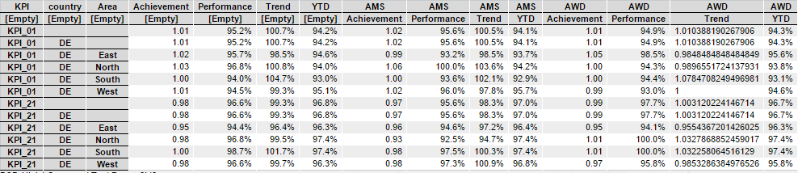
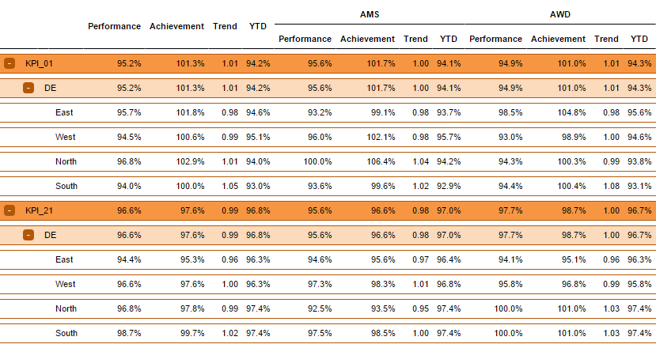

[[DocTreeReport]]
== Tree Report Component

=== Tree Report Overview

A Tree Report allows for rendering data in a tree structure.
This can be done for any Wrs, may it be generated, loaded via a direct <<DocXmlData,Wrq>> or based on a
link:../jsdoc/bcdui.component.cube.CubeModel.html[CubeModel^] or a
link:../jsdoc/bcdui.component.scorecard.ScorecardModel.html[ScorecardModel^] for example.

=== Fixed depth trees

Assume you have the following data

from a Wrq or a CubeModel for example, then you can setup a Render chain like this:
[source,javascript]
----
include::../../../BCD-UI-Tutorial/web/treeReport/index.html[tag=dynTreeRenderer]
----
And it will display the data in the following way:

=== Trees of variable depths

There is also support for a tree with unknown depth, where each row has a an id column with an optional `parentId` attribute.

[source,xml]
----
include::../../../BCD-UI-Tutorial/web/treeReport/parentWrs.xml[]
----
<1> The id column is the one with the `parentId` attribute declared
<2> Having no parentId means being top-level. Multiple top-level rows are allowed
<3> The `parentId` attribute connects it to the parent.

If you apply a renderer with the chain if the sample above, the result will be:

image::./images/treeReport_parent.png[]
