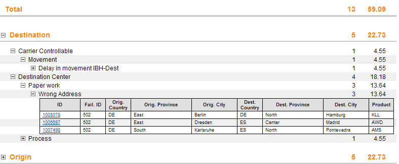

[[DocTreeReport]]
== Tree report

=== Tree report

A tree report allows loading of tree-like data down to a defined level plus lazy loading of lower level

[source,xml]
----
<TreeReportDefinition>
  <Settings>
    <!-- (TODO find better filter) Are all optional with a well-known default -->
    <ExpandAll/>
    <ContextMenu/>
  </Settings>
  <Structure>
    <!-- TODO find better name -->
    <DimemsionRequestLevel dimensionIdRef="ctrDim"/>
    <BindingSet bindingSetIdRef="parcel"/>
    <!-- bRef is recomended, otherwise servlet or servlet mapping must decide -->
    <Dimensions rowDimCount="1" colMeasureCount="1">
      <Dimension id="ctrDim" bRef="ctr"/>
      <Dimension id="moDim" bRef="moName" caption="Month Name." shortCaption="Month">
        <DimensionAttr name="sort" bRef="mo"/>
        <!-- Adds the max(mo) as attribute sort to column representing the dimension -->
      </Dimension>
      <Dimension bRef="product"/>
    </Dimensions>
    <Measures>
      <Measure id="m1">
        <ValueRef bRef="t_ontime"/>
      </Measure>
      <Measure id="ontimePerc" caption="Performance (%)" shortCaption="Perf.">
        <Calc operation="div">
          <!-- See Calc definition -->
          <Calc operation="add" precision="1" unit="#">
            <ValueRef bRef="i_ontime1"/>
            <ValueRef bRef="t_ontime2" precision="2"/>
          </Calc>
          <ValueRef bRef="t_ontime"/>
        </Calc>
      </Measure>
    </Measures>
    <Filter>
      <!-- Optional, see Filter definition, on request, sidebar filder are added with And -->
      <And>
        <Item ref="yr" op="=" value="2010"/>
        <Item ref="cw" op="=" value="1"/>
      </And>
    </Filter>
  </Structure>
  <DetailStructure>
    <BindingSet bindingSetIdRef="parcelDetails"/>
    <!-- bRef is recomended, otherwise servlet or servlet mapping must decide -->
    <Columns>
      <C id="m1">
        <ValueRef bRef="t_ontime"/>
      </C>
    </Columns>
  </DetailStructure>
</TreeReportDefinition>
----

Behaviour:

* If a level is expaned and it (and all of its loaded children) has only one leaf, it is fully expanded.
