[[DocWidgets]]
== Widgets Overview

=== Widgets Overview

Widgets are small visual objects for user interaction.
Commonly they store their state, the user's selection in a target model (by default guiStatus).
The `targetModelXPath` parameter points to the exact place where data is stored.
Widgets usually work in 2 ways.
If the user clicks/selects/does an action on it, the target value changes.
On the other hand, when you change the value from outside, e.g. via javascript,
the widget should update itself visually to be in sync with the value.

Some widgets have an options model reference as data source, for example entries in a drop down box.
The option model is referenced via `optionsModelXPath` and optional `optionsModelRelativeValueXPath`.
They point to value and caption information used for the widget.

==== Creation

As widgets support their API in different languages, widgets can be created in different ways.
All are expecting the same set of parameters. When using js, providing `targetHtml` is mandatory.

.Javascript
[source,javascript]
----
bcdui.widgetNg.createSingleSelect( {
  targetModelXPath: "/*/f:Filter/f:Expression[@bRef = 'orig_ctr' and @op = '=']/@value",
  ...
});
----

.As HTML Custom Elements
[source,html]
----
<bcd-singleselectng
  targetModelXPath = "/*/f:Filter/f:Expression[@bRef = 'orig_ctr' and @op = '=']/@value"
  ... >
</bcd-singleselectng> <!--1-->
----
<1> Note that some browsers do not allow self-cosing elements ('/>') here

.Used as JSP
[source,html]
----
<w:singleSelect id="myId" ... />
----

.Created from XSLT
[source,xml]
----
<xsl:call-template name="singleSelect">
  <xsl:with-param name="id" select="'myId'"/>
  ...
</xsl:call-template>
----

.Called from XAPI
[source,xml]
----
<xapi:SingleSelect id="myId" ... />
----

Using Javascript and HTML Custom Elements is by far the most common way.

NOTE: While you can create widges from javascript, HTML custom elements, XSLT, XAPI and jsp, the result and behavior is exactly the same.
You can easily derive the parameters from the javascript api documentation.

=== Overview bcdui.WidgetNg

==== Button

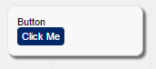
link:../jsdoc/bcdui.widgetNg.html#.createButton[Button:^] A button widget for a clickable action

==== Checkbox

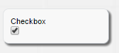
link:../jsdoc/bcdui.widgetNg.html#.createCheckbox[Checkbox:^] A checkbox widget which allows a on/off (true/false, 1/0) switch

==== Connectable

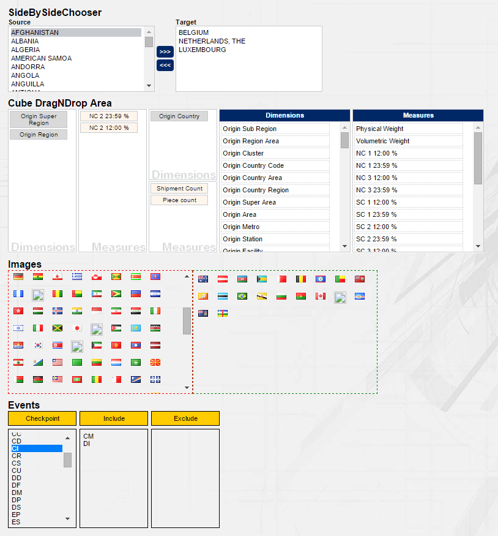
link:../jsdoc/bcdui.widgetNg.html#.createConnectable[Connectable:^] Connectables, can be used in various ways

==== Date Input

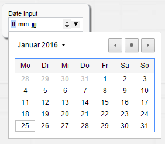
link:../jsdoc/bcdui.widgetNg.html#.createDateInput[Date Input:^] A HTML5 dateinput control

==== Input

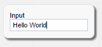
link:../jsdoc/bcdui.widgetNg.html#.createInput[Input:^] A basic input control

==== SideBySide Chooser

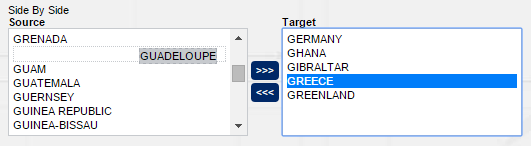
link:../jsdoc/bcdui.widgetNg.html#.createSideBySideChooser[SideBySide Chooser:^] A side-by-side chooser allowing selection and ordering of items

==== Single Select

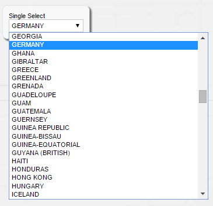
link:../jsdoc/bcdui.widgetNg.html#.createSingleSelect[Single Select:^] A drop down selector

==== Suggest Input

image::images/widgets_ng_suggestInput.png[]
link:../jsdoc/bcdui.widgetNg.html#.createSuggestInput[Suggest Input:^] A drop down selector with autocompletion functionality and custom rendering

==== Text Area

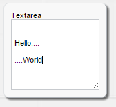
link:../jsdoc/bcdui.widgetNg.html#.createTextArea[Text Area:^] A (resizable) text area field, which allows multiline input

=== Overview bcdui.widget

==== Blind UpDown

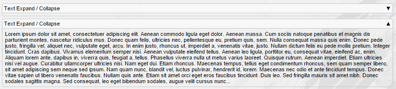
link:../jsdoc/bcdui.widget.html#.createBlindUpDownArea[Blind UpDown:^] A collapsable/expandable area

==== Contex Menu

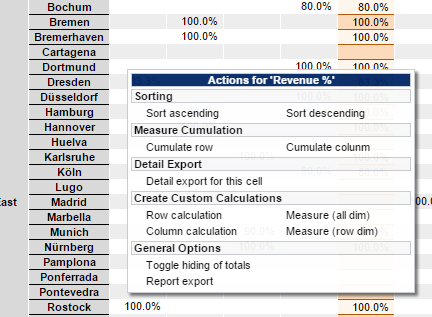
link:../jsdoc/bcdui.widget.html#.createContextMenu[Context Menu:^] A context menu which can be linked to a cell

==== Dimension Chooser

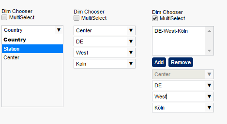
link:../jsdoc/bcdui.widget.html#.createDimensionChooser[Dimension Chooser:^] A multi level selector

==== Formula Editor

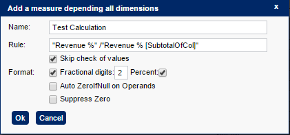
link:../jsdoc/bcdui.widget.html#.createFormulaEditor[Formula Editor:^] A formula Editor for building custom calculations

==== Input Field

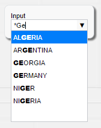
link:../jsdoc/bcdui.widget.html#.createInputField[Input Field:^] An autocompletion input widget

==== Login Form

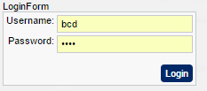
link:../jsdoc/bcdui.widget.html[Login Form:^] A simple login form widget for username and password

==== Menu

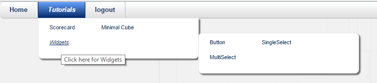
link:../jsdoc/bcdui.widget.html#.createMenu[Menu:^] A top menu bar widget

To create a menu follow these steps: First create a WEB-INF/bcdui/menu/menu.xml file with the format of
link:https://github.com/businesscode/BCD-UI/blob/master/Docu/xsd/menu-1.0.0.xsd[menu-1.0.0.xsd^].
It is picked-up on next restart.

.Sample menu.xml file
[source,xml]
----
include::../../../BCD-UI-Tutorial/web/WEB-INF/bcdui/menu/menu.xml[]
----

provide a place where to show it, depending on your theme
[source,html,indent=0]
----
include::../../../BCD-UI-Tutorial/web/widgets/index.html[tag=menuTh]
----

and call
[source,javascript]
----
include::../../../BCD-UI-Tutorial/web/widgets/index.html[tag=menuJs]
----

The menu is capable of respecting different scopes and even user rights, see XSD for details.

==== Multi Select

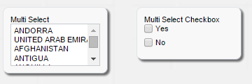
link:../jsdoc/bcdui.widget.html#.createMultiSelect[Multi Select:^] A multiple selection widget (select list or checkbox list)

==== Period Chooser

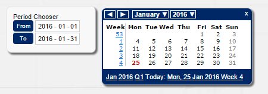
link:../jsdoc/bcdui.widget.html#.createPeriodChooser[Period Chooser:^] A date/date range popup calendar

==== Single Select

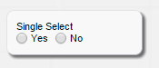
link:../jsdoc/bcdui.widget.html#.createSingleSelect[Single Select:^] A radio button widget offering single selection

==== Tab

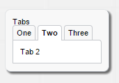
link:../jsdoc/bcdui.widget.html#.createTabMenu[Tab:^] Tabs allow to switch different views of the same data or between different data within a page

==== Tooltip

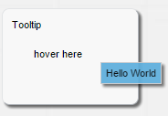
link:../jsdoc/bcdui.widget.html#.createTooltip[Tooltip:^] Flyover, Tooltips connected to cells
