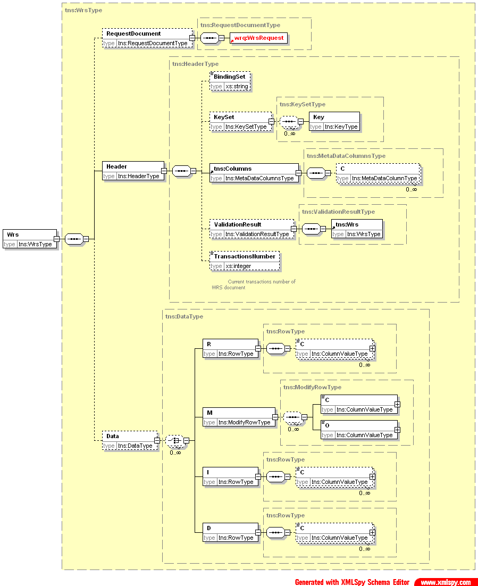

[[DocXmlData]]
== WebRowSet

=== WebRowSet Wrs Overview

BCD-UI delivers and receives data in the following XML format.

BCD-UI WebRowSet Wrs is a unique, easy to use document format, called Wrs, which is preserved during processing on the client.
This allows to reuse, replace, remove or reorder stylesheets in a transformation chain since all stylesheets work on the same input and output format.

==== WebRowSet format

[source,xml]
----
<Wrs xmlns="http://www.businesscode.de/schema/bcdui/wrs-1.0.0">
  <Header>
    <BindingSet>country_table"</BindingSet>
    <Columns>
      <!-- Definitions of the columns -->
      <C pos="1" id="ctrcd">
        <A id="ctr_caption" name="caption"/>
      </C>
      <C pos="2" id="population"/>
    </Columns>
    <Debug>
      <!-- Only available in debug case -->
      <SQL>select ctrcd, pop from countries</SQL>
      <ExecTime>100ms</ExecTime>
      <SelectedBindingSet>bindingSetId</SelectedBindingSet>
      <WrsRequest>...</WrsRequest>
      <Url>...</Url>
    </Debug>
  </Header>
  <Data>
    <R id="id0">
      <C caption="Austria">AU</C>
      <C>8000000</C>
    </R>
    <D id="id2">
      <!-- Row to be deleted -->
      <C caption="Deutsche Demokratische Repubik">DR</C>
      <C>18000000</C>
    </D>
    <M id="id3">
      <!-- Row to be updated -->
      <C caption="Great Britain">GB</C>
      <!-- Current column value -->
      <O caption="Great Britain">GB</O>
      <!-- Original column value -->
      <O>Britain</O>
      <O>England</O>
      <C>55000000</C>
      <O>55000000</O>
    </M>
    <I id="id4">
      <C caption="France">FR</C>
      <C nil="true"/>
      <!-- Without the nil attribute, this would be an empty string -->
      <!-- The following is a sample for a server side replaced value -->
      <C>
        <ServerValue name="GenerateId" param1="scope" param2="alias"/>
      </C>
    </I>
  </Data>
  <MaxRowsExceeded maxRows="500">true</MaxRowsExceeded>
</Wrs>
----

Each row can be

* R for an unmodified row
* D for a row that is to be deleted
* I for a row that is to be inserted
* M for a row that is to be updated. The original value of the column follows in an O elements after the respective C element

Each row has a unique id, whose value has no meaning beside being unique within the document.

Each column C or O contains the column value or a value to be set by the server like

[source,xml]
----
<ServerValue name="user" param1="id"/>
----

for example for the session users's id. In general

[source,xml]
----
<ServerValue name="object" param1="parameter 1" paramN="parameter n"/>
----

See <<DocContext,ServerValues>> for more information.

==== Request document

To request a Wrs from the server, a request document in the following format is to be sent.

[source,xml]
----
<WrsRequest xmlns="http://www.businesscode.de/schema/bcdui/wrs-request-1.0.0" maxRows="100" startRow="300">
  <Select id="a">
    <!-- later can this be wrapped with a Join element -->
    <Columns>
      <C bRef="ctrId"/>
      <C bRef="mo">
        <!-- Attributes to main value, like sort order or long name: -->
        <A bRef="monthName" name="caption"/>
      </C>
      <C bRef="travelers" aggr="min"/>
      <!-- the following brings: sum(travelers) over (partition by mo) order by ctrId as percentage -->
      <C caption="maxPerMonth" aggr="sum" partitionBy="mo" orderBy="ctrId"/>
    </Columns>
    <From>
      <BindingSet>ctrPeople</BindingSet>
      <!-- Or a later Select element -->
    </From>
    <Filter xmlns="http://www.businesscode.de/schema/bcdui/filter-1.0.0">
      <And>
        <Or>
          <Expression bRef="ctrName" op="=" value="DE"/>
          <Expression bRef="ctrName" op="like" value="A%" escape="\\"/>
        </Or>
        <And>
          <Expression bRef="yr" op="=" value="2010"/>
          <Expression bRef="cw" op="=" value="1"/>
        </And>
      </And>
    </Filter>
    <Grouping>
      <!-- Optional -->
      <C bRef="ctrName"/>
      <C bRef="mo"/>
    </Grouping>
    <Ordering>
      <C bRef="ctrName" order="desc"/>
    </Ordering>
  </Select>
</WrsRequest>
----

==== Filter format

Requests and per the output of choosers becoming filters follow BCD-UI's filter format.
Filter conditions can be nested and are evaluated canonically.

[source,xml]
----
<Filter xmlns="http://www.businesscode.de/schema/bcdui/filter-1.0.0">
  <And>
    <Expression bRef="val" op="&gt;=" value="1000"/>
    <Expression bRef="val" op="&lt;=" value="2000"/>
  </And>
  <And>
    <Or>
      <Expression bRef="ctrName" op="="/>
      <!-- No value means null, this filter means "is null" -->
      <Expression bRef="ctrName" op="like" value="A%" escape="\\"/>
    </Or>
    <And>
      <Expression bRef="yr" op="=" value="2010"/>
      <Expression bRef="cw" op="in" value="1,2,3"/>
    </And>
  </And>
</Filter>
----

Above leads to: 
[source,javascript]
----
(val>=? AND val <=?) AND (ctrName IS NULL OR ctrName like ? ESCAPE ?) AND (yr=? AND cw IN (?,?,?)

----

Note that prepared statements are used for security and performance reasons.
Between operator is not available, please use ... &lt;= ... AND ... &gt;= ... instead.

==== Faults

The server responses technical errors via SOAP 1.2 fault

[source,xml]
----
<Envelope xmlns="http://www.w3.org/2003/05/soap-envelope" xmlns:bcd="http://www.businesscode.de/schema/bcdui/wrs-1.0.0">
  <Fault>
    <Code>
      <Value>Sender</Value>
    </Code>
    <Subcode>
      <Value>sqlsoapfaultcode:InvalidXml</Value>
    </Subcode>
    <Reason>
      <Text xml:lang="en-US">An error occurred, DB down</Text>
    </Reason>
    <Body>
      <bcd:WrsRequest>...</bcd:WrsRequest>
      <bcd:Url>original URL</bcd:Url>
      <bcd:more_info_in_XML_like_stacktrace_in_debug_case/>
    </Body>
  </Fault>
</Envelope>
----

=== Cell addressing

Identifying the right column can be done via its hard-coded position in an xPath

[source,javascript]
----
/*/wrs:Data/wrs:R[1]/wrs:C[2]

----

This is easy but also easily breaks and is hard to read.
Thus, it is better to identify a column via its logical name 'CP_DESC', this will work in an xPath outside and inside of XSLT:

[source,javascript]
----
/*/wrs:Data/wrs:R[1]/wrs:C[number(/*/wrs:Header/wrs:Columns/wrs:C[@bRef='CP_DESC']/@pos)]/text()

----

In an XSLT, a key can help to do this even faster and easier with the help of keys:

[source,xml]
----
<xsl:stylesheet xmlns:xsl="http://www.w3.org/1999/XSL/Transform" xmlns:wrs="http://www.businesscode.de/schema/bcdui/wrs-1.0.0" version="1.0">
  <xsl:key name="colHeadById" match="/*/wrs:Header/wrs:Columns/wrs:C" use="@id"/>
  <xsl:template match="/">
    <xsl:value-of select="/*/wrs:Data/wrs:R[1]/wrs:C[number(key('colHeadById','CP_DESC')/@pos)]"/>
  </xsl:template>
</xsl:stylesheet>
----

=== XSD Schema

==== Details

