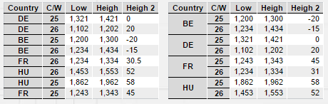
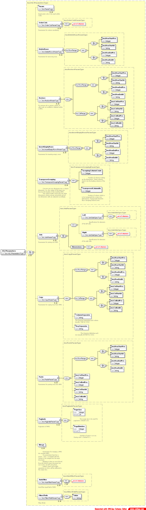

[[DocXsltLibrary]]
== XSLT library

=== Overview

The XSLT library contains a set of generic XSLTs for often required tasks.
Most of these XSLTs work with Wrs, which is the exchange format from and to the server.
They may be used in a `chain` of a ModelWrapper, ModelUpdater or a Renderer. +
You find then at `bcdui/xslt/` followed by the path shown for each item.

=== List of utils

==== Data Transformation

[horizontal]
Order and filter columns:: Only include listed columns the order given by the parameter. `wrs/orderCols.xslt`
Pagination:: Limit and access data with a given page size `wrs/paginate.xslt`
Join to Wrs:: Join two Wrs over data keys, supports _inner_, _left outer_ and _cross_ joins. `wrs/join.xslt`
Transpose grouping:: Transpose a dimension column into a row (i.e. it becomes a column dimension). All data cells are adjusted accordingly. `wrs/transposeGrouping.xslt`
Validate:: Validates the data of the input WRS against the WRS header. Adds a validation-resule WRS into the input WRS' header. `validate/validate.xslt`

==== Data Manipulation

[horizontal]
Insert:: Insert n consecutive empty rows (with new row ids), auto-fill in mandatory columns if they only have on possible value. `wrs/insertRow.xslt`
Duplicate:: Duplicate a range of rows (with new row ids). `wrs/duplicateRow.xslt`
Delete:: Delete (=mark as deleted) a range of rows. `wrs/deleteRows.xslt`
Restore:: Restore a range of rows, marked as deleted. `wrs/restore.xslt`
Merge:: Merge one WRS into another. Existing rows (same row-id) will be modified, rows with new row-ids will be inserted (marked as inserted). `wrs/mergeRow.xslt`

==== Data Visualization

[horizontal]
Render:: Render a Wrs to HTML. This renderer is used by all components `renderer/htmlBuilder.xslt`.
This renderer per default sorts dimension rows and groups row and column headers to td spans.
You can suppress by providing parameters, see below.
Number formatting:: Formats the data according to their format defined in the WRS header (scale, unit, later also i18n). `renderer/numberFormatting.xslt`
Tree rendering:: Beside default rendering, you can use a tree renderer for tree-like data.
See <<DocTreeReport,Tree Report Component>> for this.

==== Parametrization

All wrs modifying XSLT get their parameters via an XML of type
link:https://github.com/businesscode/BCD-UI/blob/master/Docu/xsd/xsltParams-1.0.0.xsd[xsltParams-1.0.0.xsd^].
There is an element defined for each of the stylesheets with the same name which holds the parameters. +
The document becomes parameter `paramModel` and each XSLT will look for a matching entry.
You will usually have only one such file for all page content.
With the optional `paramSetId` attribute you can have multiple sets of the same type
for example to provide two HtmlBuilder with different parameters from the same parameter document. +
While this mechanism may look a bit over-sized in small samples, it scales great in real world usage.

Switching off sorting and row/col span building for HtmlBuilder with XsltParameters would look like the following.

.Sample for XsltParameters
[source,js]
----
include::../../../BCD-UI-Tutorial/web/xsltLibrary/index.html[tag=xsltParam]
----
<1> If the parameters get longer, you will likely create an extra file, static or dynamically an not inline as shown here.
<2> HtmlBuilder will look for an `xp:HtmlBuilder` element with no or a matching `paramSetId` attribute
<3> Element and parameter names and meaning can be found in xsltParams-1.0.0.xsd
<4> Name of the parameter with the parameters is always `paramModel`

.Sorted with row span vs plain output of data

==== Javascript counterparts

Many of these also have counterparts in Javascript at `bcdui.wrs.wrsUtil`. For example

.Sample for using bcdui.wrs.wrsUtil
[source,javascript]
----
include::../../../BCD-UI-Tutorial/web/xsltLibrary/index.html[tag=wrsUtilJsSample]
----
leads to

.Sample Wrs with deleted and inserted rows
[source,xml]
----
<?xml version="1.0"?>
<Wrs xmlns="http://www.businesscode.de/schema/bcdui/wrs-1.0.0">
  <Header>
    <TransactionsNumber>2</TransactionsNumber>
    <TransactionsNumber>1</TransactionsNumber>
    <Columns>
      <C pos="1" id="CTR" dimId="CTR" caption="Country" type-name="VARCHAR"/>
      <C pos="2" id="CW"  dimId="CW"  caption="C/W"     type-name="INTEGER"/>
      <C pos="3" id="LOW"             caption="Low"     type-name="NUMERIC"/>
      <C pos="4" id="HIGH"            caption="Heigh"   type-name="NUMERIC"/>
      <C pos="5" id="HIGH2"           caption="Heigh 2" type-name="NUMERIC"/>
    </Columns>
  </Header>
  <Data newSelection="1 3 5 3">
    <D id="1"><C>BE</C><C>23</C><C>1200</C><C>1300</C><C>-20</C></D>
    <D id="2"><C>CZ</C><C>24</C><C>1234</C><C>1434</C><C>-15</C></D>
    <I id="I_1_3"><C/><C/><C/><C/><C/></I>
    <I id="I_1_3_2"><C/><C/><C/><C/><C/></I>
    <R id="3"><C>DE</C><C>25</C><C>1321</C><C>1421</C><C>0</C></R>
    <R id="4"><C>ES</C><C>26</C><C>1102</C><C>1202</C><C>20</C></R>
    <R id="5"><C>FR</C><C>27</C><C>1234</C><C>1334</C><C>30.5</C></R>
    <R id="6"><C>GB</C><C>28</C><C>1243</C><C>1343</C><C>45</C></R>
    <R id="7"><C>HU</C><C>29</C><C>1453</C><C>1553</C><C>52</C></R>
    <R id="8"><C>NO</C><C>30</C><C>1862</C><C>1962</C><C>58</C></R>
    <R id="9"><C>US</C><C>31</C><C>1913</C><C>2013</C><C>64</C></R>
  </Data>
</Wrs>
----
Note the two deleted rows at the beginning in the two inserted rows after.

See documentation of link:https://businesscode.github.io/BCD-UI-Docu/jsdoc/bcdui.wrs.wrsUtil.html[bcdui.wrsUtil package^] for more information and other helpers.

==== String Utilites

Common string operations which do not come with XSLT-1.0 are provided via string utility template
part of `bcdui/xslt/stringUtils.xslt`.

[horizontal]
printRows:: prints a multi-line string with an indent row by row
left-trim:: cuts of whitespace from string `s` start
right-trim:: cuts of whitespace from string `s` end
trim:: cuts of whitespace from string start and end
stringRepeater:: repeats a given string `s` for `i` times
lastIndexOf:: Finds the last occurrence of a character `c` in a string `s`
replaceString:: In string `str` it replaces substring `find` by substring `replacement`
tokenize:: splits up a `delimiter` separated `string` and returns a node set of elements
nthToken:: Gets the n-th token starting at 1 of a delimiter separated string

The following example shows how to use it.

.Sample for using replaceString from stringUtils.xslt
[source,xml]
----
include::../../../BCD-UI-Tutorial/web/xsltLibrary/stringReplaceSample.xslt[]
----
<1> Import stringUtils.xslt
<2> This is the original string
<3> Here we create a new string by applying the named template replaceString
<4> And output the result.

==== Transformation into non-WRS

These XSLT translate between a simplified clipboard format and WRS.
The in/output is &lt;Wrs xmlns:wrs=".."&gt;&lt;Data&gt;&lt;R&gt;&lt;D/&gt;..&lt;D/&gt;&lt;/R&gt;&lt;R&gt;&lt;D/&gt;..&lt;D/&gt;&lt;/R&gt;..&lt;/Data&gt;&lt;/Wrs&gt;without any header.
A js function is responsible for transforming csv from clipboard from and into the simplified format.

[horizontal]
Copy:: Puts the content of a WRS in clip board format into the clipboard.
Paste/Paste as new:: Pasts the content of the clipboard given in the clip board format to a row in a given WRS.

Later versions of BCD-UI are likely to support transformations to CSV, Sylk and Excel XML

=== Using exslt:node-set()

Here we have are more complex sample, which makes use of tokenize but also `exslt:node-set()`.
While this is not directly related to stringUtils.xslt, we take the chance to show this useful feature here.

.XSLT using node-set()
[source,xml]
----
include::../../../BCD-UI-Tutorial/web/xsltLibrary/nodeSetSample.xslt[]
----
<1> To use exslt:node-set() declare exslt and msxml as namespaces
<2> Import our utils
<3> This magic line makes exslt:node-set() available in Internet Explorer
<4> This is the string which we will split into DOM nodes
<5> Call tokenizer named template from stringUtils.xslt, it will return a Wrs like string
<6> Here, with the help of exslt:node-set(), we turn the returned string into a real DOM node set
<7> And we can then walk through the node set as if it was part of a parameter or the input document

=== XSD Schema

.XSD schema of XsltParameters

