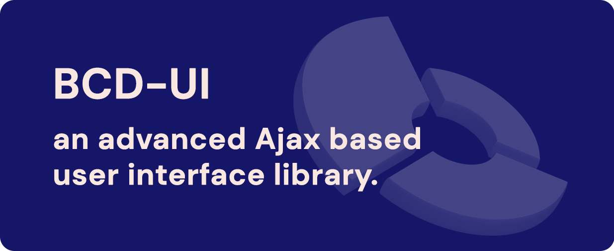
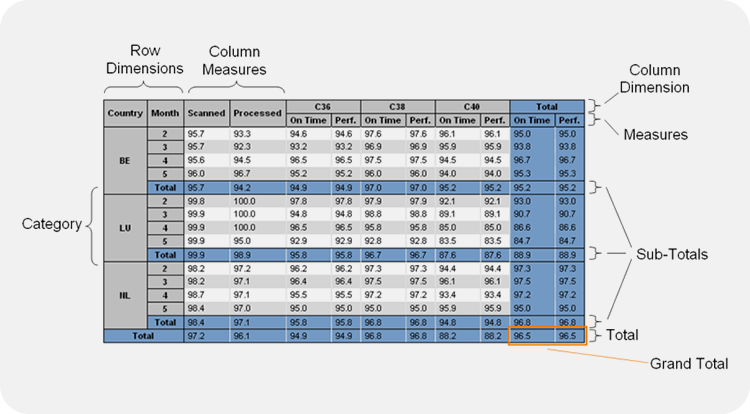
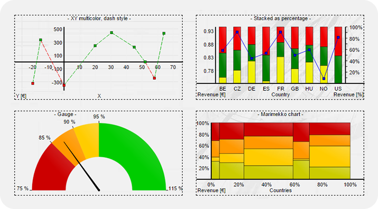
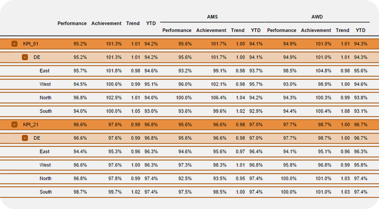
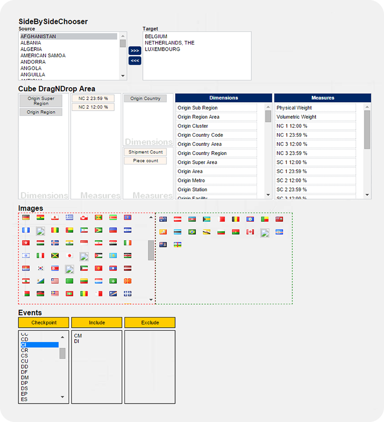

&nbsp;
# BCD-UI

BCD-UI is a full-stack framework for building enterprise applications with web technologies.

BCD features a set of often used components for reporting and data management and is built on today's technologies.

Visit our documentation at https://businesscode.github.io/BCD-UI-Docu

&nbsp;
## Example screen shots of BCD-UI elements:

&nbsp;
### Pivot-table like reporting: The Cube

&nbsp;
### Charting examples

&nbsp;
### Tree report example

&nbsp;
### Widgets examples
